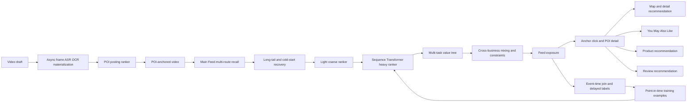

# Production recommendation model suite

This is a public, executable reconstruction built from public research and synthetic events. It is not an internal ByteDance design or a claim that every component was deployed by the author.

## Full learning loop



## Six separate surfaces

| Surface | Candidate | Model family | Primary labels |
|---|---|---|---|
| POI posting | POI for one draft | materialized content vector + sparse features + MMoE | select, entire-space select-and-publish, independent relevance |
| POI video Feed | POI-anchored video extracted from main Feed | multi-route cascade + behavior-sequence Transformer + four-expert MMoE | long view, anchor click, detail view, favorite, order, negative feedback |
| POI map/detail | nearby and intent-matched POI | geography-heavy Wide & Deep | detail click, route, save, order |
| YMAL | co-visit, semantic, category and geographic POI | two-tower related retrieval plus task heads | related click, detail dwell, save, order |
| Product | available SKU attached to video, POI or merchant | click-to-payment funnel MMoE | click, add to cart, order, payment |
| Review | eligible review/comment on current POI | offline NLP signals plus lightweight task heads | expand, dwell, helpful, report |

The models do not share weights. They share contracts for FID encoding, event identity, point-in-time joins, version manifests, experimentation, and consistency checks.

## MMoE mechanics

Each Expert is an independent MLP over the same input. For one sample, every task Gate produces a softmax distribution over the Experts. The task representation is the weighted sum of Expert outputs, followed by a task-specific Head.

```text
features x -> Expert 1 --\
          -> Expert 2 ----> Select Gate -> Select Head
          -> Expert 3 ----> Publish Gate -> Publish Head
                         \-> Relevance Gate -> Relevance Head
```

The Gate is not a business rule. It is a learned router. `gate:publish = [0.10, 0.75, 0.15]` means that, for the current sample, the Publish task uses 10%, 75%, and 15% of the three Expert representations. The weights sum to one for every sample and task. Tests inspect this invariant directly.

MMoE is used only where tasks share signal but can conflict. It is not a substitute for feature interaction models. Wide & Deep handles explicit plus nonlinear features; a two-tower model handles corpus retrieval; a Transformer handles sequence context; MMoE handles task-specific parameter sharing.

## Media extraction boundary

The online Ranker does not decode videos or run a foundation model. An asynchronous materializer consumes upstream frame and text embeddings, calculates attention over frames, fuses the result, normalizes it, and records the encoder version, source timestamp, and content hash. Online ranking reads only the materialized vector.

The local materializer is intentionally small. Production can replace its upstream frame representation with CLIP-like, VideoMAE-like, or proprietary video embeddings without changing the Ranker contract. A stale or mismatched media version fails the consistency audit.

## Feed is the heavy path

The Feed combines vector, popularity, freshness, and long-tail quality recovery. The long-tail route prevents high-quality low-popularity content from disappearing before ranking. Reciprocal-rank fusion merges routes without comparing incomparable raw scores.

The cascade is evaluated by downstream-positive pass-through:

```text
recall positive coverage
-> coarse positive pass-through
-> heavy-rank positive pass-through
-> final slate opportunity
```

A better coarse AUC is insufficient if it removes items the heavy model would place in the final slate. The executable audit requires at least 95% coarse and 90% fine positive pass-through in the local scenario.

The heavy Feed model uses a 24-event behavior sequence and candidate features. A Transformer encodes the history; an MMoE head predicts engagement, POI actions, transaction value, and negative feedback. A separate Value Tree and policy layer handle business weights, author/category caps, freshness, safety, and cross-business mixing. X's public architecture similarly separates candidate sources, hydration, filtering, scoring, selection, and post-selection effects rather than making one model own every decision.

## Main Feed sample extraction

POI Feed training data is not generated from an independent exposure universe. It is extracted from the authoritative main Feed impression stream where `poi_id` is present. The impression retains request, viewer, author, video, POI, model, index, media, position, and timestamp context.

Actions close under separate event-time windows: long view, anchor click, detail view, favorite, order, and negative feedback. The longest window controls sample maturity. Duplicate actions are idempotent. Unanchored impressions remain part of the main Feed authority but do not enter the POI vertical sample.

The local Flink-compatible operator implements the semantics that matter: `keyBy(viewer_id)`, event time, watermark, bounded sequence state, late-event accounting, and point-in-time snapshots. It is a reference operator, not a claim of a deployed Flink cluster.

## Realtime and long-sequence features

Realtime state includes recent POI action counts and the most recent action/category sequence. The training example requests a snapshot as of impression time, so later clicks and orders cannot leak backward. Long histories can be materialized offline; the online request reads a bounded recent sequence plus versioned long-term aggregates.

For Feed, sequence features represent consumption and POI intent. Posting uses creator-side history instead. Product uses transaction history. These histories are not interchangeable merely because all are sequences.

## Consistency is a family of contracts

1. Feature consistency: same FID slot, hashing, transform, missing value, and vocabulary.
2. Time consistency: training features are available as of the impression timestamp.
3. Media consistency: encoder version, content hash, and source timestamp match.
4. Sample consistency: main impression, POI extraction, action windows, deduplication, and label maturity agree.
5. Cascade consistency: recall/coarse/fine preserve downstream opportunity and use compatible candidate distributions.
6. Index/model consistency: vector dimension, index version, model version, and catalog version form one manifest.
7. Prediction consistency: offline replay and online shadow scores stay within tolerance.
8. Experiment consistency: eligibility, trigger, assignment, logging, and metric denominators match.

## Industrial failure cases represented

- Treating unexposed POIs as negatives creates exposure bias.
- Training publication only on selected samples creates selection bias; the posting model uses the entire exposure space.
- Easy-negative dominance teaches popularity and distance shortcuts; hard exposed negatives are retained.
- Missing precise location interpreted as zero distance leaks permission semantics.
- A stale media vector paired with a new model silently changes the feature distribution.
- Late orders closed as zero create false negatives.
- Main Feed and POI vertical joins using different request identities duplicate or lose actions.
- Coarse ranking that improves its own AUC can reduce final opportunity through low pass-through recall.
- MMoE can collapse to one Expert; Gate entropy and task-specific routing must be monitored.
- A Value Tree can increase short watch time while reducing POI relevance, supply quality, or long-term transactions.

## Executable evidence

```bash
python3 -m fid_lab.poi_posting.demo
python3 -m fid_lab.poi_feed.demo
python3 -m fid_lab.surfaces.demo
python3 -m fid_lab.check
```

The repository uses `unittest` as its single existing gate; the test files are also discoverable by pytest because they use standard `unittest.TestCase` contracts. Adding a second pytest-only gate would create duplicate test authority without improving coverage.

## Public references

- [X For You Feed algorithm](https://github.com/xai-org/x-algorithm): source/hydrator/filter/scorer/selector separation, two-tower retrieval, sequence ranking, multi-action predictions, and weighted scoring.
- [Apache Flink event time](https://nightlies.apache.org/flink/flink-docs-stable/docs/concepts/time/): event timestamps, watermarks, out-of-order events, and lateness.
- [Apache Flink stateful processing](https://nightlies.apache.org/flink/flink-docs-stable/docs/concepts/stateful-stream-processing/): keyed state and fault-tolerant stream semantics.
- [Co-optimizing content generation and consumption](https://research.google/pubs/co-optimize-content-generation-and-consumption-in-a-large-scale-video-recommendation-system/): sparse creator actions, conditional losses, task relationships, and personalized value conflict.
- [MMoE](https://research.google/pubs/modeling-task-relationships-in-multi-task-learning-with-multi-gate-mixture-of-experts/): task-specific gates over shared Experts.
- [ESMM](https://arxiv.org/abs/1804.07931): entire-space modeling for sparse post-action funnels.
- [Mixed Negative Sampling](https://research.google/pubs/mixed-negative-sampling-for-learning-two-tower-neural-networks-in-recommendations/): retrieval negatives and sampling bias.
