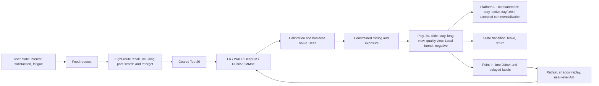
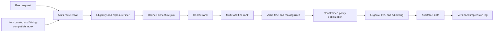
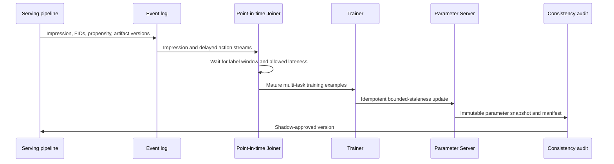
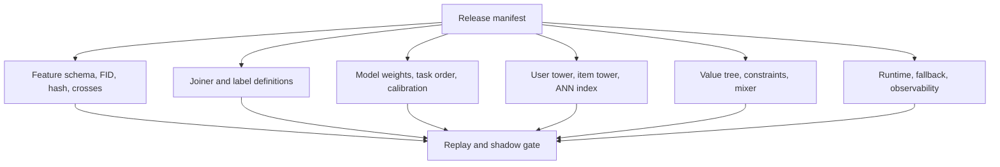

# Production Recommendation System Reference

[](https://github.com/kleon1024/recsys-fid-system/actions/workflows/ci.yml)
[](LICENSE)
[](pyproject.toml)

An executable reference architecture and public outsourcing RFP for an industrial Feed, search, and recommendation platform.

## What the checked evidence says

`LR` is ambiguous in recommendation work. This repository writes **logistic
regression** for the model and **Launch Review** for the release record.

The current stateful Feed still serves logistic regression. That is a measured
decision, not a claim that neural ranking cannot work: the original simulator
was nearly linear, the actual policy consumed only 24 dense features, and the
training split contained about 20,000 rows. A versioned nonlinear DGP run on an
RTX 4090 shows the missing capacity effect: at ten million main impressions and
about 200,000 anchor samples, XGBoost, MMoE, PLE, and DCNv2 all beat logistic
regression offline. They remain offline candidates until the same artifacts
pass the stateful replay and A/B loop.


The full bilingual diagnosis is
[Why LR still serves](docs/research/model-simulator-root-cause.md). It separates
simulator/DGP, sample and label, feature, training, cascade, experiment, and
serving-consistency failures instead of attributing every miss to the model.

## Published model on the GPU tensor engine

The V2 serving gap is now closed. The checked logistic-regression and XGBoost
files, their composite constraint manifest, the 24-field feature schema, and
the nonlinear behavior version are hash-bound. XGBoost uses CUDA
`inplace_predict` through CuPy and zero-copy DLPack; candidate features, model
scores, responses, and state transitions stay on the RTX 4090.


The one-million-user, 24-step rerun reaches 3.06M requests/s for LR control and
2.51M requests/s for guarded XGBoost with less than 421MB peak GPU memory.
Semantic/tensor distribution and effect parity pass. Unified exchanged LT per
user improves 0.265%; its absolute 95% confidence interval is [0.00393, 0.06223],
so the model clears the nonnegative-LT gate. Quality-long-view falls 1.49% and is
reported as a trade-off diagnostic; it cannot override LT until a measured
long-term exchange rate makes it part of the same container. See
[L-TENSOR-003](docs/launch-reviews/2026-08-23-main-feed-suite/l-tensor-003.md).
This is synthetic launch evidence, not a production-lift claim. Its simulator
gate passes, while production readiness remains `hold_synthetic_rates` until the
exchange manifest is replaced with accepted causal estimates.

## Main Feed first, Local Service inside the same value contract

The current acceptance boundary is the short-video main Feed. Local Service is
the primary business iteration inside that Feed, but it cannot make the gate
pass with a private metric. Business Value Trees remain separate; only measured
stay, active-day/DAU, and accepted commercialization effects enter the LT
container.



There are three deliberately separate execution tiers:

- a debuggable stateful trajectory engine for request, session, and retention semantics;
- an RTX 4090 tensor engine for million-user sequential simulation;
- a vectorized experiment engine for orthogonal layers, CUPED, and 0.1%-1% effects.

The latest synthetic [main-Feed Launch Review](docs/launch-reviews/2026-08-23-main-feed-foundation.md)
records both wins and rejected launches. It does not claim company-internal
metrics. The [simulation evidence review](docs/research/main-feed-simulation-evidence.md)
defines the public evidence boundary and why Rust is conditional on profiling.
The [unified launch protocol](docs/operations/launch-protocol.md) and
[independent Launch Review index](docs/launch-reviews/README.md) cover model,
feature, strategy, architecture, realtime, Bug, chain, product, Value Tree, and
long-term iterations under the same gate.

The runnable [POI posting recommendation reconstruction](docs/architecture/poi-posting.md) adds multimodal draft fusion, permission-aware geographic features, impression-derived labels, hard-negative sampling, entire-space sparse publication, and a multi-task ranker.

The [production model suite](docs/architecture/model-suite.md) extends that supply-side model into POI-anchored Feed distribution, map/detail, YMAL, product, and review recommendation with separate model families, streaming samples, long sequences, cascade audits, and full-path consistency.

The bilingual [unified LT and Local Service design](docs/architecture/unified-lt-local-service.md)
defines the value-exchange authority, closed/open-loop behavior world,
post-search and retarget routes, stable GPU catalog, and multi-seed LR gate.

The [model evolution laboratory](docs/architecture/model-evolution.md) compares
mature open-source LR, XGBoost, WDL, DeepFM, DCN-Mix, DIN, MMoE, and PLE
implementations on one synthetic distribution. It also adds trained Semantic-ID
generation, closed/open-loop attribution, and stateful request/session A/B simulation.
Use the [failure runbook](docs/operations/failure-runbook.md) and
[senior project deep dive](docs/interview/project-deep-dive.md) for production
diagnosis and interview practice.

Additional checked visual evidence:

- [Training loss versus launch outcome](docs/assets/training-loss.svg)
- [Coarse-cascade repair and Local/LT trade-off](docs/assets/cascade-local-tradeoff.svg)
- [Architecture and launch visual atlas](docs/architecture/visual-atlas.md)

Public procurement package:

- [REQUEST_FOR_PROPOSAL.md](REQUEST_FOR_PROPOSAL.md): scope, delivery gates, acceptance criteria, security, commercial response, and vendor evaluation.
- [Bidder response template](docs/procurement/bidder-response-template.md): mandatory response format.
- [Architecture visual atlas](docs/architecture/visual-atlas.md): visual system atlas for technical and delivery review.

## Procurement status

| Item | Status |
|---|---|
| RFP | Public and open until an award or closure notice is posted |
| Delivery | Remote-first, milestone-gated outsourcing engagement |
| Scale response | Mandatory pricing for 100, 1,000, and 10,000 RPS tiers |
| Technical questions | Public `rfp-question` GitHub issue |
| Capability statement | Public `rfp-capability` GitHub issue |
| Commercial response | Private channel after capability review |
| Source license | MIT; bidder submissions and third-party assets retain their declared licenses |

## Target architecture



## Learning and publication loop



## One atomic publication manifest



The repository includes a local end-to-end reference implementation of the intended sparse-feature and ranking boundaries:

```text
raw event
  -> feature registry (slot ownership + declared crosses)
  -> stable signature
  -> packed FID V1/V2
  -> one shared encoded batch
  -> XGBoost / Wide&Deep / DeepFM / user-item-context three-tower
  -> AUC + log loss
```

The online system continues from that model lab:

```text
catalog (1,200 items)
  -> Viking vector + popular + fresh recall (400 route hits)
  -> weighted recall merge + deduplication (300)
  -> eligibility and exposure filtering
  -> online FID feature join
  -> coarse rank (240)
  -> fine multi-objective prediction + value tree (240)
  -> boost/bury ranking rules
  -> COPP adapter / constrained policy selection (40)
  -> calibrated organic/live/ad mixed ranking (20)
```

See the [system design](docs/architecture/system-design.md) for contracts and evidence boundaries.

Production engineering and interview references:

- [Practical engineering](docs/interview/practical-engineering.md): Joiner, training examples, online PS, consistency, offline/online AUC, Feed growth, multi-objective learning, public industry references, Euclidean distance, Lagrangian constraints, and generative recommendation.
- [Common interview Q&A](docs/interview/common-qa.md): compact production and fundamentals questions with answer boundaries.

This lab reproduces the **public FID bit contract**, not a proprietary internal framework. The name "SEO" and its predefined feature-combination functions could not be identified from public evidence, so their semantics are not guessed here.

## What FID means

The public ByteDance Monolith implementation stores a slot and signature in one unsigned 64-bit value:

| Layout | Slot | Signature | Reserved |
|---|---:|---:|---:|
| V1 | 10 bits | 54 bits | 0 bits |
| V2 | 15 bits | 48 bits | 1 bit |

```text
FID V1 = (slot << 54) | (signature & (2^54 - 1))
FID V2 = (slot << 48) | (signature & (2^48 - 1))
```

The slot identifies the feature field. The signature identifies a value inside that field. A signature can come from a raw numeric ID or a stable hash; FID packing itself does not define the hash function.

V1 to V2 conversion preserves the slot but truncates the upper six signature bits. It is therefore not generally reversible. The implementation and tests are in `fid_lab/fid.py` and `tests/test_fid_lab.py`.

## Durable boundaries

- `fid_lab/fid.py` is the only owner of bit packing and stable signatures.
- `fid_lab/schema.py` is the only owner of slot assignment, feature groups, bucket sizes, and crosses.
- `fid_lab/data.py` creates and encodes every example once.
- `fid_lab/models.py` contains models only; models cannot reinterpret raw features.
- `fid_lab/experiment.py` owns the fixed split, training loop, and comparable metrics.

This preserves the main production invariant: offline training and online inference must use the same feature definitions, hash version, slot registry, cross semantics, and model artifact.

## Model evolution

| Stage | What it learns | Main limitation |
|---|---|---|
| XGBoost | Nonlinear rules over one-hot FID buckets | Sparse IDs generalize poorly; no learned embeddings |
| Wide&Deep | Memorized linear terms plus higher-order DNN patterns | Important crosses may still need explicit declaration |
| DeepFM | First-order terms, all second-order embedding interactions, and DNN interactions | Every pair receives the same FM interaction form; sequence intent is absent |
| Three-tower | Separate user, item, and context representations plus a ranking head | This lab's architecture is explicitly defined, not claimed as a universal named model |

`DeepFM` and `DeepFFM` are not synonyms. DeepFM shares one embedding per feature across pairwise interactions. FFM-style models use field-dependent embeddings, which cost substantially more parameters. Add DeepFFM only when field-aware interactions are a measured requirement, rather than treating it as the default successor.

The production suite now adds separate retrieval, coarse-rank, fine-rank,
sequence, multi-task, Joiner, and experiment boundaries. The original compact
models remain as teaching baselines; the evolution benchmark uses
DeepCTR-Torch rather than maintaining another local copy of its model zoo.

Start with the bilingual [system evolution review](docs/architecture/system-evolution-review.md)
for the complete strategy → algorithm → model → feature → sample → consistency
→ launch-review narrative.

## Run

```bash
git clone https://github.com/kleon1024/recsys-fid-system.git
cd recsys-fid-system
python3 -m venv .venv
source .venv/bin/activate
python -m pip install --upgrade pip
python -m pip install -e .
python -m fid_lab.check
```

The single acceptance command runs structural checks, public-document scanning,
the complete unit and integration suite, deterministic serving demos, the CI-sized model
ladder, and an A/B estimator calibration smoke. GPU scale runs are intentionally
separate because GitHub-hosted CI has no RTX 4090:

```bash
python3 -m fid_lab.experiment
python3 -m fid_lab.online.demo
python3 -m fid_lab.online.benchmark
python3 -m fid_lab.training.demo
python3 -m fid_lab.generative.demo
python3 -m fid_lab.evolution.evaluation.benchmark --profile ci
python3 -m fid_lab.evolution.cli.signal_diagnostic --impressions 1000000 --signal-version heterogeneous-nonlinear-v2
python3 -m fid_lab.evolution.cli.generative_demo
python3 -m fid_lab.evolution.cli.ab_demo
python3 -m fid_lab.simulation.cli --users 2000 --items 4000
python3 -m fid_lab.feed_loop.models.cli --users 3000 --items 4000 --ab-users 500 --epochs 10 --device cuda:0
python3 -m fid_lab.feed_loop.scale.tensor_cli --users 1000000 --steps 24 --device cuda:0
python3 -m fid_lab.feed_loop.scale.artifact.cli \
  --report reports/launches/2026-08-23-feed-xgb-guarded-v2-10k-gpu.json \
  --artifact-dir artifacts/models/stateful-v2 \
  --users 1000000 --steps 24 --device cuda:0
python3 -m fid_lab.feed_loop.scale.local_value_cli --users 1000000 --steps 24 --seeds 3 --device cuda:0
python3 -m fid_lab.feed_loop.scale.local_value_cli --users 10000000 --steps 24 --seeds 3 --intent-only --device cuda:0
python3 -m fid_lab.feed_loop.scale.queue_value_cli --users 1000000 --steps 24 --seeds 3 --device cuda:0
python3 -m fid_lab.feed_loop.experimentation.cascade_cli --users 1000000 --steps 24 --candidates 100 --seeds 3 --device cuda:0
python3 -m fid_lab.feed_loop.experimentation.reverse_holdout --users 1000000 --steps 48 --burn-in-steps 12 --seeds 3 --device cuda:0
python3 -m fid_lab.simulation.local.switchback_cli --cities 100 --periods 28 --users-per-city-period 10000 --calibration-runs 500
python3 -m fid_lab.feed_loop.scale.power_cli --users 1000000
python3 -m fid_lab.feed_loop.streaming.online_learning_cli --users 1000 --ab-users 1000
python3 -m fid_lab.launches.policy.cli --users 1000000 --device cuda:0
python3 -m fid_lab.launches.system.cli --users 1000000 --device cuda:0
python3 -m fid_lab.check
```

Regenerate the deterministic report figures from checked JSON authorities:

```bash
python -m pip install -r requirements-docs.txt
python3 -m fid_lab.reporting.charts
```

See [CONTRIBUTING.md](CONTRIBUTING.md) before changing contracts, reports, or
generated evidence. All checked-in business results are synthetic and must not
be represented as company-internal or production metrics.

Run one stage while studying it:

```bash
python3 -m fid_lab.experiment --models xgboost
python3 -m fid_lab.experiment --models wide_deep deepfm
python3 -m fid_lab.experiment --models three_tower
```

The generated data contains user and item latent effects plus country-category, category-device, and age-hour interactions. Model metrics are deterministic for the same seed, but they are reference evidence, not a production benchmark claim.

## Sources and evidence boundary

- [ByteDance Monolith](https://github.com/bytedance/monolith): public FID V1/V2 layout, `FeatureSlot`, and `FeatureColumn` implementation. The repository was archived in 2025, so it is useful as public design evidence rather than a current dependency.
- [Wide & Deep Learning](https://arxiv.org/abs/1606.07792): memorization plus generalization architecture.
- [DeepFM](https://arxiv.org/abs/1703.04247): shared embedding input for FM and deep components.
- [FAT-DeepFFM](https://arxiv.org/abs/1905.06336): evidence that DeepFFM is a field-aware branch, not another name for DeepFM.
- [Viking AI Search documentation](https://docs.byteplus.com/en/docs/viking-aisearch/Recommended_Input): public product boundary for recommendation input, recall strategies, merging, filtering, deduplication, reranking, and diversity.
- [SARDINE](https://github.com/naver/sardine): packaged Gymnasium runtime for dynamic recommendation environments.
- [KuaiSim](https://proceedings.neurips.cc/paper_files/paper/2023/hash/8c7f8f98f9a8f5650922dd4545254f28-Abstract.html): request-level, session-level, and cross-session simulator evaluation protocol.
