# Production Recommendation System Reference

[](https://github.com/kleon1024/recsys-fid-system/actions/workflows/ci.yml)
[](LICENSE)
[](pyproject.toml)

An executable reference architecture and public outsourcing RFP for an industrial Feed, search, and recommendation platform.

## Current Feed model V4 and governance world V5

The active Feed simulator is now an external sequence world with a hidden
four-group user mixture, 64-step online behavior state, conditional watch-time
distribution, temporal drift, and a consumer-to-creator-to-new-supply loop. The
same request state feeds logging and online serving. The frozen dataset contains
279,903 train, 83,430 validation, and 63,135 test requests; every row retains 64
candidates, coarse/fine decisions, exact exposure propensity, point-in-time
sequence, 21 labels, and maturity masks.

The equal-data ladder now gives request context to models that can use it.
Long-view AUC is 0.620 for logistic regression, 0.608 for XGBoost, 0.646 for
DIN, 0.676 for Transformer, 0.668 for MMoE, and 0.667 for PLE. This proves the
new DGP contains learnable sequence and multi-task structure. It does not make
AUC a launch metric: the published MMoE artifact is separately evaluated in a
common-random stateful A/B with LT, negative-feedback, and duration guardrails.
The predeclared guarded 0.010 MMoE candidate passes at one million users: LT per
user +1.62%, stay per exposure +2.94%, quality-long-view +2.85%, neutral
long-view, and negative feedback remains inside its declared guardrail. Selected
duration rises 3.76% and remains inside the 5% reward-hacking guard. This changes the simulator
ranking control only; production serving and production LT remain unclaimed.

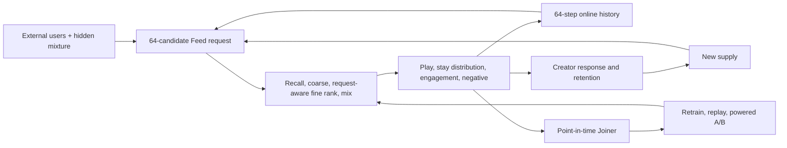

See the bilingual [Feed V4 Launch Review](docs/launch-reviews/2026-08-24-feed-v4-request-aware-loop.md),
the [request dataset manifest](reports/datasets/2026-08-24-feed-v4-request-candidate-log-manifest.json),
and the [model report](reports/training/2026-08-24-feed-v4-request-aware-model-ladder-200k.json).

Feed governance is now a separate serving and experiment authority rather than
an unnamed ranking rule. The V5 world separates hidden experience quality from
the observable integrity-risk prediction, preserves upstream candidate masks,
models heterogeneous repetition fatigue, and matures one terminal next-day
retention label per user. A 1.5-million-user RTX 4090 A/B estimates platform LT
at +0.30%, next-day active at +0.38%, and consecutive duplicates at -46%. The
candidate remains in `continue_powered_online_experiment`: stay's 95% lower
bound misses its predeclared noninferiority margin by 0.0014 seconds. See the
[governance architecture](docs/architecture/content-governance.md) and
[L-GOVERNANCE-001](docs/launch-reviews/2026-08-24-content-governance-v5.md).

The main Feed and POI/Local models now also have one typed serving graph rather
than exchanging anonymous scalar scores. Eight recall routes feed independent
coarse and fine stages; the active Feed MMoE and POI Linear model emit primitive
probabilities into a versioned score bundle, then a central Value Tree and
eligibility-aware mixer produce the served score. A one-million-user candidate
raises paired anchor click by 5.14%, paired LT by 0.027%, and paired stay by
0.063%. The disjoint randomized A/B confirms anchor growth but is underpowered
for LT and guardrails, so the candidate is explicitly not active. See
[L-SERVING-UNIFIED-001](docs/launch-reviews/2026-08-24-unified-feed-local-serving.md).

The external world-model lane follows explicit
[data, modeling, evaluation, and launch boundaries](docs/architecture/external-world-model-boundaries.md).
Artifact and dataset identities fail closed before scoring, and V3 remains the
rollback epoch. Composite V4 now promotes three simulator-only kernels: the
external-data-calibrated Feed behavior kernel, the causally tested synthetic
Local response kernel, and the repeated-creator synthetic Supply response
kernel. Retention, commercialization, and the unified neural SCM remain held or
measurement-only. The serving policy is a separate authority.

The [scale and orchestration decision](docs/architecture/simulation-scale-and-orchestration.md)
keeps a future asset DAG outside the GPU request hot path. The refactored tensor
runtime has a measured ten-million-user RTX 4090 scale report.

## What the checked evidence says

### V4 is a composite world, not one universal model

The 2026-08-24 randomized lane closes the missing Feed evidence. One treatment
artifact is evaluated by doubly robust OPE and two independently trained shadow
worlds. All three estimate positive normalized stay with nonnegative 95%
confidence bounds; click, long-view, like, and hate guardrails pass. The two
stateful shadows also recover their paired-world truth in a one-million-user
power simulation. This promotes the Feed behavior kernel inside the simulator,
not into production and not as unified LT.

The attempted universal NeuralSCM remains held. A request-level bridge with
1,010,285 training requests corrected stay p50 error from 158% to 8.5%, p90
error from 466% to 4.6%, and observed-task uncertainty p99 from 0.115 to 0.055.
It still failed joint-action calibration and free-running sequence gates because
Kuai Feed history does not observe Local, retention, or commercialization state.
Those missing labels remain masked instead of being manufactured.

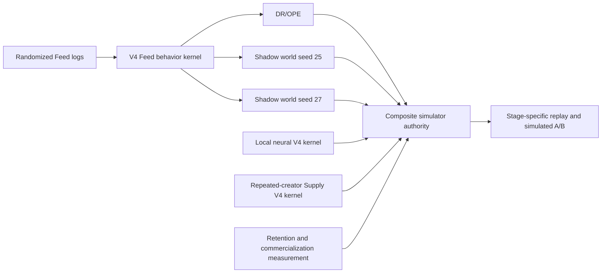

The content-bound decision is
[`composite-launch-review.json`](reports/world-model/v4/composite-launch-review.json),
and [`simulator-world.json`](artifacts/releases/simulator-world.json) is the
separate world authority manifest. The active ranking policy remains in its own
release manifest, so changing a behavior evaluator cannot silently deploy a
ranker.

The first V4 stage-level launch is retrieval. Popular, Co-visit Graph,
Two-Tower, and Multi-interest share the same 7,388-item corpus, random-exposure
test users, Top-50 budget, fixed fine ranker, and independent Feed world across
three model seeds. Popular Recall@50 is 1.068%; Two-Tower and Multi-interest
average 0.712% and 0.850%. Their downstream stay effects change sign across
seeds, so both learned routes are rejected and Popular remains active. Learned
coverage is much larger, but coverage is not accepted as business impact. See
[L-RECALL-EXT-001](docs/launch-reviews/2026-08-24-feed-retrieval-ladder.md).

`LR` is ambiguous in recommendation work. This repository writes **logistic
regression** for the model and **Launch Review** for the release record.

All new Launch Reviews now use one machine-enforced scale protocol: 100k/one
salt smoke, 100k/three-salt screen, and a pre-registered powered A/B sized from
control variance plus an absolute business MDE. Training examples and scale
benchmarks are never A/B evidence; observed-effect projections such as 100M are
never executable sample plans. See the
[unified launch protocol](docs/operations/launch-protocol.md) and
[registered experiment plans](experiments/README.md).

The v2 multi-surface continuous-learning twin is implemented under
[`fid_lab/simulation/twin`](fid_lab/simulation/twin/). One user and supply state
spans Feed, Search, Commerce, Live, Local, and Posting, but hidden user truth is
physically separated from platform-observable state. Short video, photo,
article, card, live room, product, POI, ad, and creator-prompt items share one
versioned catalog and cross-request exposure ledger. A pre-period is
materialized once. Pure control and treatment branches are disposable shadow
counterfactuals; the factual future is always the shared mixed-A/B world, so
experiment exposure changes later users, supply, and training samples. See the bilingual
[multi-surface architecture](docs/architecture/multi-surface-digital-twin.md).

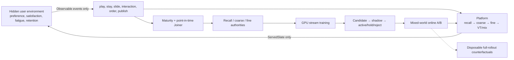

The request trace contains 54 observable estimates, counters, content signals,
and context features. It contains no latent preference, true satisfaction,
true quality, true risk, retention state, or future signup schedule. It retains
all recalled candidates,
route provenance, coarse/fine scores, exploration and position propensity,
exposure, point-in-time history, 17 labels, maturity masks, served-policy ID,
and experiment-cell ID. The Joiner compiles three independent tensor
authorities rather than reusing one exposure table for every stage. The online
trainer supports LR, Wide & Deep, DCNv2, and MMoE on the current dense
observable contract and uses clipped IPS BCE plus request-aware pairwise and
listwise losses;
unmatured order, payment, and publish heads cannot enter serving value.
Offline metrics use a whole-step chronological holdout and include AUC,
PR-AUC, log loss, ECE, NDCG, and user GAUC coverage. A separate robustness gate
replays one source-trained checkpoint unchanged across unseen hidden-world
seeds; offline lift or success in only one simulated world cannot promote it.

The first v2 held-out screen freezes one MMoE checkpoint and replays it in two
unseen user worlds. Both worlds improve synthetic LT and stay, but both remain
`hold` because the negative-feedback confidence bound exceeds the fixed
guardrail. The result demonstrates learnable neural-model impact without
manufacturing a launch. See the
[held-out MMoE screen](reports/benchmarks/2026-08-24-hidden-environment-mmoe-heldout-screen-4090.json).

The fixed RTX 4090 profile contains 1,000,000 users, 2,000,000 items, 250,000
users per persistent state shard, 50,000 requests per candidate compute
microbatch, 96 candidates per request, and 64 exposure-history slots. In the
frozen one-iteration report, 65,536 observed logging requests produce 145,079
fine-rank rows. The run takes 279.5 seconds and reports 8.90GB peak CUDA
allocation. Its LR lift is now explicitly rejected as model evidence because
that v1 run exposed noisy transforms of hidden satisfaction and intent to the
ranker. The artifact remains an immutable throughput and end-to-end plumbing
canary only. A new v2 model Launch Review requires hidden/platform isolation,
held-out environment seeds, and a rerun on the RTX 4090. See the
[content-bound historical GPU report](reports/benchmarks/2026-08-24-multi-surface-continuous-learning-1m-4090.json).

The historical stateful Feed control served logistic regression, and the
legacy single-Feed V4 simulator later selected a guarded MMoE. The new v2
multi-surface twin still keeps `shared_rules_v1` active because its held-out
MMoE is `hold`, not passed. The old LR result did not show that neural ranking
could not work: the original simulator
was nearly linear, the actual policy consumed only 24 dense features, and the
training split contained about 20,000 rows. A versioned nonlinear DGP run on an
RTX 4090 shows the missing capacity effect: at ten million main impressions and
about 200,000 anchor samples, XGBoost, MMoE, PLE, and DCNv2 all beat logistic
regression offline. They remain offline candidates until the same artifacts
pass the stateful replay and A/B loop.

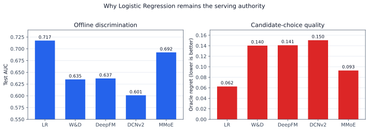


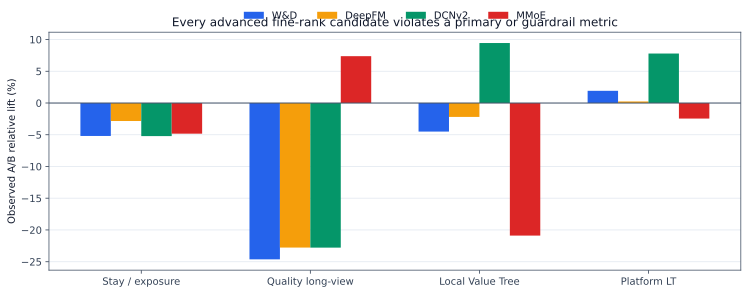

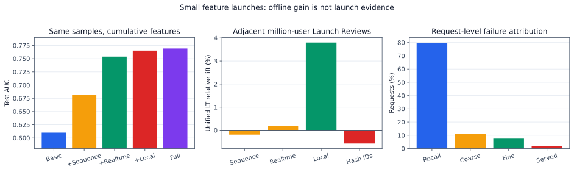

The million-user GPU path now executes a request-level candidate graph instead
of selecting directly from 20 dense random items. Eight routes feed an RRF
merge and deduplication stage, about 49 unique candidates reach 48-to-20 coarse
truncation, and fine rank plus constrained mixing produce explicit stage
attribution. The checked control processes 12.01M measured requests at 2.69M
requests/s with 2.67GB peak GPU memory. Recall, coarse, fine, and mix misses are
now observable; a bounded content-hashed request trace retains one exposure and
mature labels per request. See [L-SIMULATOR-003](docs/launch-reviews/2026-08-23-main-feed-suite/l-simulator-003.md).

Post-search is also a sparse exogenous event rather than an always-on feature.
At a 4.001% pre-treatment trigger rate, the Local intent treatment is held:
unified LT is -0.0172% overall and +0.190% in the triggered cohort, with both
confidence intervals crossing zero. These are synthetic mechanism checks, not
production-lift estimates.

The RTX 4090 runtime now uses counter-based random streams keyed by user,
request step, stream, and seed. Changing the GPU batch from 25K to 200K leaves
all stage-attribution counts identical and changes checked metrics by at most
2.2e-8, while throughput rises from 1.36M to 2.88M requests/s. The selected
200K batch uses 2.67GB; 400K uses 5.30GB but is slower, so additional memory is
not treated as a goal by itself.

The historical V3 executable behavior kernel below is retained as rollback
evidence and is superseded by the composite V4 authority described above. A public
KuaiRand-Pure snapshot contributes 1,436,609 standard-policy
interactions; raw data stays outside Git and exact input hashes are retained in
the calibration report. V3 fixes a counter-RNG defect that correlated event
streams above 0.998 and moves nonlinear response truth out of the policy class.
At one million users, play and stay align within 1% of the public marginals;
three-second play, long view, like, and hate retain explicit calibration error.
The first V3 Local intent launch remains Hold at unified LT -0.162% with an
interval crossing zero. See [L-SIMULATOR-004](docs/launch-reviews/2026-08-23-main-feed-suite/l-simulator-004.md).

A subsequent 64-paper architecture review finds that V1--V3 remain variants of
one feature-derived formula world. V3 calibrates selected marginals but does not
validate joint actions, free-running sequences, interventions, or policy-order
agreement. XGBoost's V3 pointwise AUC edge over logistic regression is only
0.0019, while its request-level audit regret is 0.0922 versus 0.0393. See the
[DGP architecture decision](docs/research/dgp-literature-review/architecture-decision.md)
and [literature survey PDF](docs/research/dgp-literature-review/lit_review_report.pdf).

That research decision is now implemented as a separate neural-SCM world-model
lane rather than another V3 formula patch. On the RTX 4090, a three-member
ensemble trained on all 709,644 request-level training examples in 65.99 seconds.
It passes joint-distribution, censored stay-tail, free-rollout, uncertainty,
frozen-V3 intervention-recovery, and synthetic policy-order gates. It remains a
research challenger because artifact-bound external randomized interventions and
real frozen-policy outcomes are not yet available. See
[L-SIMULATOR-005](docs/launch-reviews/2026-08-23-main-feed-suite/l-simulator-005.md).

The follow-up equal-request capacity audit prevents that architectural success
from being mistaken for a useful behavioral world. After fixing time-support
sampling, a missing W&D user field, and global/model schema coupling, XGBoost
still reaches AUC 0.58575 while W&D, DIN, and the slate Transformer reach
0.58006, 0.58119, and 0.58080. Permuting the entire behavior sequence changes
V4 probability by only 0.00121 on average. V4 therefore learned V3's tabular
response surface and effectively ignores sequence; all sequence-capacity gates
fail and V4 remains held. See
[L-SIMULATOR-006](docs/launch-reviews/2026-08-23-main-feed-suite/l-simulator-006.md).

The first external sequence lane now uses the official KuaiSim KuaiRand-Pure
snapshot with point-in-time 64-event histories and a date-disjoint test period.
On 1,079,797 training interactions, W&D reaches long-view AUC 0.70236 and the
sequence Transformer reaches 0.73868, versus 0.64832 for XGBoost. Shuffling
history reduces Transformer AUC to 0.59807, proving that the gain is genuinely
sequential. The kernel passes all capacity gates but remains outside simulator
authority because Pure does not contain the randomized logs required for causal
promotion. See
[L-SIMULATOR-007](docs/launch-reviews/2026-08-23-main-feed-suite/l-simulator-007.md).

The external kernel now also closes a stateful request/slate shadow A/B. The
final independent-world run covers 200,000 users, eight sequential feedback
steps, and 20 candidates per request. Click, long view, and normalized stay are
significantly positive at roughly 0.001--0.005 percentage points, while like
stays inside its guardrail. Hate improves on average but its 95% upper bound is
still positive, so the release correctly holds. Pure also lacks randomized
exposure logs, and the ranking utility is not unified LT. See
[L-SIMULATOR-008](docs/launch-reviews/2026-08-23-main-feed-suite/l-simulator-008.md).

The Feature LR release ladder now trains every legal combination of four atomic
feature proposals on one immutable sample snapshot. Each A/B compares a proposal
with the last accepted control. Sequence is held; realtime promotes over Basic;
Local context then promotes over Basic + Realtime; the final hash/content bundle
is rejected. The active simulated control and its rollback artifact are
content-bound in `artifacts/releases/simulated-feed-control.json`. See the
[request-level candidate authority](docs/architecture/request-candidate-dataset.md)
and individual F-LR Launch Reviews.

The rejected hash/content bundle is now split into three smaller Launch Reviews.
Duration is rejected at unified LT -1.329%; identity hash is held at +0.004%
with an interval crossing zero; category hash passes at +0.366%. Only category
is promoted. The active simulated artifact is therefore Basic + Realtime +
Local + Category, with the prior Basic + Realtime + Local artifact retained as
rollback. Category still worsens negative feedback and oracle regret, which
remain explicit diagnostics rather than hidden behind the LT pass.

The Local bundle is then decomposed with active-preserving ablations. Removing
POI identity, post-search, retarget, or POI-quality/inventory is held because
each LT interval crosses zero. Removing distance and Local-interest features is
rejected at LT -3.073%. No ablation promotes, so the active artifact remains
Basic + Realtime + Local + Category. This is a valid launch outcome: the system
keeps the accepted control instead of deleting features on inconclusive offline
evidence.

The ambiguous post-search and retarget ablations are rerun as triggered
experiments after an eight-request burn-in. Search eligibility is 4.001% and
retarget eligibility is 3.143%; both cohorts are frozen before treatment.
Removing post-search yields overall LT +0.0341%, while removing retarget yields
+0.0186%; both intervals cross zero. F-LR-013 and F-LR-014 are held, and the
accepted Basic + Realtime + Local + Category artifact remains active.

The full bilingual diagnosis is
[Why LR still serves](docs/research/model-simulator-root-cause.md). It separates
simulator/DGP, sample and label, feature, training, cascade, experiment, and
serving-consistency failures instead of attributing every miss to the model.

## Published model on the GPU tensor engine

The V2 serving gap is now closed. The checked logistic-regression and XGBoost
files, their composite constraint manifest, the 24-field feature schema, and
the nonlinear behavior version are hash-bound. XGBoost uses CUDA
`inplace_predict` through CuPy and zero-copy DLPack; candidate features, model
scores, responses, and state transitions stay on the RTX 4090.

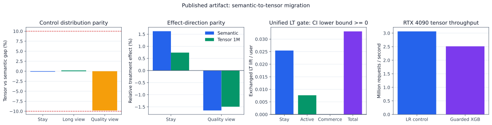

The one-million-user, 24-step rerun reaches 3.06M requests/s for LR control and
2.51M requests/s for guarded XGBoost with less than 421MB peak GPU memory.
Semantic/tensor distribution and effect parity pass. Unified exchanged LT per
user improves 0.265%; its absolute 95% confidence interval is [0.00393, 0.06223],
so the model clears the nonnegative-LT gate. Quality-long-view falls 1.49% and is
reported as a trade-off diagnostic; it cannot override LT until a measured
long-term exchange rate makes it part of the same container. See
[L-TENSOR-003](docs/launch-reviews/2026-08-23-main-feed-suite/l-tensor-003.md).
This is synthetic launch evidence, not a production-lift claim. Its simulator
gate passes, while production readiness remains `hold_synthetic_rates` until the
exchange manifest is replaced with accepted causal estimates.

## Main Feed first, Local Service inside the same value contract

The current acceptance boundary is the short-video main Feed. Local Service is
the primary business iteration inside that Feed, but it cannot make the gate
pass with a private metric. Business Value Trees remain separate; only measured
stay, active-day/DAU, and accepted commercialization effects enter the LT
container.

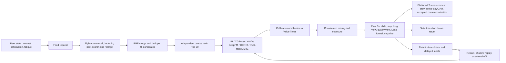

There are three deliberately separate execution tiers:

- a debuggable stateful trajectory engine for request, session, and retention semantics;
- an RTX 4090 tensor engine for million-user sequential simulation;
- a vectorized experiment engine for orthogonal layers, CUPED, and 0.1%-1% effects.

The latest synthetic [main-Feed Launch Review](docs/launch-reviews/2026-08-23-main-feed-foundation.md)
records both wins and rejected launches. It does not claim company-internal
metrics. The [simulation evidence review](docs/research/main-feed-simulation-evidence.md)
defines the public evidence boundary and why Rust is conditional on profiling.
The [V3 multi-task Launch Review](docs/launch-reviews/2026-08-23-main-feed-suite/l-v3-multitask-001.md)
shows why higher long-view AUC can reduce LT, and why a large stay lift is held
when it is explained by selected-duration drift. The accepted path uses the
same MMoE as a bounded residual reranker and promotes it through three
sequential million-user Launch Reviews.
The [unified launch protocol](docs/operations/launch-protocol.md) and
[independent Launch Review index](docs/launch-reviews/README.md) cover model,
feature, strategy, architecture, realtime, Bug, chain, product, Value Tree, and
long-term iterations under the same gate.

The runnable [POI posting recommendation reconstruction](docs/architecture/poi-posting.md) adds multimodal draft fusion, permission-aware geographic features, impression-derived labels, hard-negative sampling, entire-space sparse publication, and a multi-task ranker.

The [production model suite](docs/architecture/model-suite.md) extends that supply-side model into POI-anchored Feed distribution, map/detail, YMAL, product, and review recommendation with separate model families, streaming samples, long sequences, cascade audits, and full-path consistency.

The bilingual [unified LT and Local Service design](docs/architecture/unified-lt-local-service.md)
defines the value-exchange authority, closed/open-loop behavior world,
post-search and retarget routes, stable GPU catalog, and multi-seed LR gate.
The [POI distribution stage ladder](docs/launch-reviews/2026-08-24-poi-distribution-stage-ladder.md)
repairs the `48 recall -> 20 coarse -> fine -> mix` boundary and records the
adjacent three-seed Launch Reviews. Only retarget recall passes; Local expansion
is rejected because Local value rises while platform LT falls.
The [POI posting request ladder](docs/launch-reviews/2026-08-24-poi-posting-request-ladder.md)
adds a teacher-hidden creator world, non-oracle candidate sets, actual
LR/W&D/MMoE artifacts, and a supply-to-Feed LT review. History recall and W&D
pass all three seeds; MMoE is held because its incremental effect is unstable.

The historical [Feed posting request ladder](docs/launch-reviews/2026-08-24-feed-posting-request-ladder.md)
separates Feed-to-creation prompts from POI posting. It is superseded by the
[creator-neural Feed Posting V4 review](docs/launch-reviews/2026-08-24-feed-posting-neural-v4.md),
which repairs the click/create/publish label spaces, runs 64-step sequence models,
and makes creator-randomized A/B the launch authority. Full neural replacements
are rejected on content risk; a 5% DIN dose is held for insufficient power; a
20% residual passes the 10m-request simulator review with publish +1.21%, Feed
stay +1.62%, and LT +1.60%. A separate 1.25m-creator cross-day mediation run
then inserts the new supply into later Feed days: creator posts and Feed stay
increase, while the three-day LT interval still crosses zero. These are
synthetic effects, not production claims.

Feed Posting has now advanced again through the
[V43 entire-space review](docs/launch-reviews/2026-08-24-feed-posting-esmm-v43.md).
The model serves `pClick`, joint `pCreate`, and joint `pPublish` instead of
adding incompatible conditional probabilities. ESMM-DIN and raw-score W&D are
both rejected in adjacent 10m-request reviews. W&D with request-standardized
20% residual passes against the previous DIN20% control: publish +1.20%, quality
supply +1.50%, Feed stay +1.66%, and platform LT +1.64%. The previous DIN
release is the immediate rollback. Cross-day supply gates pass, while
three-day Feed LT remains directionally positive but not significant.

The [Local Search request ladder](docs/launch-reviews/2026-08-24-local-search-request-ladder.md)
adds a joint Search/Recommendation journey with Lexical, Geo, learned Two-Tower,
History, and Retarget routes; position-biased exposure; closed/open-loop orders;
IPS/listwise training; XGBoost CUDA; and adjacent model Launch Reviews. Learned
retrieval raises audit recall but is rejected on query success and LT. Linear is
promoted; W&D, DIN, and Transformer+MMoE stop at their adjacent online gates.

The [model evolution laboratory](docs/architecture/model-evolution.md) compares
mature open-source LR, XGBoost, WDL, DeepFM, DCN-Mix, DIN, MMoE, and PLE
implementations on one synthetic distribution. It also adds trained Semantic-ID
generation, closed/open-loop attribution, and stateful request/session A/B simulation.
Use the [failure runbook](docs/operations/failure-runbook.md) and
[senior project deep dive](docs/interview/project-deep-dive.md) for production
diagnosis and interview practice.

Additional checked visual evidence:

- [Training loss versus launch outcome](docs/assets/training-loss.svg)
- [Coarse-cascade repair and Local/LT trade-off](docs/assets/cascade-local-tradeoff.svg)
- [Architecture and launch visual atlas](docs/architecture/visual-atlas.md)

Public procurement package:

- [REQUEST_FOR_PROPOSAL.md](REQUEST_FOR_PROPOSAL.md): scope, delivery gates, acceptance criteria, security, commercial response, and vendor evaluation.
- [Bidder response template](docs/procurement/bidder-response-template.md): mandatory response format.
- [Architecture visual atlas](docs/architecture/visual-atlas.md): visual system atlas for technical and delivery review.

## Procurement status

| Item | Status |
|---|---|
| RFP | Public and open until an award or closure notice is posted |
| Delivery | Remote-first, milestone-gated outsourcing engagement |
| Scale response | Mandatory pricing for 100, 1,000, and 10,000 RPS tiers |
| Technical questions | Public `rfp-question` GitHub issue |
| Capability statement | Public `rfp-capability` GitHub issue |
| Commercial response | Private channel after capability review |
| Source license | MIT; bidder submissions and third-party assets retain their declared licenses |

## Target architecture

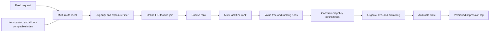

## Learning and publication loop

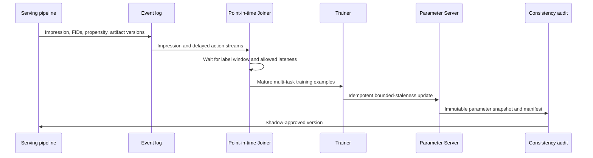

## One atomic publication manifest

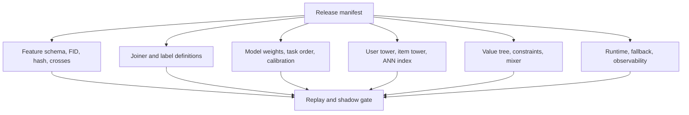

The repository includes a local end-to-end reference implementation of the intended sparse-feature and ranking boundaries:

```text
raw event
  -> feature registry (slot ownership + declared crosses)
  -> stable signature
  -> packed FID V1/V2
  -> one shared encoded batch
  -> XGBoost / Wide&Deep / DeepFM / user-item-context three-tower
  -> AUC + log loss
```

The online system continues from that model lab:

```text
catalog (1,200 items)
  -> Viking vector + popular + fresh recall (400 route hits)
  -> weighted recall merge + deduplication (300)
  -> eligibility and exposure filtering
  -> online FID feature join
  -> coarse rank (240)
  -> fine multi-objective prediction + value tree (240)
  -> boost/bury ranking rules
  -> COPP adapter / constrained policy selection (40)
  -> calibrated organic/live/ad mixed ranking (20)
```

See the [system design](docs/architecture/system-design.md) for contracts and evidence boundaries.

Production engineering and interview references:

- [Practical engineering](docs/interview/practical-engineering.md): Joiner, training examples, online PS, consistency, offline/online AUC, Feed growth, multi-objective learning, public industry references, Euclidean distance, Lagrangian constraints, and generative recommendation.
- [Recommendation data contracts](docs/interview/recommendation-data-contracts.md): retrieval/coarse/fine sample spaces, negative proposals, ESMM funnel labels, request-level attribution, and interview-ready English answers.
- [Common interview Q&A](docs/interview/common-qa.md): compact production and fundamentals questions with answer boundaries.

This lab reproduces the **public FID bit contract**, not a proprietary internal framework. The name "SEO" and its predefined feature-combination functions could not be identified from public evidence, so their semantics are not guessed here.

## What FID means

The public ByteDance Monolith implementation stores a slot and signature in one unsigned 64-bit value:

| Layout | Slot | Signature | Reserved |
|---|---:|---:|---:|
| V1 | 10 bits | 54 bits | 0 bits |
| V2 | 15 bits | 48 bits | 1 bit |

```text
FID V1 = (slot << 54) | (signature & (2^54 - 1))
FID V2 = (slot << 48) | (signature & (2^48 - 1))
```

The slot identifies the feature field. The signature identifies a value inside that field. A signature can come from a raw numeric ID or a stable hash; FID packing itself does not define the hash function.

V1 to V2 conversion preserves the slot but truncates the upper six signature bits. It is therefore not generally reversible. The implementation and tests are in `fid_lab/fid.py` and `tests/core/test_fid_lab.py`.

## Durable boundaries

- `fid_lab/fid.py` is the only owner of bit packing and stable signatures.
- `fid_lab/schema.py` is the only owner of slot assignment, feature groups, bucket sizes, and crosses.
- `fid_lab/data.py` creates and encodes every example once.
- `fid_lab/models.py` contains models only; models cannot reinterpret raw features.
- `fid_lab/experiment.py` owns the fixed split, training loop, and comparable metrics.

This preserves the main production invariant: offline training and online inference must use the same feature definitions, hash version, slot registry, cross semantics, and model artifact.

## Model evolution

| Stage | What it learns | Main limitation |
|---|---|---|
| XGBoost | Nonlinear rules over one-hot FID buckets | Sparse IDs generalize poorly; no learned embeddings |
| Wide&Deep | Memorized linear terms plus higher-order DNN patterns | Important crosses may still need explicit declaration |
| DeepFM | First-order terms, all second-order embedding interactions, and DNN interactions | Every pair receives the same FM interaction form; sequence intent is absent |
| Three-tower | Separate user, item, and context representations plus a ranking head | This lab's architecture is explicitly defined, not claimed as a universal named model |

`DeepFM` and `DeepFFM` are not synonyms. DeepFM shares one embedding per feature across pairwise interactions. FFM-style models use field-dependent embeddings, which cost substantially more parameters. Add DeepFFM only when field-aware interactions are a measured requirement, rather than treating it as the default successor.

The production suite now adds separate retrieval, coarse-rank, fine-rank,
sequence, multi-task, Joiner, and experiment boundaries. The original compact
models remain as teaching baselines; the evolution benchmark uses
DeepCTR-Torch rather than maintaining another local copy of its model zoo.

Start with the bilingual [system evolution review](docs/architecture/system-evolution-review.md)
for the complete strategy → algorithm → model → feature → sample → consistency
→ launch-review narrative.

The [execution and scale boundary](docs/architecture/execution-and-scale.md)
explains why the tensorized GPU path does not yet depend on Dagster, and names
the measurable conditions that justify a DAG. The latest [POI Detail Launch
Review](docs/launch-reviews/2026-08-24-poi-detail-request-ladder.md) closes the
remaining surface in the launch ledger without promoting a model that failed
safety or incremental-value gates.

The [POI distribution neural V4 Launch Review](docs/launch-reviews/2026-08-24-poi-distribution-neural-v4.md)
shows the full request-log → IPS/listwise training → coarse/fine/mix A/B →
combined release path. It includes the important result that W&D, DCNv2, and
MMoE beat Linear on offline AUC but fail the online LT gate, while the accepted
Linear coarse and fine stack produces positive pooled simulator lift.

The [request-level Retrieval V4 Launch Review](docs/launch-reviews/2026-08-24-request-retrieval-v4.md)
records the POI-only corpus failure, training-serving query skew, paired-estimator
repair, Two-Tower promotion, and Multi-interest rejection.

The [POI Posting / Supply V4 Launch Review](docs/launch-reviews/2026-08-24-poi-posting-neural-v4.md)
records repeated-creator panels, post-publication label maturity, creator-cluster
A/B, recall failures, Linear promotion, and the direct rejection of W&D and MMoE
despite their higher offline AUC.

## Run

```bash
git clone https://github.com/kleon1024/recsys-fid-system.git
cd recsys-fid-system
python3 -m venv .venv
source .venv/bin/activate
python -m pip install --upgrade pip
python -m pip install -e .
python -m fid_lab.check
```

The single acceptance command runs structural checks, public-document scanning,
the complete unit and integration suite, deterministic serving demos, the CI-sized model
ladder, and an A/B estimator calibration smoke. GPU scale runs are intentionally
separate because GitHub-hosted CI has no RTX 4090:

```bash
python3 -m fid_lab.experiment
python3 -m fid_lab.online.demo
python3 -m fid_lab.online.benchmark
python3 -m fid_lab.training.demo
python3 -m fid_lab.generative.demo
python3 -m fid_lab.evolution.evaluation.benchmark --profile ci
python3 -m fid_lab.evolution.cli.signal_diagnostic --impressions 1000000 --signal-version heterogeneous-nonlinear-v2
python3 -m fid_lab.evolution.cli.generative_demo
python3 -m fid_lab.evolution.cli.ab_demo
python3 -m fid_lab.simulation.cli --users 2000 --items 4000
python3 -m fid_lab.feed_loop.models.cli --users 3000 --items 4000 --ab-users 500 --epochs 10 --device cuda:0
python3 -m fid_lab.feed_loop.scale.tensor_cli --users 1000000 --steps 24 --device cuda:0
python3 -m fid_lab.feed_loop.scale.artifact.cli \
  --report reports/launches/2026-08-23-feed-xgb-guarded-v2-10k-gpu.json \
  --artifact-dir artifacts/models/stateful-v2 \
  --users 1000000 --steps 24 --device cuda:0
python3 -m fid_lab.feed_loop.scale.local_value_cli --users 1000000 --steps 24 --seeds 3 --device cuda:0
python3 -m fid_lab.feed_loop.scale.local_value_cli --users 10000000 --steps 24 --seeds 3 --intent-only --device cuda:0
python3 -m fid_lab.feed_loop.scale.queue_value_cli --users 1000000 --steps 24 --seeds 3 --device cuda:0
python3 -m fid_lab.feed_loop.experimentation.cascade_cli --users 1000000 --steps 24 --candidates 100 --seeds 3 --device cuda:0
python3 -m fid_lab.feed_loop.experimentation.reverse_holdout --users 1000000 --steps 48 --burn-in-steps 12 --seeds 3 --device cuda:0
python3 -m fid_lab.simulation.local.switchback_cli --cities 100 --periods 28 --users-per-city-period 10000 --calibration-runs 500
python3 -m fid_lab.feed_loop.scale.power_cli --users 1000000
python3 -m fid_lab.feed_loop.streaming.online_learning_cli --users 1000 --ab-users 1000
python3 -m fid_lab.launches.policy.cli --users 1000000 --device cuda:0
python3 -m fid_lab.launches.system.cli --users 1000000 --device cuda:0
python3 -m fid_lab.check
```

Regenerate the deterministic report figures from checked JSON authorities:

```bash
python -m pip install -r requirements-docs.txt
python3 -m fid_lab.reporting.charts
```

See [CONTRIBUTING.md](CONTRIBUTING.md) before changing contracts, reports, or
generated evidence. All checked-in business results are synthetic and must not
be represented as company-internal or production metrics.

Run one stage while studying it:

```bash
python3 -m fid_lab.experiment --models xgboost
python3 -m fid_lab.experiment --models wide_deep deepfm
python3 -m fid_lab.experiment --models three_tower
```

The generated data contains user and item latent effects plus country-category, category-device, and age-hour interactions. Model metrics are deterministic for the same seed, but they are reference evidence, not a production benchmark claim.

## Sources and evidence boundary

- [ByteDance Monolith](https://github.com/bytedance/monolith): public FID V1/V2 layout, `FeatureSlot`, and `FeatureColumn` implementation. The repository was archived in 2025, so it is useful as public design evidence rather than a current dependency.
- [Wide & Deep Learning](https://arxiv.org/abs/1606.07792): memorization plus generalization architecture.
- [DeepFM](https://arxiv.org/abs/1703.04247): shared embedding input for FM and deep components.
- [FAT-DeepFFM](https://arxiv.org/abs/1905.06336): evidence that DeepFFM is a field-aware branch, not another name for DeepFM.
- [Viking AI Search documentation](https://docs.byteplus.com/en/docs/viking-aisearch/Recommended_Input): public product boundary for recommendation input, recall strategies, merging, filtering, deduplication, reranking, and diversity.
- [SARDINE](https://github.com/naver/sardine): packaged Gymnasium runtime for dynamic recommendation environments.
- [KuaiSim](https://proceedings.neurips.cc/paper_files/paper/2023/hash/8c7f8f98f9a8f5650922dd4545254f28-Abstract.html): request-level, session-level, and cross-session simulator evaluation protocol.
- [KuaiRand](https://github.com/chongminggao/KuaiRand): public short-video logs with 12 feedback signals and random-intervention data; this repository checks in only hash-bound aggregate calibration evidence.
- [RecSim NG](https://google-research.github.io/recsim_ng/): modular probabilistic ecosystem simulation and vectorized accelerator execution.
- [TorchRec](https://meta-pytorch.org/torchrec/overview.html): mature jagged-feature, embedding-sharding, and distributed recommendation training primitives.
