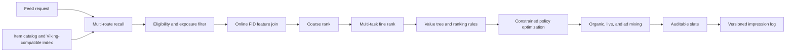
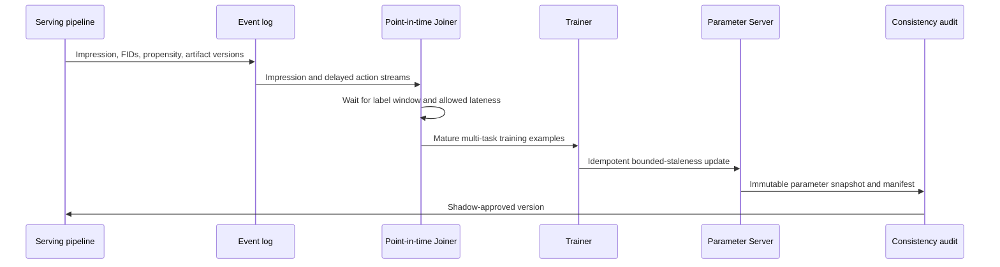
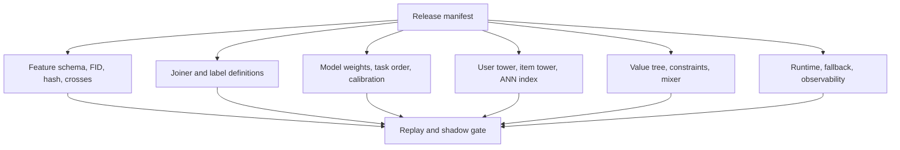

# Production Recommendation System Reference

[](https://github.com/kleon1024/recsys-fid-system/actions/workflows/ci.yml)

An executable reference architecture and public outsourcing RFP for an industrial Feed, search, and recommendation platform.

Public procurement package:

- [REQUEST_FOR_PROPOSAL.md](REQUEST_FOR_PROPOSAL.md): scope, delivery gates, acceptance criteria, security, commercial response, and vendor evaluation.
- [BIDDER_RESPONSE_TEMPLATE.md](BIDDER_RESPONSE_TEMPLATE.md): mandatory response format.
- [ARCHITECTURE_VISUALS.md](ARCHITECTURE_VISUALS.md): visual system atlas for technical and delivery review.

## Procurement status

| Item | Status |
|---|---|
| RFP | Public and open until an award or closure notice is posted |
| Delivery | Remote-first, milestone-gated outsourcing engagement |
| Scale response | Mandatory pricing for 100, 1,000, and 10,000 RPS tiers |
| Technical questions | Public `rfp-question` GitHub issue |
| Capability statement | Public `rfp-capability` GitHub issue |
| Commercial response | Private channel after capability review |
| Source license | Evaluation only until an explicit `LICENSE` or contract grant is added |

## Target architecture



## Learning and publication loop



## One atomic publication manifest



The repository includes a local end-to-end reference implementation of the intended sparse-feature and ranking boundaries:

```text
raw event
  -> feature registry (slot ownership + declared crosses)
  -> stable signature
  -> packed FID V1/V2
  -> one shared encoded batch
  -> XGBoost / Wide&Deep / DeepFM / user-item-context three-tower
  -> AUC + log loss
```

The online system continues from that model lab:

```text
catalog (1,200 items)
  -> Viking vector + popular + fresh recall (400 route hits)
  -> weighted recall merge + deduplication (300)
  -> eligibility and exposure filtering
  -> online FID feature join
  -> coarse rank (240)
  -> fine multi-objective prediction + value tree (240)
  -> boost/bury ranking rules
  -> COPP adapter / constrained policy selection (40)
  -> calibrated organic/live/ad mixed ranking (20)
```

See [SYSTEM_DESIGN.md](SYSTEM_DESIGN.md) for contracts and evidence boundaries.

Production engineering and interview references:

- [PRACTICAL_ENGINEERING.md](PRACTICAL_ENGINEERING.md): Joiner, training examples, online PS, consistency, offline/online AUC, Feed growth, multi-objective learning, X/ByteDance references, Euclidean distance, Lagrangian constraints, and generative recommendation.
- [COMMON_INTERVIEW_QA.md](COMMON_INTERVIEW_QA.md): 48 compact production and fundamentals questions with answer boundaries.

This lab reproduces the **public FID bit contract**, not a proprietary internal framework. The name "SEO" and its predefined feature-combination functions could not be identified from public evidence, so their semantics are not guessed here.

## What FID means

The public ByteDance Monolith implementation stores a slot and signature in one unsigned 64-bit value:

| Layout | Slot | Signature | Reserved |
|---|---:|---:|---:|
| V1 | 10 bits | 54 bits | 0 bits |
| V2 | 15 bits | 48 bits | 1 bit |

```text
FID V1 = (slot << 54) | (signature & (2^54 - 1))
FID V2 = (slot << 48) | (signature & (2^48 - 1))
```

The slot identifies the feature field. The signature identifies a value inside that field. A signature can come from a raw numeric ID or a stable hash; FID packing itself does not define the hash function.

V1 to V2 conversion preserves the slot but truncates the upper six signature bits. It is therefore not generally reversible. The implementation and tests are in `fid_lab/fid.py` and `tests/test_fid_lab.py`.

## Durable boundaries

- `fid_lab/fid.py` is the only owner of bit packing and stable signatures.
- `fid_lab/schema.py` is the only owner of slot assignment, feature groups, bucket sizes, and crosses.
- `fid_lab/data.py` creates and encodes every example once.
- `fid_lab/models.py` contains models only; models cannot reinterpret raw features.
- `fid_lab/experiment.py` owns the fixed split, training loop, and comparable metrics.

This preserves the main production invariant: offline training and online inference must use the same feature definitions, hash version, slot registry, cross semantics, and model artifact.

## Model evolution

| Stage | What it learns | Main limitation |
|---|---|---|
| XGBoost | Nonlinear rules over one-hot FID buckets | Sparse IDs generalize poorly; no learned embeddings |
| Wide&Deep | Memorized linear terms plus higher-order DNN patterns | Important crosses may still need explicit declaration |
| DeepFM | First-order terms, all second-order embedding interactions, and DNN interactions | Every pair receives the same FM interaction form; sequence intent is absent |
| Three-tower | Separate user, item, and context representations plus a ranking head | This lab's architecture is explicitly defined, not claimed as a universal named model |

`DeepFM` and `DeepFFM` are not synonyms. DeepFM shares one embedding per feature across pairwise interactions. FFM-style models use field-dependent embeddings, which cost substantially more parameters. Add DeepFFM only when field-aware interactions are a measured requirement, rather than treating it as the default successor.

This is a ranking lab, not a full recommendation platform. The next meaningful extensions would be behavior-sequence models (DIN/DIEN or Transformer), multi-task objectives (MMoE/PLE), and retrieval/index consistency. They should be added as separate stages only when the data contract includes histories, multiple labels, or an ANN index.

## Run

```bash
git clone https://github.com/kleon1024/recsys-fid-system.git
cd recsys-fid-system
python3 -m pip install -r requirements.txt
python3 -m unittest discover -s tests -v
python3 -m fid_lab.experiment
python3 -m fid_lab.online.demo
python3 -m fid_lab.online.benchmark
python3 -m fid_lab.training.demo
python3 -m fid_lab.generative.demo
python3 -m fid_lab.check
```

Run one stage while studying it:

```bash
python3 -m fid_lab.experiment --models xgboost
python3 -m fid_lab.experiment --models wide_deep deepfm
python3 -m fid_lab.experiment --models three_tower
```

The generated data contains user and item latent effects plus country-category, category-device, and age-hour interactions. Model metrics are deterministic for the same seed, but they are reference evidence, not a production benchmark claim.

## Sources and evidence boundary

- [ByteDance Monolith](https://github.com/bytedance/monolith): public FID V1/V2 layout, `FeatureSlot`, and `FeatureColumn` implementation. The repository was archived in 2025, so it is useful as public design evidence rather than a current dependency.
- [Wide & Deep Learning](https://arxiv.org/abs/1606.07792): memorization plus generalization architecture.
- [DeepFM](https://arxiv.org/abs/1703.04247): shared embedding input for FM and deep components.
- [FAT-DeepFFM](https://arxiv.org/abs/1905.06336): evidence that DeepFFM is a field-aware branch, not another name for DeepFM.
- [Viking AI Search documentation](https://docs.byteplus.com/en/docs/viking-aisearch/Recommended_Input): public product boundary for recommendation input, recall strategies, merging, filtering, deduplication, reranking, and diversity.
