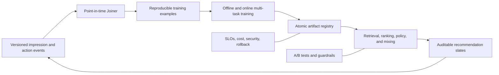
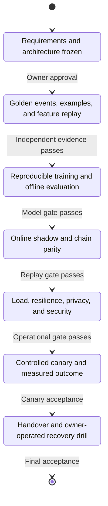

# Public Request for Proposal

## Production Feed, Search, and Recommendation Platform

| Field | Value |
|---|---|
| RFP owner | `kleon1024/recsys-fid-system` project owner |
| Status | Open until an award or closure notice is published |
| Issue date | 22 August 2026 |
| Procurement model | Public technical RFP; commercial details submitted privately after capability review |
| Delivery model | Remote-first, milestone-gated outsourcing engagement |
| Source repository | [kleon1024/recsys-fid-system](https://github.com/kleon1024/recsys-fid-system) |
| Questions | Open a GitHub issue labeled `rfp-question`; do not post confidential information |
| Proposal format | [Bidder response template](docs/procurement/bidder-response-template.md) |

## 1. Purpose

The owner seeks an engineering partner to turn the reference implementation in this repository into a production-grade recommendation platform supporting Feed, search, and personalized recommendation workloads.

The selected bidder will deliver an auditable data-to-decision system, not only a ranking model. The required boundary covers impression and action logging, point-in-time training examples, sparse and sequence features, distributed training, online parameter and model serving, retrieval, ranking, policy optimization, experimentation, observability, security, and operational handover.

This repository is the executable reference contract. It demonstrates intended invariants and failure handling at local scale. Bidders must not describe the simulator as production infrastructure.

## 2. Procurement principles

The engagement will be evaluated against four principles:

1. **One causal chain:** every online decision must be reconstructable from versioned events, features, models, indices, and policy configuration.
2. **Measurable acceptance:** completion requires executable evidence against frozen requirements, not screenshots or architecture prose.
3. **No proprietary contamination:** bidders must not contribute confidential employer code, internal documents, protected forum content, or unlicensed datasets.
4. **Owner operability:** the final system must be understandable, testable, deployable, and recoverable by the owner without continuing vendor dependence.

## 3. Target outcome



The platform must support classical discriminative recommendation first. Generative retrieval is an optional, separately gated workstream and must be benchmarked against strong ANN/two-tower baselines at equal latency, compute, and candidate budget.

## 4. Scope of work

### 4.1 Discovery and requirements freeze

The bidder shall:

- inspect the reference code and public evidence boundaries;
- identify the target cloud, region, data stores, traffic tier, privacy classification, retention policy, and operational ownership;
- produce a system context, threat model, cost model, dependency decision record, and migration plan;
- freeze measurable functional and non-functional requirements before production implementation;
- identify every assumption requiring owner approval.

No bidder may treat unconfirmed names such as proprietary `COPP`, `SEO`, or `Euclid` semantics as public specifications. The local adapter boundaries remain authoritative until the owner provides an approved contract.

### 4.2 Event and training-example platform

Required capabilities:

- versioned impression, candidate, decision, and action event schemas;
- globally unique and replay-safe event identity;
- event-time joins with watermarks, task-specific label windows, allowed lateness, and deduplication;
- point-in-time feature reconstruction without future leakage;
- negative-example maturity guarantees;
- logged propensity and ranking position;
- deterministic replay, lineage, backfill, and partition recovery;
- data-quality dashboards for delay, loss, duplication, unmatched actions, missing features, and label prevalence.

### 4.3 Feature and identity platform

Required capabilities:

- one governed slot and feature registry;
- FID V1/V2-compatible migration boundary where required;
- stable hash, cross, default, normalization, unit, and bucket versions;
- offline/online feature replay tests;
- sparse, dense, sequence, and item-content features;
- feature freshness and missingness monitoring by slice;
- safe deprecation and dual-read or dual-write migration.

### 4.4 Training and model platform

Required capabilities:

- reproducible temporal datasets and splits;
- XGBoost and neural ranking baselines;
- multi-task objectives for positive, consumption, and negative-feedback actions;
- calibration, GAUC, NDCG, Recall@K, and slice evaluation;
- distributed sparse embedding training or a justified alternative;
- online or nearline update path with idempotency and bounded staleness;
- immutable snapshots, model manifests, rollback, and retention;
- training cost, data freshness, convergence, and task-interference monitoring.

Bidders shall propose where Wide&Deep, DeepFM, DCN, sequence models, MMoE/PLE, or larger architectures are justified. Architecture names without a causal hypothesis and serving budget will not satisfy the requirement.

### 4.5 Online recommendation serving

Required stages:

- multi-route collaborative, semantic, fresh-item, and fallback recall;
- a Viking-compatible vector-retrieval interface or a justified production alternative;
- route attribution, deduplication, score calibration, and merge;
- eligibility, policy, safety, geographic, liveness, and exposure filtering;
- coarse ranking that preserves downstream value and coverage;
- multi-task fine ranking and calibrated value fusion;
- hard constraints separated from reversible score adjustments;
- diversity, fatigue, creator, item, and content-type policy;
- organic, live, ad, or other inventory mixing where applicable;
- full, bounded, and observable fallback behavior.

### 4.6 Chain consistency and publication

Every release must atomically bind:

```text
event and feature schema
FID, hash, cross, default, and normalization versions
Joiner and label definitions
model weights, task order, and calibration
user tower, item tower, corpus snapshot, and ANN index
value tree, constraints, ranking rules, and mixer
runtime image, region, feature store, and fallback policy
```

The bidder shall deliver feature replay, prediction shadow, candidate replay, slate replay, and manifest compatibility gates. The first divergent stage must be visible in traces and dashboards.

### 4.7 Evaluation and experimentation

Required capabilities:

- offline and online AUC/GAUC with identical mature-label replay;
- calibration and prevalence monitoring for every task head;
- retrieval and coarse/fine consistency evaluation;
- A/B assignment integrity and sample-ratio-mismatch detection;
- power and minimum-detectable-effect planning;
- mature primary metrics and short-term diagnostics;
- guardrails for negative feedback, latency, supply concentration, and safety;
- experiment interaction, novelty, carryover, and rollback handling.

### 4.8 Generative recommendation option

If proposed, the bidder shall separately price and gate:

- item encoder and Semantic-ID tokenizer or quantizer;
- codebook, collision, streaming insertion, and mapping lifecycle;
- valid-prefix constrained decoding and item-liveness enforcement;
- duplicate-beam and shared-prefix handling;
- multi-objective generation strategy;
- ANN baseline comparison at equal resource limits;
- tokenizer, model, mapping, filter, and rollback atomicity.

An LLM-generated explanation feature does not satisfy the generative-retrieval scope.

### 4.9 Security, privacy, and operations

Required deliverables:

- threat model and data-flow inventory;
- least-privilege identity and secret management;
- encryption in transit and at rest;
- environment separation and production change control;
- dependency and container scanning;
- audit logs for data, model, configuration, and deployment changes;
- privacy deletion and retention workflows;
- SLOs, alerts, runbooks, capacity planning, backup, restore, and disaster recovery;
- regional placement aligned with authoritative data residency.

## 5. Scale and performance response

Final target scale will be selected during Gate G0. Every proposal must price and describe three reference tiers:

| Tier | Sustained request rate | Required response |
|---|---:|---|
| A | 100 requests/second | architecture, monthly cost, p50/p95/p99 latency |
| B | 1,000 requests/second | architecture, monthly cost, p50/p95/p99 latency |
| C | 10,000 requests/second | architecture, monthly cost, p50/p95/p99 latency |

For each tier, state assumptions for item count, active users, candidate counts, feature volume, event throughput, update freshness, availability, region, redundancy, and traffic shape. Unsupported headline latency claims will not be evaluated.

The selected tier’s load profile and SLO become frozen acceptance inputs at G0. Bidders may recommend different thresholds with measured justification.

## 6. Required deliverables

The awarded bidder shall deliver:

1. architecture and decision records;
2. versioned event, feature, model, and API contracts;
3. production source code and tests;
4. infrastructure as code and environment manifests;
5. deterministic local and CI acceptance commands;
6. data-quality, model-quality, experiment, cost, and service dashboards;
7. threat model, security evidence, and dependency inventory;
8. load, chaos, backup, restore, and rollback evidence;
9. runbooks, on-call procedures, and incident templates;
10. operator and developer documentation;
11. recorded knowledge-transfer sessions;
12. final source, infrastructure, artifact, and credential ownership handover.

## 7. Delivery gates and acceptance



### G0: Requirements and architecture

Acceptance evidence:

- approved requirements and assumptions;
- selected traffic tier and regional topology;
- threat, cost, dependency, and migration decisions;
- frozen gate commands and artifact registry.

### G1: Golden data and contracts

Acceptance evidence:

- versioned schemas and sample data;
- deterministic Joiner replay;
- no premature negatives or future leakage;
- offline/online FID and feature parity;
- backfill and duplicate-event tests.

### G2: Training and offline evaluation

Acceptance evidence:

- reproducible baseline and candidate models;
- temporal evaluation and slices;
- task calibration and interference analysis;
- cost and convergence report;
- immutable manifest and rollback artifact.

### G3: Shadow serving and consistency

Acceptance evidence:

- feature, prediction, candidate, and slate replay;
- user-tower/item-index compatibility enforcement;
- explained candidate attrition at every stage;
- zero unresolved manifest mismatches;
- bounded fallback behavior.

### G4: Load, resilience, and security

Acceptance evidence:

- selected-tier load test with p50/p95/p99 and saturation point;
- fault injection for PS, index, feature store, stream, and model failures;
- backup and restore drill;
- privacy deletion test;
- no unresolved critical or high security findings.

### G5: Controlled canary

Acceptance evidence:

- approved experiment plan and SRM check;
- live observability and automatic rollback;
- primary, diagnostic, and guardrail maturity;
- owner-authorized traffic expansion only.

### G6: Handover

Acceptance evidence:

- owner deploys from a clean environment;
- owner performs rollback and recovery without vendor intervention;
- documentation, source, infrastructure, dashboards, accounts, and credentials transferred;
- open risks and operational costs accepted in writing.

Passing an earlier gate does not waive a later failure. A gate is accepted only by the owner against the exact frozen state.

## 8. Commercial response

Bidders must provide:

- fixed-price and time-and-material alternatives where possible;
- price by gate, role, and traffic tier;
- third-party infrastructure and license costs separated from labor;
- payment schedule tied to accepted gates, not elapsed time;
- warranty and post-acceptance support terms;
- change-request rates and scope-control process;
- proposed start date, duration, staffing, and availability;
- assumptions that could change price or schedule.

Do not publish confidential pricing in a GitHub issue. The owner will provide a private submission channel after initial capability review.

## 9. Bidder qualifications

Required evidence:

- at least one production recommendation, search, ads, or Feed system delivered at a comparable tier;
- named lead engineer with direct ownership of data, model, and serving boundaries;
- demonstrated event-time stream processing and point-in-time training data experience;
- demonstrated model serving, retrieval, observability, and rollback experience;
- security and privacy delivery capability;
- references or redacted acceptance evidence that can be verified.

Large company names, model names, and architecture diagrams without personal ownership evidence are insufficient.

## 10. Evaluation rubric

| Dimension | Weight | Evidence expected |
|---|---:|---|
| Technical architecture and causal correctness | 25% | contracts, failure analysis, trade-offs |
| Delivery plan and measurable acceptance | 20% | gates, commands, evidence ownership |
| Relevant production experience | 15% | comparable systems and named ownership |
| Security, privacy, and reliability | 15% | threat model, controls, recovery evidence |
| Operability and knowledge transfer | 10% | runbooks, owner drills, documentation |
| Commercial value and cost transparency | 10% | itemized pricing and infrastructure cost |
| Generative recommendation option | 5% | benchmarked optional design, if proposed |

The owner may request a paid, bounded technical discovery before final award. No bidder will be asked to perform substantial unpaid implementation work.

## 11. Intellectual property and open-source policy

The awarded contract must state ownership explicitly. At minimum:

- newly commissioned source, configuration, infrastructure, documentation, tests, and operational artifacts transfer to the owner upon payment;
- bidder background IP is declared before use and licensed sufficiently for operation, modification, and transfer;
- all open-source dependencies include license and provenance records;
- copyleft, non-commercial, source-available, model-weight, dataset, and API terms are separately disclosed;
- no confidential third-party code, data, prompts, schemas, or documents may enter the project;
- generated outputs remain subject to human review and repository governance.

Repository source is available under the MIT License. Bidder submissions,
third-party assets, datasets, models, infrastructure and background IP retain
their separately declared licenses and commercial terms; the MIT License does
not override those rights.

## 12. Public repository boundary

The public repository may contain architecture, synthetic data, tests, benchmarks, and public references. It must not contain:

- secrets, credentials, production endpoints, or private infrastructure identifiers;
- personal, customer, employee, or production event data;
- confidential internal platform semantics;
- protected interview-post text or unlicensed documentation;
- vendor confidential pricing or security-sensitive implementation details.

Production access and private artifacts will be provided only after contract, identity, and access controls are complete.

## 13. Proposal instructions

1. Fork or review the repository without submitting implementation work.
2. Complete the [bidder response template](docs/procurement/bidder-response-template.md).
3. Open a concise `rfp-capability` GitHub issue containing only public capability information and a link to public evidence.
4. Request the private commercial submission channel.
5. Identify every exception, assumption, and owner decision required.

Submissions that claim to reproduce proprietary ByteDance, X, or other company internals without licensed evidence will be rejected.
