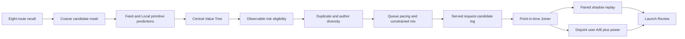

# Feed content governance / Feed 内容治理

This subsystem separates four responsibilities that are often incorrectly
collapsed into one score: model relevance, content eligibility, reversible
distribution policy, and user-value measurement. It is an original simulator
implementation informed by public product descriptions and open-source code;
it does not claim access to TikTok or X production internals.

本子系统把四个经常被错误合并的责任拆开：模型相关性、内容准入、可回滚分发策略、
用户价值度量。实现只参考公开产品资料与开源代码，不声称复刻 TikTok 或 X 内部系统。

## Public references / 公开参考

TikTok publicly describes For You Feed eligibility separately from ranking,
limits recommendation of some content without necessarily removing it from the
platform, interrupts repetitive patterns, and offers user controls such as Not
Interested, feed refresh, topic management, and keyword filters. These are
product and policy disclosures, not source code:
[FYF eligibility standards](https://www.tiktok.com/community-guidelines/en/fyf-standards)
and [recommendation controls](https://newsroom.tiktok.com/more-ways-to-discover-new-content-and-creators-you-love?lang=en).

X publishes a current recommendation repository in which ranking and
visibility are separate modules. Phoenix predicts multiple positive, attention,
follow, and negative actions; the home mixer also applies filters and author
diversity before serving. This repository borrows the separation of concerns,
not the implementation:
[xAI x-algorithm](https://github.com/xai-org/x-algorithm). The older
[Twitter algorithm repository](https://github.com/twitter/the-algorithm)
remains useful for feature hydration, fatigue, deduplication, visibility, and
multi-module mixing. [ByteDance Monolith](https://github.com/bytedance/monolith)
is relevant to collisionless embeddings and realtime training/serving, but not
an authority for governance policy.

## Invariants / 不变量

- Hidden integrity risk and hidden experience quality belong to the behavior
  world. Serving sees only a noisy versioned risk prediction.
- Governance may select only from candidates retained by retrieval, coarse
  ranking, eligibility, and the Feed guard. Fallback cannot resurrect an
  upstream-rejected item.
- A risk reduction is a manipulation check, not proof of user value. Platform
  LT, stay, quality view, and negative feedback remain launch gates.
- Content filtering, diversity, POI pacing, and creator exploration are
  independently configurable experiments. A bundle cannot hide a harmful
  component.
- POI load is a Local business trade-off. It is not content safety. The default
  governance profile therefore leaves POI pacing and creator boost disabled.
- Every request records predicted risk, repeated cluster, repeated author, POI
  selection, and governance retention. Hidden DGP values never enter online
  gates.
- Active-day LT has one mature terminal observation opportunity per user.
  Within-session leave-and-return events are runtime state, not active days.

## Fast layer versus learned layer / 快策略与长期模型

The fast layer contains only reversible, observable controls: high-confidence
eligibility, near-duplicate suppression, repeated-author decay, bounded creator
exploration, and queue pacing. It is cheap enough for a configuration-driven
experiment and rollback.

The learned layer owns semantic originality, trust, content understanding,
long-sequence fatigue, and calibrated multi-objective value. Those signals
require labels, point-in-time features, shadow replay, and model releases. A
strong business request can change experiment priority; it cannot turn a proxy
score into platform LT or bypass a guardrail.

## Failure diagnosis / 故障定位

| Symptom | Owner | Diagnostic |
|---|---|---|
| Risk falls, LT does not move | policy or DGP | coverage, calibration, threshold dose, paired behavior deltas |
| Duplicates fall, stay rises, LT falls | value/retention | primitive heads, terminal retention, relevance opportunity cost |
| POI value falls | queue policy | selected POI rate, Local primitives, business-specific holdout |
| Eligible fraction exceeds one | measurement | inactive exposure leakage and denominator parity |
| Empty post-filter list | serving | fallback rate and upstream-mask preservation |
| Paired replay passes, A/B is inconclusive | experimentation | disjoint-cell SE, CUPED support, MDE and required users |
| Creator boost has no effect | supply loop | creator need, publication, retention, and switchback exposure |

The executable evidence is recorded in
[L-GOVERNANCE-001](../launch-reviews/2026-08-24-content-governance-v5.md).
