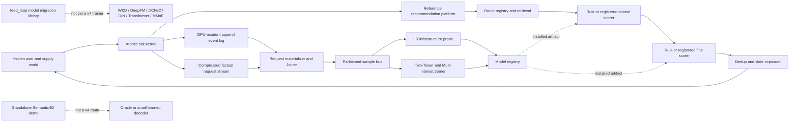

# Digital Twin v4 Current Architecture Audit

Status: executable evidence snapshot, not a second backlog authority

Date: 2026-08-26

Owner: [v4 execution plan](../plans/digital-twin-v4-execution-plan.md)

Scope: synthetic Feed and multi-surface engineering reference. Nothing in this
document is evidence about a proprietary production system.

## 1. Executive finding

The repository has most required components, but they do not yet form one
continuous recommendation authority. The current blocker is not raw GPU
throughput. It is the combination of three mismatches:

1. The factual runtime uses the formula response path while documentation records
   a NeuralSCM promotion from shadow evidence.
2. World initialization creates a tick-zero registration/session surge followed
   by rapid traffic depletion, so short experiments are powered by startup bias.
3. Ranking and generative models live mainly in legacy or standalone execution
   paths and cannot complete the same request-data -> train -> shadow -> factual
   A/B transaction as the current v4 retrieval path.

Until those are corrected, more model complexity produces activity but not a
credible model Launch Review.

## 2. Current executable topology



The `AssetGraph` describes the intended topology but is not an execution engine.
Several declared assets still have no single materializer, retry boundary or
content-addressed runtime transaction.

## 3. Evidence collected in this audit

### 3.1 Remote GPU state

The Mac Tailscale client reports host `ding` offline for 17 hours. ICMP and TCP
22 time out. This does not prove WSL or the RTX 4090 crashed; it proves only that
the WSL Tailscale/SSH endpoint is currently unreachable from the Mac. F-R00
therefore remains unverified until its immutable journal and branch head can be
read.

### 3.2 Fixed-profile performance

The accepted standard Random tick previously rendered 65,063 requests in 1.04
seconds with 7.687 GiB peak VRAM. Request partitions fell from about 1.735 GiB
to 100.5 MiB per tick. Initialization checkpoint size fell from 7.6 GiB to 3.1
GiB. These prove a viable short-tick kernel, not a long-running world.

### 3.3 Elapsed-time growth and traffic stationarity

A fresh 10K-user/100K-item, 16-tick CPU audit using the same profile ratios found:

| Tick | Rendered requests | Retained event bytes |
|---:|---:|---:|
| 0 | 6,500 | 28.3 MB |
| 3 | 4,698 | 91.5 MB |
| 7 | 2,176 | 140.6 MB |
| 11 | 608 | 158.9 MB |
| 15 | 108 | 163.2 MB |

Requests fell 98.3% in 16 ticks. The direct cause is that 65% of users have
`signup_time=0`, are initially unregistered, and registration unconditionally
opens a session. When sessions end, return delay is expressed in day-scale
ticks. This produces a synchronized startup cohort rather than a stationary
population. The four-tick experiment power assumption is therefore invalid.

## 4. Correctness gaps

### 4.1 Response-authority mismatch

`BehavioralSCMResponseAuthority` and `FormulaResponseAuthority` both call the
same formula event generator. `NeuralFeedResponseAuthority` exists and passed a
shadow review, but `_build_kernel` does not load it. The public repository does
not contain the frozen weights, so a factual runtime cannot reproduce the
documented promotion.

Required invariant:

```text
invariant tests may choose Formula explicitly
factual quality LRs must name and hash a response artifact explicitly
missing or incompatible artifacts fail closed
support fallback is counted and cannot be silent
```

The promoted NeuralSCM also lacks identified support for session exit, return,
retention and non-Feed outcomes. It can own immediate supported Feed response
only; calendar retention and business worlds remain separate synthetic
authorities.

### 4.2 Baseline contamination

The former Random baseline used random candidates but still applied semantic,
geo, counter and sequence rule scores. Commit `8aa4713` corrected new runtime
initialization to random retrieval plus randomized order. Existing checkpoints
retain the old policy and cannot establish F-R00.

### 4.3 Non-stationary population bootstrap

Existing users and future signups are represented by one registration mechanism.
The world needs an equilibrium initialization authority:

- existing users begin registered with dispersed next-arrival state;
- future signups alone emit registration events;
- a burn-in branch reaches stable hourly/weekday/locale traffic before A/A;
- experiment duration follows achieved MDE and unique triggered traffic rather
  than a startup surge;
- restart and request-order invariance remain exact.

### 4.4 Point-in-time ambiguity

Request partitions retain point-in-time request context, which is correct. The
materializer also attaches the final restored projection to each output
partition. That projection must remain diagnostic-only; no trainer or Joiner may
read it as request-time state. The contract should remove or explicitly mark it
as end-of-window state.

## 5. Scale and state-management gaps

### 5.1 Event authority grows with elapsed time

`ObservableEventLog` retains every `AppEventBatch` and exact event ID tensor in
process memory on the producer device. Checkpoints enumerate every retained
event batch again. `request_materialization.py` then concatenates all events
before filtering requests. This is unsuitable for a 96-tick day or continuous
training.

Target ownership:

```text
immutable compressed event partitions on disk
+ bounded CPU hot window for allowed lateness and idempotency
+ cumulative content manifest and watermark
+ predicate-pushed request/time reads
```

GPU contains only the current request microbatch and online state. Historical
events never remain in VRAM.

### 5.2 Monolithic tick transaction

The kernel renders one experiment cell at a time for all assigned requests,
then concatenates full traces and response events. Neural inference alone has a
microbatch, but retrieval, feature encoding, ranking, trace capture and sample
publication do not share one bounded request-batch contract.

The target is bounded compute with one factual commit:

```text
schedule and assign once
-> render/respond request microbatches with request-keyed randomness
-> stage trace/event partitions
-> validate closure
-> commit hidden world, projection, stream and checkpoint once
```

Microbatch size must not change assignments, slates, response draws or next
world state.

### 5.3 Full checkpoints are not generational

Streaming writes removed the temporary full-object memory copy, but each launch
still writes a raw full world/platform tensor state plus retained event objects.
External compression can reduce disk bytes but not restore memory.

The durable design is a compressed full base plus incremental generations for
changed user, item, graph, delayed-event and learning-cursor partitions. Branch
garbage collection retains every object reachable from a live ref. Periodic
compaction creates a new full base after a measured number of generations.

### 5.4 Request evidence has no retention tier

At about 100.5 MiB per standard tick, one 96-tick day is about 9.6 GiB before
full-flow analytical tables and model datasets. Continuous simulation needs hot
request evidence, compact training examples and archived audit evidence as
separate retention tiers with content-bound lineage.

## 6. Learning and experiment gaps

The v4 path currently proves sample-bus mechanics with a small LR probe and has
an observable Two-Tower/Multi-interest implementation. It does not yet provide
one trainer family for LR, XGBoost, W&D, DeepFM, DCNv2, DIN, Transformer, MMoE
and PLE over the same v4 request partitions.

The retained `feed_loop/scale/model_ladder` implementations are useful model
code, but their datasets, reports and promotion decisions are not v4 evidence.
The duplicate `simulation/twin` runtime has been deleted. Retained models must move
behind these common interfaces:

```text
ModelTrainer.fit(request partitions, frozen feature manifest)
ModelArtifact.score(exact serving tensors)
ShadowEvaluator.compare(active, candidate, frozen requests)
LaunchReview.run(active checkpoint, candidate checkpoint)
```

Further gaps:

- pairwise/listwise losses are not wired into the factual ranker ladder;
- the current serving probe scores only the `long_view` head;
- calibration, Value Tree and mixer are not one accepted v4 serving authority;
- active/candidate lanes do not yet train continuously during factual LRs;
- shared training-data interference and data-diverted experiments remain design
  text rather than executable assignment;
- long-term metrics cannot be trusted until the calendar reaches stationarity.

## 7. Generative recommendation status

Current capability is research scaffolding, not an integrated generative route.

| Component | Current state | Blocking gap |
|---|---|---|
| Semantic IDs | sklearn residual K-Means plus collision suffix | million-item GPU build, version migration, churn and new-item assignment |
| Constrained decoding | valid-prefix API exists | trie operations scan all item codes and are not serving-scale |
| Learned decoder | small Transformer conditioned on one query vector | factual sequence query, batching, time split, masks, checkpoint and calibration |
| Session generation | post-hoc greedy author/category caps | not an autoregressive session model; no slate likelihood or feedback training |
| Platform integration | none | route registry, provenance, eligibility, RRF, trace and fallback |
| Evaluation | standalone tests/demo | equal corpus/Top-K/latency Two-Tower comparison and factual A/B |

The correct path is incremental:

1. Build versioned Semantic IDs from the same active Feed corpus and content
   embeddings; publish codebook, item mapping, collisions and churn.
2. Train an autoregressive decoder from factual point-in-time user sequences to
   positive item codes with constrained batched decoding.
3. Register it as a seventh retrieval route. Preserve ANN, Graph, Popular, Hot,
   Fresh, Cold-start and Evergreen fallbacks.
4. Compare against Two-Tower at identical corpus, Top-K and latency budget;
   report valid-item rate, Recall/NDCG, novelty, duplicates, cold-item coverage,
   beam latency and codebook update cost.
5. Only after route-level value is established, experiment with a true
   session-wise decoder and list constraints. Do not label the current greedy
   selector OneRec-style generation.

## 8. Ordered remediation

The execution-plan and launch-ladder remain the only backlog authority. This
audit establishes the order:

```text
S-AUTH00 explicit factual response authority
-> S-WORLD00 stationary population and powered A/A
-> S-EVENT00 disk event authority and bounded hot window
-> S-MICRO00 atomic request microbatch
-> S-CKPT00 generational checkpoint
-> S-LONG00 96-tick soak
-> corrected A/A -> F-R00 Random -> F-R01 Popular
-> v4 retrieval/fine/coarse model ladders
-> calibration/VT/mixer/cadence
-> Semantic-ID generative route
-> session-wise generation research
```

Multi-business expansion remains behind a credible core Feed control. Search,
Ads and Commerce implementations may retain focused tests, but they cannot
advance the main factual world until the shared runtime gates pass.

## 9. Acceptance boundary

The simulator becomes a credible continuous LR environment only when all of the
following are true:

- one explicit response authority and artifact hash appears in every checkpoint;
- seven-day traffic is stationary conditional on hour, weekday, locale and
  cohort, with no initialization surge used for power;
- RAM/VRAM do not grow with elapsed ticks and one 96-tick day uses no swap;
- checkpoint restart produces the exact next factual tick;
- every model consumes the same request authority and exact serving features;
- shadow proves an actual Top-K delta before A/B;
- A/B sample size and duration are derived from achieved variance/MDE;
- accepted changes alone advance the active policy and future training stream;
- generative retrieval is evaluated as one equal-budget route, not a demo.
