# Recommendation Digital Twin v4 — 全链路重构设计

Status: design authority; implementation is not complete.

本文件是后续模拟器重构的唯一架构依据。当前 `simulation/twin` v2/v3 只保留为
迁移输入和历史工程证据，不再通过局部修补继续扩展。任何新代码必须指向本文定义的
边界、事件语义、DAG 节点和验收项。

### 当前实现状态（2026-08-24）

已经落地：

- `AppEventBatch v2`、public catalog、hidden user/catalog truth 的物理边界。
- 请求打开后执行稳定 user/request 分桶；支持 eligibility、部分流量 ramp、default active
  policy 和逐请求 assignment probability。
- 同一 event-time 内按 policy 做无副作用 GPU batching，统一事实提交；cell 执行顺序不会
  改变用户状态或事件日志。
- Feed、Search、Commerce、Live、Local、Posting 的 examination、outside option、行为级联、
  dwell、session leave 和 cross-session return 用户世界。
- Creator 根据事实曝光、互动和负反馈调整投稿动机并发布 reserved item；merchant 根据订单
  消耗和可靠性回补库存；advertiser 根据广告曝光消耗预算并产生 pacing bid。
- 曝光与实验 propensity、append-only tensor idempotency index、事件到事实 successor 的直接
  DAG 依赖。release decision 只决定未来 active policy，不能阻塞已经发生的事实行为。
- DETAIL→ORDER→PAYMENT→REFUND 与 ad click→Pixel 使用 event-time pending queue；行为发生
  时间和平台 ingest 时间分离，重复 schedule 在 acknowledge 前保持幂等。
- Point-in-time platform projection 只消费已交付事件，维护用户行为 counter、surface
  counter、ring sequence、item/creator counter、publish/inventory/bid 状态和双 watermark。
- RequestCandidateTrace 强制 coarse⊆recall、fine⊆coarse、exposed⊆fine；Recall、Coarse、
  Fine 三套样本由同一 watermark-aware Joiner 生成，但保留不同的观测边界。未曝光候选
  只能携带 route/sampling probability/teacher score，不能伪造行为负标签。
- RTX 4090 已验证 500K 用户、2M item、16M candidate 的单 event-time 微批；报告见
  `reports/benchmarks/2026-08-24-digital-twin-v4-world-kernel-4090.json`。

尚未落地：真实多路召回与新模型 ladder。Request-level trace 和 Joiner contract 已落地，
但当前 throughput platform 尚未产生真实 recall/coarse/fine trace，因此它还不能作为模型
训练 authority。当前证据只证明因果边界、用户/供给行为、迟到与样本语义，不证明推荐质量
或业务增量。

## 1. 决策

当前系统已经证明 GPU tensor execution、多 surface 状态、request trace、连续训练和
mixed-world A/B 可以跑通，但尚未证明模型收益可信。问题不是单一 DGP 公式，而是
hidden world、platform state、样本语义、score composition、共享供给和实验估计之间
缺少一个可执行的因果边界。

v4 采用以下结构：

```text
independent hidden ecosystem
→ typed observable events
→ append-only event log
→ point-in-time platform projections
→ retrieval / coarse / fine / mix
→ rendered slate with logged propensities
→ hidden examination / action / lifecycle transitions
→ atomic event commit
→ sample DAG / training / shadow / A/B
→ only factual mixed-world events enter later windows
```

核心 invariant：推荐系统永远不能读取用户或供给的 hidden state；hidden world 永远
不能读取 rank score、candidate feature、experiment result 或 platform estimate。两边
只能通过带时间戳的 command/event contract 交互。

## 2. 当前结论

2026-08-24 的 causal-lineage ladder 不能作为模型 leaderboard 或上线证据。它暴露了
问题，但不回答 LR、W&D、DeepFM、DCNv2 或 MMoE 谁最好。

当前可信证据只有：

- 旧的 `0.99` 类 AUC 来自 oracle proxy / sample coupling，已经失效。
- 隔离初始化状态后，LR long-view AUC 降到约 `0.62`，说明直接泄漏有所下降。
- `+2%` 到 `+7%` synthetic LT 仍不可信，因为模型 score 和 rule/VT score 未对齐，
  不同模型还使用不同 blend weight。
- continuous ladder 中每轮 world 和训练窗口不同，不能横向排序模型。
- DeepFM loss 和 calibration 明显异常，不能解释为模型优越。
- 所有历史 v1/v2/v3 report 继续作为 throughput、determinism 或 failure evidence；未经
  v4 gate 的数值不得称为模型增量。

## 3. 全链路 failure audit

### P0：会直接改变模型结论或 A/B 结论

| ID | 当前问题 | 代码证据 | 后果 | v4 owner |
|---|---|---|---|---|
| P0-01 | 初始 `observed_interest` 曾由 hidden `long_interest` 加噪生成 | `twin/state.py` 历史实现 | LR 获得 oracle proxy | World bootstrap |
| P0-02 | 日更 `quality/risk` 仍直接读取 `true_quality/true_risk` | `world/supply.py::advance_supply_day` | 初始化隔离后 oracle 会重新进入 platform | Supply world + feature projection |
| P0-03 | 17 个任务曾对同一 user/item 共用一个随机 draw | `environment/response.py` 历史 task sampling | 无关任务被人为排序，multi-task 退化 | Behavior SCM RNG |
| P0-04 | hidden interest/intent 曾对 inactive 用户更新 | `environment/response.py::advance_hidden_state` | 未使用 App 的用户也被策略改变 | User transition |
| P0-05 | hidden world 使用 platform `cold_start_confidence` | `environment/response.py`, `environment/lifecycle.py` | DGP 与 serving feature 直接耦合 | User SCM |
| P0-06 | label maturity 由 selected-item task mask 控制 | `training/materialize.py` | 其他曝光候选的任务空间被错误 censor | Label joiner |
| P0-07 | exactly-one hidden choice 决定所有非 selected 曝光为零；choice 又近似线性使用 affinity/quality/risk | `environment/response.py::_choose_item`, `training/materialize.py` | LR 主要拟合 simulator choice rule，而非真实行为 | Examination + action SCM |
| P0-08 | learned score 与 rule score 做 raw convex blend | `serving/surfaces.py` 历史 `_rank_scores` | 模型替换同时改变 relevance/VT 相对系数，产生伪 A/B lift | Score composition |
| P0-09 | negative gate 比较累计次数却使用固定绝对阈值 | `experimentation/campaign.py` 历史 gate | measurement window 改变会改变 launch decision | Metric registry |
| P0-10 | mixed A/B 固定先跑 control 再跑 treatment，control 立即修改共享 `ad_spend` | `experimentation/mixed.py`, `experimentation/runtime.py` | treatment 同 tick 看到不同市场状态，产生 arm-order bias | Atomic experiment kernel |
| P0-11 | platform、environment、supply 直接互相修改同一 dataclass | `environment/lifecycle.py`, `environment/runtime.py`, `world/supply.py` | import isolation 不能保证信息隔离或事件完整性 | Event exchange |
| P0-12 | pooled AUC 可通过识别 surface/kind/base-rate 获得，而不是同请求排序 | `training/ranker.py::_offline_metrics` | “AUC 上升”不能证明 Top-K 改善 | Evaluation |

### P1：系统能运行，但模型演进结果会被系统性偏置

| ID | 当前问题 | 后果 |
|---|---|---|
| P1-01 | 六个 recall route 都由同一个 ID hash 生成随机 corpus slice | Geo/Graph/ANN/Fresh/Popular 只是打分标签，不是真实召回 |
| P1-02 | 非 Feed surface 没有 position examination、outside option、多点击或 abandonment | slate/listwise 反馈过于理想化 |
| P1-03 | guessed `1/log2(position+2)` 被当成 examination propensity | IPS correction 没有对应真实 logging probability |
| P1-04 | 65K request window 训练约 3.4M sparse buckets | W&D/DeepFM/DCNv2 被结构性欠训练，LR 获得不公平优势 |
| P1-05 | 所有 architecture 共用 epoch、learning rate、regularization | 不是同预算调参，也不是公平模型比较 |
| P1-06 | DeepCTR adapter 为每个 architecture 构造未使用的 FM/Cross/DNN | 显存、参数量和 optimizer state 虚高；DeepFM 数值不稳定 |
| P1-07 | MMoE 只使用 dense tensor，已记录 sequence 没有进入模型 | “advanced model”名称和真实能力不一致 |
| P1-08 | 17 task raw probabilities 未经 per-task calibration 就进入统一 value | base-rate 和 loss scale 污染 value composition |
| P1-09 | 只报 user GAUC，不报 request GAUC 和 per-surface GAUC | 无法判断同一次请求内是否排对 |
| P1-10 | continuous learning 与 frozen benchmark 混为一体 | 每个模型面对不同 world、sample 和 blend weight |
| P1-11 | user/item FID 可记忆 counter-RNG 和固定 ID 结构 | 同 ID test 看似提升，cold-user/item 泛化可能失败 |
| P1-12 | hidden MMoE 是随机权重而非真实数据校准模型 | 非线性不等于真实性，任务相关性和 marginal 可任意 |
| P1-13 | task cascade 由独立 BCE 训练，未保证 probability consistency | 可能出现下游概率高于上游概率 |
| P1-14 | delayed label 只是 maturity mask，没有真正的 late-event delivery/attribution | 无法验证 joiner 迟到、撤单、Pixel 丢失和回填 |

### P2：扩展到真实多业务前必须解决

| ID | 当前问题 |
|---|---|
| P2-01 | creator motivation 放在 platform catalog，而不是 hidden creator state |
| P2-02 | 新供给覆盖旧 slot 时没有原子更新 topic、embedding、kind、country、index version |
| P2-03 | FID `hour` 使用 global step，不是用户 local hour |
| P2-04 | registry 长期保留 GPU model，连续实验峰值接近 24GB |
| P2-05 | Search query、session arrival、registration 由 environment 直接写 platform state，没有事件 |
| P2-06 | Local 只有 country/region，没有距离、出行半径、营业状态延迟、开环 Pixel attribution |
| P2-07 | Commerce 没有 shelf→detail→submit→order→payment/refund 的真实事件链 |
| P2-08 | Ads 没有 auction、budget competition、conversion delay、market-level interference |
| P2-09 | Posting 没有 creator-randomized experiment、内容生产成本和分发后的 creator retention |
| P2-10 | synthetic LT 是固定本地公式，没有版本化 exchange-rate authority、MDE 和 sensitivity analysis |

## 4. 为什么当前 LR 仍可能显得强

LR 强并不等价于 hidden feature 仍被直接读取。当前还有四种更隐蔽的捷径：

1. `observed_affinity`、`realtime_affinity`、`price_match`、`trend`、
   `query_match` 已经是人工计算后的交叉特征。LR 不需要自己学习 user-item interaction。
2. hidden choice 使用相似的 affinity/quality/risk 线性效用，而 fine labels 又主要由该
   choice 生成。模型与 DGP 共享函数族。
3. pooled AUC 可以识别 surface 和 kind 的 base rate，不要求模型改善 request 内排序。
4. sparse deep model 的参数/样本比严重失衡，并且没有 architecture-specific tuning。

v4 不会人为设计成“M​​MoE 必须赢”。验收目标是：当 hidden world 确实包含候选相关
序列、非线性交叉、多任务异质性时，有能力的模型应在 unseen DGP family 和 request
metrics 上稳定胜出；若 LR 仍胜出，系统必须能证明是数据、延迟或成本使其成为真正的
Pareto choice，而不是 simulator shortcut。

## 5. 目标架构

```mermaid
flowchart LR
    Exogenous[Exogenous world<br/>time, country, trends, economy]
    Hidden[Hidden ecosystem<br/>users, creators, merchants, item truth]
    Scheduler[Session and supply scheduler]
    Platform[Recommendation platform<br/>observable state only]
    Log[Append-only observable event log]
    DAG[Point-in-time projection DAG]
    Models[Retrieval / coarse / fine / mix]
    Slate[RenderedSlate + propensities]
    Response[Examination / choice / actions]
    Commit[Atomic world commit]

    Exogenous --> Scheduler
    Hidden --> Scheduler
    Scheduler -->|entry, query, publish, inventory events| Log
    Log --> DAG
    DAG --> Platform
    Platform --> Models
    Models --> Slate
    Slate --> Response
    Hidden --> Response
    Response -->|impression, examine, play, click, order...| Commit
    Commit --> Hidden
    Commit --> Log
```



### 5.1 三个物理边界

`WorldRuntime` 只拥有 hidden state 和 structural equations。它不能 import platform
feature、model、registry 或 experiment package。

`PlatformRuntime` 只拥有 event-derived projection、feature artifacts、indexes、models
和 serving policy。它不能 import hidden dataclass 或 environment RNG。

`ExperimentRuntime` 只拥有 assignment、logical tick、atomic delta merge、estimators 和
release state。它不能修改 DGP 参数来让 challenger 胜出。

### 5.2 Typed exchange

平台发给 world：

```text
RenderedSlate
  request_id, user_id, surface, timestamp
  rendered item IDs and positions
  UI treatment and eligibility flags
```

不允许包含 candidate universe、model score、feature tensor、teacher score 或 experiment
decision。

world 发给平台：

```text
AppEvent
  registration/session_start/query
  impression/examine/play/slide/click/like/share/follow/negative
  detail/add_cart/order/payment/refund/pixel_conversion
  create/publish/session_end/return/churn-observation
```

每个 event 必须包含 event time、ingest time、request/item/creator/order keys、observable
payload 和 schema version；不能包含 latent utility、true preference 或 counterfactual。

## 6. Event-time microbatch simulation kernel

每个 logical tick 是同一个 `event_time` 内的 GPU 微批，不是一个 control day、treatment
day，也不是先跑完一个实验组再跑另一个实验组。每个请求打开后才执行 eligibility 和稳定
分桶；请求只执行一个事实策略。未分配给实验的流量继续执行当前 active policy，并与实验
流量共同改变唯一的事实世界。

每个 event-time 微批分两阶段执行：

```text
Phase A — read-only snapshot
1. schedule exogenous events and active sessions
2. deliver pending events whose ingest_time equals this logical time
3. project only delivered observable state at watermark
4. 对到达请求执行 eligibility 和正交实验稳定分桶
5. 按 policy 临时聚合 GPU batch，但每个请求只执行一个 policy
6. 把各 policy 输出恢复为原始 request/event-time 顺序
7. world generates factual observable events with independent RNG channels

Phase B — atomic commit
8. merge同一 ingest_time 的 user、creator、inventory、budget 和 trend delta
9. append events once with idempotency keys
10. enqueue future outcomes without making them observable early
11. advance ingest/event watermarks and materialize downstream assets
```

control/treatment 执行顺序、GPU microbatch 大小、user shard 数量和 candidate partition
不得改变结果。共享供给影响在 Phase B 合并，不能让后执行的 arm 看到先执行 arm 的
同 tick 变化。

实验默认不是 100% 流量。eligibility 之后只按预注册 ramp 分配 control/treatment；其余
请求进入 `default_cell`，继续使用 last accepted active policy，并参与真实世界状态与后续
样本演进，但不进入该实验的 effect estimator。GPU 可以按 cell 串行计算，前提是所有
cell 读取同一不可变 snapshot，且任何状态都只能在 Phase B 统一提交。

这段“按 cell 计算”只允许存在于无副作用的 inference batching 内部，不能成为模拟时间。
早到事件必须先提交并影响晚到请求；同一个 `event_time` 内才使用原子合并。延迟转化、退款
和 Pixel 回传必须在真实 delivery time 重新进入 scheduler，禁止在产生请求时提前提交未来
事件。

`event_time` 表示行为实际发生时间，`ingest_time` 表示平台收到时间。ORDER/PAYMENT/REFUND
通常两者相同但发生在未来；Pixel 可以先在第三方发生、后延迟回传，因此
`event_time < ingest_time`。Feature projection 按 ingest time 更新，label maturity 按保守
event watermark 判断，任何未交付事件都不能出现在训练或在线特征里。

## 7. Hidden ecosystem / DGP

### 7.1 Hierarchical population

用户由 country、timezone、language、lifecycle、activity tier、acquisition channel 等
observable profile 与独立 hidden residual 共同生成。因果方向只能是：

```text
observable profile + hidden residual → true preference/behavior
```

禁止：

```text
true preference/quality → add noise → platform feature
```

### 7.2 Behavior modules

用户响应拆成独立可替换模块：

```text
entry model
→ examination / scroll model
→ outside-option choice model
→ multi-behavior action cascade
→ continuous dwell/watch-time model
→ session continuation/leave model
→ cross-session return/churn model
```

每种 UI 使用不同 examination semantics：single-column Feed 自动播放；双列 Search/Explore
先 examine 再 click；shelf/local list 可以 examine 多个 item；Posting 是 POI/product
selection；Live 包含 room stay 和 commerce actions。

每个 stochastic node 使用独立 counter RNG key：

```text
(world_seed, environment_family, entity_id, request_id,
 event_type, item_id, logical_time)
```

key 不能依赖 tensor position、batch shape 或执行顺序。

### 7.3 Multi-agent supply

creator、merchant、advertiser 是独立 hidden agents：

- Creator 根据分发、互动、负反馈和创作成本决定是否继续投稿、投稿什么。
- Merchant 根据订单、退款、库存和价格决定供给。
- Advertiser 根据 auction outcome、budget、conversion 和 pacing 调整 bid。
- Platform 只能从 publish/inventory/bid/payment 等 observable events 更新 catalog。

### 7.4 多个 DGP family

单一随机 MLP 不能作为 model authority。v4 至少保留三类互相独立的环境：

1. Transparent SCM：显式 mixture、fatigue、trend、drift、supply feedback，用于机制测试。
2. Learned response world：从 KuaiRand/其他许可数据训练的 request/session/return models。
3. Causal trace world：使用 randomized exposure/RCT 数据拟合，评估 trace replay bias。

候选模型必须在 source world 训练，在至少两个 unseen seed 和一个 unseen family 上 replay。
任何单一环境的胜利都只算 simulator-specific evidence。

## 8. Platform projection and feature DAG

所有 user/item/context feature 都由 event log 通过 point-in-time DAG 生成：

```text
raw events
→ dedup and sessionization
→ short/long counters
→ sequence snapshots
→ content/creator/POI/product projections
→ FID encoding and crosses
→ request feature snapshot
```

同一 logical transform 同时服务 offline 和 online replay。每个 feature 带：

```text
logical name, owner, source events, event-time window, availability lag,
default, dtype, FID slot/bucket, transform version, training cutoff
```

`affinity` 可以存在，但必须是一个版本化 encoder artifact 对可观测历史和内容 embedding
的输出，不能由 hidden semantic/preference 直接计算。LR explicit cross 与 deep model raw
field 必须分别记录，模型结构实验不能偷偷混入 feature change。

## 9. Retrieval, ranking and mixing

### 9.1 真实 route

每条 route 必须有自己的 corpus/index/query 和 recall provenance：

- Popular：region/time-window popularity index。
- Geo：distance/region/open-now index。
- Graph：co-view/co-click/co-order graph。
- ANN：versioned user/item tower embeddings and ANN snapshot。
- Fresh：publish-time index with quality/safety gate。
- Long-tail：eligible tail reservoir with exploration probability。
- Search/retarget：query/session/order/pixel-triggered indexes。

hash 生成的统一随机 item pool 不再允许伪装为多路 recall。

### 9.2 Stage isolation

每个 request 保存完整 stage closure：

```text
route outputs
→ RRF/dedup merge
→ coarse input/output
→ fine input/output
→ per-business value models
→ calibration
→ queue/mix/rerank
→ rendered slate
```

召回、粗排、精排、VT、calibration、mixing 的实验分别拥有参数；同一个 LR 不能同时
改变多个 stage。

### 9.3 Score composition

learned model 只能作为固定权重的 request-standardized residual 加入 last accepted
baseline。模型比较必须使用同一个 residual weight。per-task probabilities 先做独立
calibration，再进入版本化 value composition。禁止 raw score convex blend。

## 10. Event and sample authorities

### RecallExample

正样本来自实际 mature action；negative 按 in-batch、exposed-not-action、production hard、
random catalog 分层，并保存 source 与真实 sampling probability。未曝光 catalog item 不得
在没有采样机制时直接写负样本。

### CoarseRankExample

只来自实际 recall merge output，保存所有 route scores、eligibility、teacher logits/order、
served coarse score、sampling probability 和 stage attrition。

### FineRankExample

一行代表一个真实 rendered impression，不代表整个 recall set。字段包括 request、position、
examination opportunity、point-in-time features、sequence snapshot、served scores、task labels
和 task-specific masks。

### Funnel semantics

- CTR 定义在 valid impression space。
- conditional CVR 只在 clicked space；entire-space 模型使用 click 与 joint conversion label。
- play/3s/long-view/complete 根据 UI autoplay/examination opportunity 定义。
- delayed order/payment/refund/pixel event 通过真实 late-event queue 到达。
- immature、unobservable、orphan event 使用 mask/status，不能写零。

Joiner key 不再假设所有业务都只有 `request_id + video_id + poi_id`；使用 typed entity key
并由 request closure 绑定 video/product/POI/ad/live/order/creator。

## 11. Evaluation and experiment protocol

### 11.1 Frozen benchmark

模型结构比较必须固定：

```text
world snapshot, event window, request dataset, candidate set, feature manifest,
train/validation/test time split, Top-K, residual weight, latency budget,
hyperparameter search budget, seed set
```

每个 architecture 有独立合理 optimizer/config，但 tuning trial budget 相同。结果报告：

- overall 与 per-surface AUC/PR-AUC/logloss/ECE。
- request GAUC、user GAUC 及有效 group coverage。
- NDCG/Recall/Top-K overlap/value/negative slices。
- cold user/item、country、lifecycle、head/tail、permission、surface slices。
- 参数量、实际 touched embeddings、吞吐、P50/P99、峰值显存。
- calibration 与最终 served ranking delta。

### 11.2 Continuous learning

与 frozen benchmark 分开。continuous loop 验证：

```text
factual mixed traffic
→ delayed events mature
→ feature/sample DAG
→ train candidate artifact
→ shadow/OPE
→ powered A/B
→ pass/hold/reject
→ next factual window
```

失败实验产生的真实 treatment traffic 会进入后续样本，但 candidate artifact 不会成为
active control。

### 11.3 Experiment units

- Feed/Search/consumer models：user-randomized A/B。
- Posting/supply：creator-randomized cluster A/B。
- Shared creator/inventory/market effects：region-time switchback 或 cluster experiment。
- Ads auction：market-level experiment，不能用独立 user SUTVA 假设。

所有 rate metric 明确 numerator/denominator；所有 cumulative metric 明确 horizon。固定阈值
只能作用于固定单位。每次 experiment 保存 MDE、power、SRM、exposure、fallback、latency、
interference 和 sample evolution。

## 12. Performance design

v4 继续使用 PyTorch/CUDA tensor engine，不引入第二套 TensorFlow runtime。成熟组件优先：

- PyTorch compile/CUDA graphs 用于固定 shape kernels。
- Arrow/Parquet/Polars/DuckDB 用于 columnar event/sample materialization。
- FAISS 或现有 ANN adapter 用于 retrieval benchmark。
- DeepCTR-Torch 只作为独立正确 adapter，不包裹未使用的网络模块。
- ClickHouse SQL 用于线上式诊断 fixture。

State 按 entity shard 持久化，candidate compute 按 request microbatch；snapshot 使用
copy-on-write delta，不复制完整 GPU world。registry 仅让 active 和当前 candidate 驻留
GPU，历史 artifact 转 CPU/磁盘。性能验收同时记录：

```text
users, active sessions, corpus, candidates/request, events,
requests/sec, events/sec, host RSS, CUDA allocated/reserved, wall time
```

不能只报“100K/1M users”而省略系统复杂度。

## 13. 目标目录与 DAG

```text
fid_lab/simulation/digital_twin/
├── contracts/          # commands, events, entity keys, schemas
├── engine/             # two-phase clock, shards, atomic delta commit, RNG
├── world/
│   ├── users/          # entry, examination, action, session, retention
│   ├── creators/       # posting, motivation, retention, supply
│   ├── merchants/      # inventory, price, order/refund
│   ├── advertisers/    # auction, bid, budget, conversion
│   ├── content/        # video/photo/article/card/live/product/POI truth
│   └── contexts/       # time, country, trend, drift, shocks
├── platform/
│   ├── projections/    # observable state compiled from events
│   ├── features/       # feature DAG and FID manifest
│   ├── retrieval/      # real route adapters and indexes
│   ├── ranking/        # coarse/fine/value/calibration
│   └── mixing/         # queues, COPP, diversity, eligibility
├── events/             # append log, dedup, watermark, late-event queue
├── samples/            # recall/coarse/fine typed authorities and joiner
├── learning/           # trainers, artifacts, registry, streaming loop
├── experiments/        # assignment, switchback, estimators, launch state
├── validation/         # causal, distribution, replay, mutation, performance
├── scenarios/          # feed/search/local/commerce/ads/live/posting configs
└── cli/                # benchmark, campaign, calibration, audit
```

DAG asset keys：

```text
world.exogenous
events.pending_delivery
world.sessions
platform.requests
platform.rendered_slates
events.observable
projection.online_state
samples.recall
samples.coarse
samples.fine
models.candidate
evaluation.shadow
experiment.mixed_ab
release.decision
world.factual_successor
```

`world.factual_successor[t+1]` 直接依赖 `events.observable[t]`。A/B estimator 和 release
decision 是旁路分析与未来 policy authority，不能成为事实世界提交的前置条件。

每个节点声明 input closure、content hash、partition key、watermark 和 owner。CLI 只选择
scenario/profile，不手写第二套执行顺序。

## 14. 迁移顺序

### Phase 0 — Freeze and falsify

- 冻结当前 v3 report 为 `INVALID_MODEL_EVIDENCE`，保留 throughput evidence。
- 为本表每个 P0 建立会在旧实现失败的 regression/mutation test。
- 不再给 `simulation/twin` 添加新 surface 或新 model。

Acceptance：P0 inventory 完整；旧行为能被测试实际击穿，而不是只检查命名/import。

### Phase 1 — Contracts and atomic kernel

- 建 typed command/event、logical clock、independent RNG channel、delta commit。
- 迁移 registration/session/query/examination/action，不允许 direct dataclass mutation。
- 修复 mixed A/B arm-order bias。

Acceptance：arm order、batch partition、GPU shard、control/treatment label swap 均不改变 A/A；
同 tick 两个 arm 读取相同 market snapshot。

### Phase 2 — User and supply worlds

- 实现 request/session/cross-session behavior modules。
- 迁移 creator/merchant/advertiser hidden agents。
- 删除 true quality/risk 到 platform refresh 路径。

Acceptance：latent intervention 只改变 future observable events；无 event 时 platform projection
字节不变；inactive user 无响应 transition。

### Phase 3 — Event log, projection DAG and Joiner

- 落地 append-only events、late queue、watermark、dedup、typed attribution。
- 重建 online/offline feature parity 和三套 sample authority。

Acceptance：future leakage、selected-item mask、join explosion、duplicate/late/orphan Pixel
mutation tests全部失败闭合；ClickHouse fixture 与 tensor materialization 一致。

### Phase 4 — Real retrieval and stage serving

- 实现 Popular/Geo/Graph/ANN/Fresh/Long-tail/Search/Retarget route。
- 重建 coarse/fine/calibration/value/mix stage closure。
- learned score 只允许 standardized residual。

Acceptance：每条 route 有独立 corpus/query/index；recall miss、coarse drop、fine error、mix drop
可由同一 request trace 唯一定位。

### Phase 5 — Frozen model ladder

- LR/XGBoost/W&D/DeepFM/DCNv2 使用合理且同预算 tuning。
- 加 DIN/Transformer/MMoE/PLE 和 point-in-time sequence。
- 加 Two-Tower/Multi-interest retrieval 与 coarse distillation。

Acceptance：同一 frozen dataset/candidates/weights；request/per-surface metrics、calibration、
latency、memory 完整；至少一个 nonlinear-capacity scenario 能被复杂模型学习，且该收益在
unseen DGP family 仍存在。

### Phase 6 — Continuous ecosystem launches

- 逐项开 retrieval/coarse/fine/feature/realtime/calibration/VT/mix/product experiments。
- A/B 影响后续 factual samples、retention 和 supply。

Acceptance：至少一条 pass、一条 hold、一条 reject 有明确因果诊断；last accepted control、
rollback、MDE、guardrail 和 interference 均闭合。

### Phase 7 — Scale and deletion

- 100K screen、1M standard、10M/高复杂度 GPU evidence。
- v4 达到 parity 后删除旧 `simulation/twin` executable CLI、旧 direct mutation world、
  guessed propensity 和 duplicate score-composition helpers。

Acceptance：architecture linter、full tests、multi-family heldout、GPU benchmark、manifest/hash、
public scan 全通过；文档与运行 manifest 同版本。

## 15. 必须删除的旧路径

完成对应迁移后删除，不保留双 authority：

- `twin/state.py` 中同时构造 observable/latent pair 的 bootstrap。
- environment 直接接收或修改完整 `UserState/CatalogState`。
- `world/supply.py` 对 `true_quality/true_risk` 的 projection refresh。
- hash-random `_candidate_ids` 作为所有 recall route 的实现。
- selected-item request-wide label mask。
- guessed position propensity 被当成真实 probability。
- raw convex learned/rule score blend。
- frozen benchmark 与 continuous orchestration 共用一个 runner。
- historical GPU model 长期驻留 registry。

## 16. 验收矩阵

| Boundary | 必须证明 |
|---|---|
| Causal | platform state 对 hidden seed 初始化不变；所有后续变化都有 observable event lineage |
| RNG | task/channel/batch/shard 独立且 partition invariant |
| Behavior | request、session、retention marginal/conditional/sequence statistics 通过 calibration |
| Samples | impression space、conditional funnel、maturity、propensity、late attribution 正确 |
| Models | frozen fair benchmark；complexity scenario 与 linear scenario 都能区分 |
| Serving | exact artifact/FID/feature/index replay；score composition affine-invariant |
| A/B | A/A、SRM、MDE、unit、arm-order、interference、last-control 全闭合 |
| Ecosystem | user retention、creator supply、inventory、ads market 在 mixed world 连续演进 |
| Scale | 规模与复杂度同时报告；无 OOM、无 silent fallback、无 scale-dependent semantics |

## 17. 研究依据

- [RecSim NG](https://google-research.github.io/recsim_ng/) 使用 entity、behavior、story 和
  dynamic Bayesian network 组织可组合的多 agent 模拟，并支持 accelerator execution。
- [KuaiSim, NeurIPS 2023](https://proceedings.neurips.cc/paper_files/paper/2023/hash/8c7f8f98f9a8f5650922dd4545254f28-Abstract.html)
  将评估拆成 request-level listwise、whole-session sequential 与 cross-session retention。
- [CausalSim, NSDI 2023](https://causalsim.csail.mit.edu/) 说明旧策略收集的 trace 会使
  counterfactual replay 有偏，需要 randomized intervention 和 causal latent model。
- [SARDINE](https://arxiv.org/abs/2311.16586) 强调推荐改变用户、偏置数据再改变下一轮模型
  的 dynamic/interactive feedback loop，并用多个环境而非单一 DGP 判断方法。
- [KuaiRand](https://arxiv.org/abs/2208.08696) 提供随机插入曝光、12 类反馈、顺序日志和
  user/item side information，适合校准 exposure bias、multi-task 与 long sequence。
- [T-RECS](https://arxiv.org/abs/2107.08959) 将用户、内容生产者与算法视为一个
  sociotechnical multi-stakeholder system，并强调可复现 simulation assumption。

本项目复用这些架构原则和公开数据校准协议，不声称重现任何公司内部公式、数据或指标。
