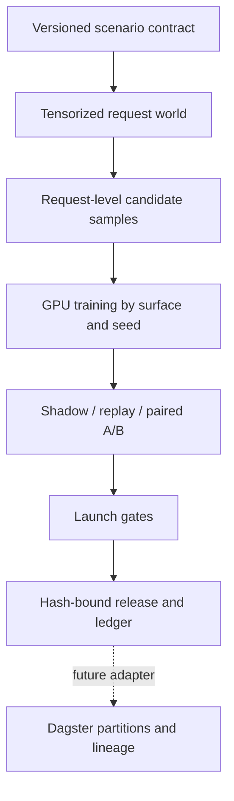

# Execution architecture and scale boundary

## Decision

Do not add Dagster to the single-GPU simulation path yet. The stable boundary
is a set of request-level launch assets; orchestration remains an adapter.

The current 500k POI Detail workload completes one seed in 8–10 seconds at
roughly 52k–61k requests/s and 4.17 GB peak allocated memory. Adding a workflow
runtime cannot improve the dominant tensor operations. It would add a second
configuration authority before there is a multi-node scheduling requirement.

## Invariants

- A scenario owns one immutable config, seed, sample contract, and feature time.
- Training, shadow/replay, A/B, release, and ledger consume the same report.
- Surface packages own behavior and model code; shared release code owns hashing,
  source closure, and bundle identity.
- The model artifact and every source in its declared closure are content-bound.
- A held or rejected treatment never replaces the last accepted control.

## When a DAG becomes justified

Introduce Dagster only when at least one workload requires multi-GPU or
multi-node partitions, restart from a failed partition, cross-surface asset
lineage, or scheduled materialization. At that point, each existing CLI becomes
one software-defined asset and the asset key replaces physical paths. Model,
sample, and launch-review code stays unchanged.

## Next performance steps

The next scale gain comes from sharding request tensors by seed/time partition,
mixed precision where parity gates allow it, memory-mapped request datasets,
and concurrent GPUs. CPU orchestration and Python object graphs must stay off
the per-candidate path. Distributed embedding tables should use TorchRec rather
than a local parameter-server implementation once the corpus exceeds one GPU.
