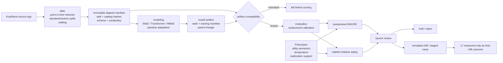
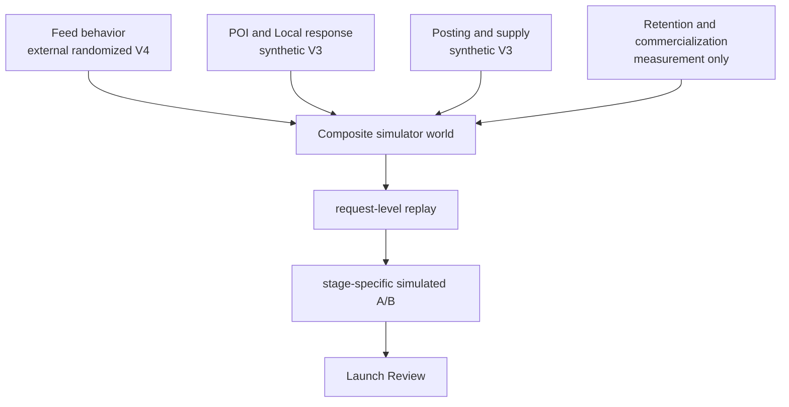

# External World-Model Architecture

This boundary keeps model capacity, causal evaluation, and launch authority
separate. A higher AUC can enter evaluation, but it cannot promote the simulator
or be called LT without passing the launch state machine.

## Ownership

| Package | Owns | Must not own |
|---|---|---|
| `data` | source parsing, point-in-time history, split and catalog materialization | model fitting or launch decisions |
| `modeling` | architectures, losses, training, adaptation, artifact production | causal claims or LT conversion |
| `evaluation` | calibration, policy scoring, randomized OPE, replay estimands | artifact promotion |
| `launch` | hashes, compatibility, policy contract, gate transitions | feature generation or training |
| `cli` | argument parsing and invocation | business logic |

The invariant is fail-closed compatibility. Dataset split bytes, catalog bytes,
feature schema, vocabulary, model state, calibration rules, and policy parameters
form one evidence closure. A rebuilt catalog invalidates old artifacts even when
the training split hashes are unchanged.

## Composite authority after randomized evaluation

V4 does not replace every behavior surface with one neural model. It composes
task kernels with independent evidence scopes:

The Feed component is eligible because one frozen treatment artifact passes
randomized DR/OPE, two independent stateful shadow worlds, behavior guardrails,
and a one-million-user power simulation. Shadow stay effects are 3.1--4.0 times
the randomized OPE estimate, so the review preserves magnitude disagreement and
uses agreement only for primary direction and guardrails.

The unified NeuralSCM remains a challenger. Its external bridge has request-level
slates, point-in-time features, histories, observed labels, and masks, but the
source has no POI, supply, retention, or commercialization outcomes. Missing
tasks have `label_mask=0`; they are never written as negatives or proxy-mapped
to unrelated Feed actions.

`artifacts/releases/simulator-world.json` owns world-kernel selection.
`artifacts/releases/simulated-feed-control.json` owns the active ranking policy.
Neither file may mutate the other. V3 is the executable rollback epoch.
