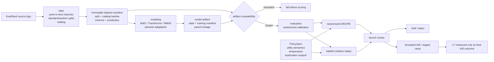

# External World-Model Architecture

This boundary keeps model capacity, causal evaluation, and launch authority
separate. A higher AUC can enter evaluation, but it cannot promote the simulator
or be called LT without passing the launch state machine.

## Ownership

| Package | Owns | Must not own |
|---|---|---|
| `data` | source parsing, point-in-time history, split and catalog materialization | model fitting or launch decisions |
| `modeling` | architectures, losses, training, adaptation, artifact production | causal claims or LT conversion |
| `evaluation` | calibration, policy scoring, randomized OPE, replay estimands | artifact promotion |
| `launch` | hashes, compatibility, policy contract, gate transitions | feature generation or training |
| `cli` | argument parsing and invocation | business logic |

The invariant is fail-closed compatibility. Dataset split bytes, catalog bytes,
feature schema, vocabulary, model state, calibration rules, and policy parameters
form one evidence closure. A rebuilt catalog invalidates old artifacts even when
the training split hashes are unchanged.

V3 remains the active simulator authority. The external V4 sequence lane has
passed capacity checks but remains held by randomized policy-value and safety
evidence. Refactoring cannot change that decision.
