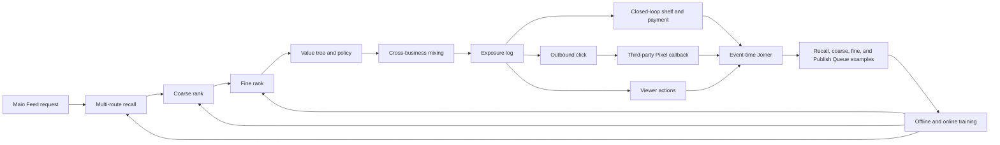
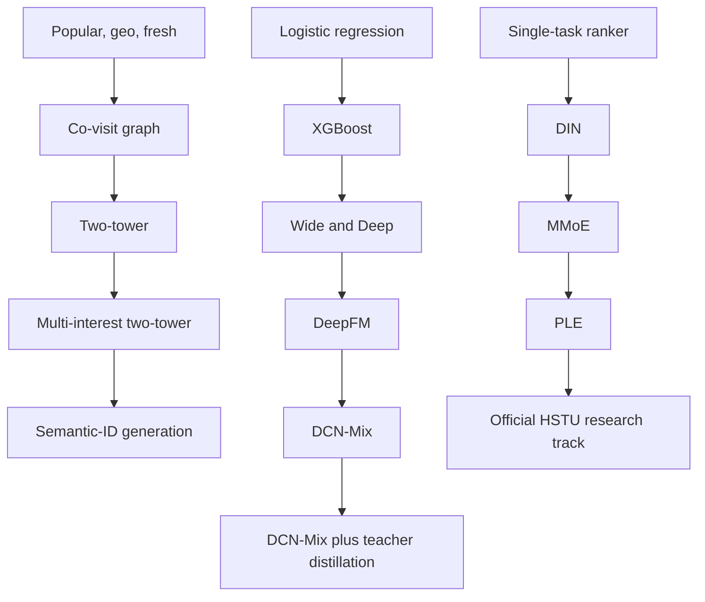
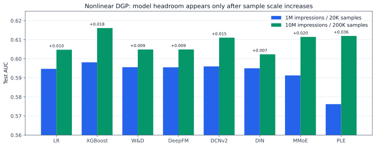
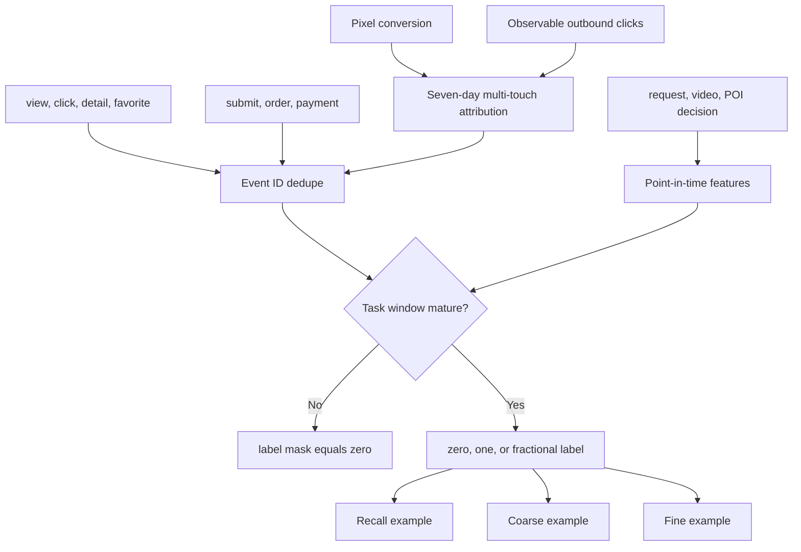
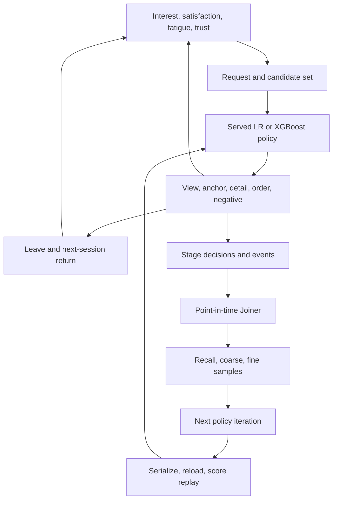

# Model evolution and business-effect laboratory

This public laboratory uses synthetic events and mature open-source components.
It demonstrates engineering decisions and experiment mechanics; it is not
evidence of any company's internal architecture or business lift.

## Production learning loop



The three cascade sample authorities are deliberately separate. Recall learns from a
positive item and probability-carrying negative mix. Coarse rank learns from
the actual recalled candidate distribution and fine-rank teacher signals. Fine
rank learns only from real exposures; an unexposed candidate is never an
ordinary negative.

The Publish Queue is a fourth, cross-request business authority over the same
Feed content candidates. It joins an exposure to later posting entry, create,
publish, and qualified-supply outcomes after maturity; it is not the
posting-page candidate ranker.

## Model ladder



The repository does not reimplement the mature CTR model zoo. Logistic
regression and metrics use scikit-learn, trees use XGBoost, and WDL, DeepFM,
DCN-Mix, DIN, MMoE, and PLE use DeepCTR-Torch 0.3.0. The local adapters own only
feature mapping, stage-specific labels, distillation, and comparable reporting.

HSTU stays outside the default dependency closure because its FBGEMM and CUDA
stack is materially heavier. The research track is pinned to Meta's official
`meta-recsys/generative-recommenders` commit
`2a4fa9256aff3b6e21decab8738b6f1872891f4f`; no local class is described as an
HSTU implementation.

## Synthetic distribution and benchmark

The default scenario has one million main Feed impressions and a two-percent
POI-anchor rate, producing about twenty thousand rank examples. Ten million
main impressions produce about two hundred thousand examples. Viewer, author,
video, and POI activity follow a long-tail distribution. The report includes
positive counts, standard error, unique entities, Gini, and top-one-percent
exposure share.

Signals contain linear, feature-cross, and sequence components. This matters:
on the earlier linear scenario, logistic regression correctly matched or beat
larger models. A 20-epoch diagnostic then exposed severe neural overfit: DIN
training loss fell from 0.648 to 0.245 while test AUC fell to 0.540. The adapter
now uses temporal validation, early stopping, embedding/DNN regularization,
dropout, and masked history pooling.

On the corrected one-million-impression run, LR, XGBoost, WDL, DeepFM,
distilled DCN-Mix, DIN, MMoE, and PLE reached AUC 0.6436, 0.6542, 0.6454,
0.6453, 0.6519, 0.6437, 0.6417, and 0.6402 respectively. The neural models stop
after 4-12 recorded loss points instead of driving training loss downward for
20 epochs. XGBoost is still the best model at this sample size; model complexity
is accepted only when the data and validation result justify it.

The synthetic signal is now explicitly versioned. `industrial-cross-sequence-v1`
is retained as a linear-control DGP: logistic regression with the known cross
and sequence features nearly reaches the oracle. `heterogeneous-nonlinear-v2`
adds threshold, periodic, segment-compatibility, recency-weighted sequence, and
nonlinear intent/quality effects without exposing all of them as direct
features. On the checked RTX 4090 run, V2 at one million main impressions still
has only 19,964 anchor samples and W&D improves AUC over logistic regression by
less than 0.001. At ten million impressions and 199,883 samples, XGBoost,
XGBoost, PLE, MMoE, and DCNv2 reach 0.6161, 0.6120, 0.6115, and 0.6111 versus logistic
regression at 0.6048. Raw reports are versioned under `reports/benchmarks/`.

合成信号现已显式版本化。V1 保留为线性对照；加入阈值、周期、分群匹配、带时间衰减的
序列和非线性意图后，V2 在 100 万主曝光时仍只有 19,964 条 anchor 样本，W&D 相对
逻辑回归的 AUC 增量不足 0.001。扩大到 1,000 万主曝光、199,883 条样本后，XGBoost、
MMoE、PLE、DCNv2 均超过逻辑回归。这是容量与样本规模证据，仍不是上线证据；下一步
必须把同一模型 artifact 接进有状态 candidate-to-A/B 链路。



The earlier ten-million-impression throughput run produced 200,481 anchor
examples, but predates this regularization change and is retained only as scale
evidence, not the current model-selection leaderboard. The earlier retrieval
numbers were invalidated because training and test reused queries and the query
was constructed directly from its target item embedding. The corrected RTX
4090 benchmark freezes 5,000 items, splits 2,000 queries 70/15/15, and applies
60/25/15 negative-source sampling with `log q` correction. At equal Recall@20,
popular, co-visit graph, exact content, two-tower, and multi-interest reach
0.0000, 0.0900, 0.0533, 0.0200, and 0.0067 respectively. The learned towers
therefore fail the offline launch gate; decreasing training loss is not treated
as retrieval progress. Raw evidence is stored in
`reports/benchmarks/2026-08-23-retrieval-gpu.json`.

旧版召回结果因 train/test query 复用、query 直接由 target item embedding 构造而
失效。修复后使用冻结 item corpus、query-disjoint 70/15/15 split、60/25/15 负样本
及 `log q` 修正。Two-Tower 和 Multi-interest Recall@20 仅为 2.00% 和 0.67%，均未
超过 graph 的 9.00%，因此离线门禁直接拒绝，不能用 loss 下降宣称模型进步。

The offline leaderboard is not the launch authority. A separate actual-model
fine-rank run trains on 45,794 stateful Feed impressions and evaluates 5,000
disjoint fresh A/B users. LR has AUC 0.7175 and candidate oracle regret 0.0625;
W&D, DeepFM, DCNv2, and MMoE have higher regret or violate stay/quality-view
guardrails, so LR remains the serving authority for this DGP. Positive
composite LT cannot override a hard Feed regression.

离线 leaderboard 不是上线权威。另一组 actual-model 精排实验使用 45,794 条有状态
Feed 曝光训练，并在 5,000 个独立 fresh A/B 用户上评估。LR 的 AUC 为 0.7175、
candidate oracle regret 为 0.0625；W&D、DeepFM、DCNv2 和 MMoE 的 regret 更高，
或违反 stay/quality-view 护栏，因此当前 DGP 继续使用 LR。综合 LT 为正也不能覆盖
Feed 硬护栏回退。

The scale cascade freezes 100 recalled candidates and the same fine ranker.
Replacing quality-only coarse Top-20 with LR-style affinity raises oracle
pass-through from 65.3% to 99.9%; later Local crosses and Top-40 add no
significant platform LT. This separates model quality from candidate budget.

规模级联实验固定 100 个召回候选和同一精排模型。将 quality-only Top-20 替换为
LR-style affinity 后，oracle 通过率从 65.3% 升至 99.9%；后续 Local cross 与
Top-40 均未显著提升平台 LT，因此模型质量与候选预算可以分别归因。

```bash
python3 -m fid_lab.evolution.evaluation.benchmark --profile ci
python3 -m fid_lab.evolution.evaluation.benchmark --profile local --seeds 3 --epochs 5
python3 -m fid_lab.evolution.evaluation.benchmark --profile gpu --seeds 3 --epochs 5 --device cuda:0
python3 -m fid_lab.feed_loop.models.cli --users 3000 --items 8000 --ab-users 5000 --epochs 8 --device cuda:0
python3 -m fid_lab.feed_loop.experimentation.cascade_cli --users 1000000 --candidates 100 --seeds 3 --device cuda:0
python3 -m fid_lab.feed_loop.experimentation.reverse_holdout --users 1000000 --steps 48 --burn-in-steps 12 --seeds 3 --device cuda:0
```

## Joiner and transaction authority



Closed-loop detail, submit, order, and payment retain separate labels. Open-loop
conversion uses a seven-day window and a 24-hour exponential half-life. Exact
click identity is preferred; otherwise eligible touches for the same observable
identity and merchant share one normalized fractional label. Missing identity,
orphan conversion, duplication, and late arrival are reported separately.

## Stateful policy iteration and online increment



`python3 -m fid_lab.simulation.cli --users 2000 --items 4000` runs the full
logging-policy to training to serving to A/B loop. SARDINE 1.0.8 supplies the
packaged Gymnasium environment boundary; the POI, commerce, Pixel, and Joiner
dynamics remain explicit domain contracts. Evaluation follows KuaiSim's three
levels: request ranking, whole-session behavior, and cross-session return/value.

The checked RTX 4090 run generated 37,291 logging-policy exposures with a 42.6%
long-view rate. XGBoost moved AUC from 0.6853 to 0.6880, user GAUC from 0.6631 to
0.6666, and session GAUC from 0.6534 to 0.6548. Serialization and reload changed
scores by at most `1.94e-7`. The observed user-level test showed +4.24% watch
minutes but was not significant at five percent; orders were underpowered, and
negative feedback failed the guardrail. The release decision was therefore to
reject the treatment, despite higher offline metrics.

XGBoost trains on CUDA in the 4090 profile, then publishes an explicit CPU
serving artifact because online candidate batches are small NumPy arrays. This
removes the silent GPU-to-CPU prediction fallback; replay and P99 latency are
both release gates rather than consequences of the training device.

The simulator retains both policy trajectories under common exogenous random
draws, so true synthetic ITT is available for estimator audits. Five hundred
fresh user assignments recovered every true effect inside its randomization
interval. A single assignment did not cover every true effect: that is a useful
demonstration of false positives, not a reason to tune the seed. These results
validate mechanics under declared assumptions; only calibration against real
logs plus a live randomized experiment can establish production lift.

GAUC is record-weighted AUC within users or sessions. Single-class groups have
no AUC and are excluded. A scalar GAUC is therefore incomplete: every report
also publishes eligible-group and eligible-record coverage. In this run user
coverage was 97.35% of groups and 99.49% of records; session coverage was 88.53%
of groups and 94.83% of records. Request GAUC is intentionally absent because
the Feed exposes one selected item per sequential request; inventing labels for
unexposed candidates would make the metric invalid.

## Primary open-source references

- [DeepCTR-Torch model zoo](https://deepctr-torch.readthedocs.io/en/latest/Models.html)
- [DCNv2](https://arxiv.org/abs/2008.13535)
- [Meta Generative Recommenders and HSTU](https://github.com/meta-recsys/generative-recommenders)
- [OneRec](https://arxiv.org/abs/2502.18965)
- [SARDINE](https://github.com/naver/sardine)
- [KuaiSim](https://proceedings.neurips.cc/paper_files/paper/2023/hash/8c7f8f98f9a8f5650922dd4545254f28-Abstract.html)
