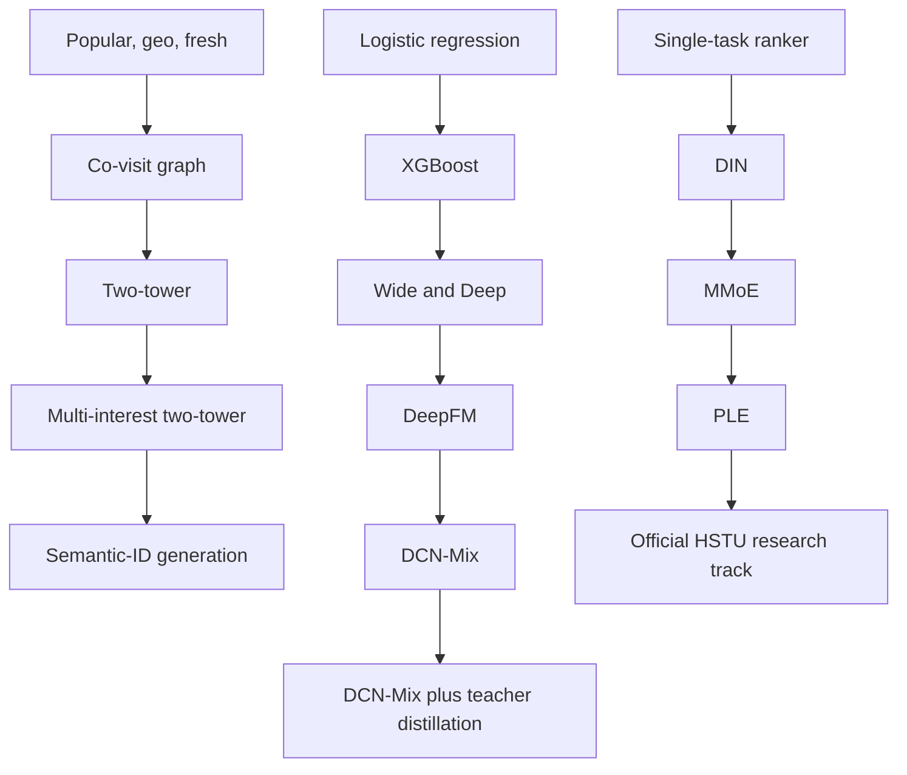
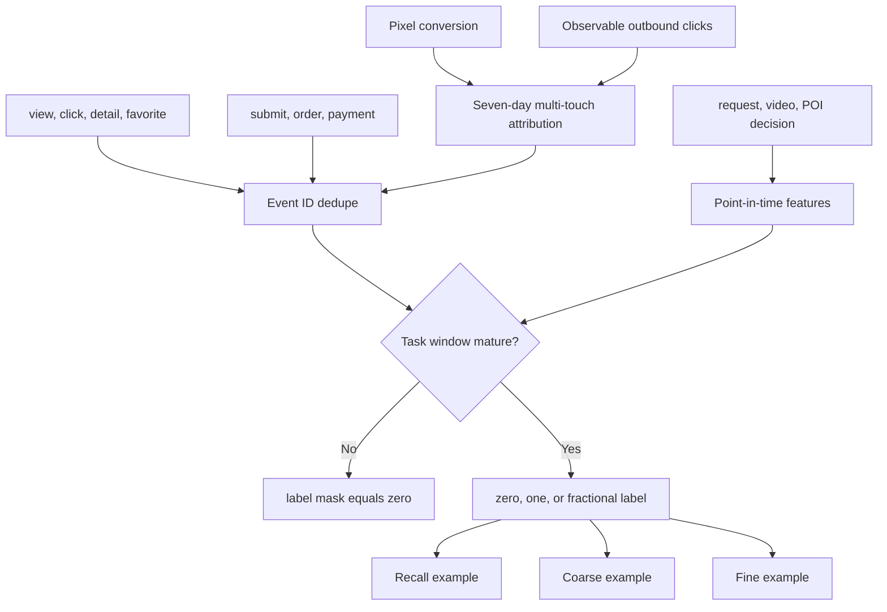
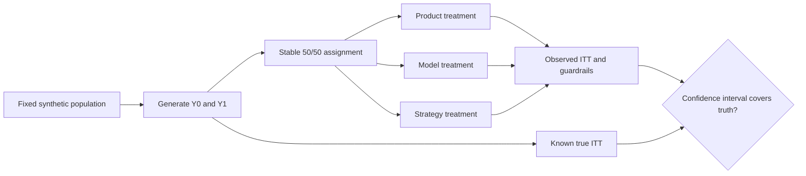

# Model evolution and business-effect laboratory

This public laboratory uses synthetic events and mature open-source components.
It demonstrates engineering decisions and experiment mechanics; it is not
evidence of any company's internal architecture or business lift.

## Production learning loop


The three sample authorities are deliberately separate. Recall learns from a
positive item and probability-carrying negative mix. Coarse rank learns from
the actual recalled candidate distribution and fine-rank teacher signals. Fine
rank learns only from real exposures; an unexposed candidate is never an
ordinary negative.

## Model ladder



The repository does not reimplement the mature CTR model zoo. Logistic
regression and metrics use scikit-learn, trees use XGBoost, and WDL, DeepFM,
DCN-Mix, DIN, MMoE, and PLE use DeepCTR-Torch 0.3.0. The local adapters own only
feature mapping, stage-specific labels, distillation, and comparable reporting.

HSTU stays outside the default dependency closure because its FBGEMM and CUDA
stack is materially heavier. The research track is pinned to Meta's official
`meta-recsys/generative-recommenders` commit
`2a4fa9256aff3b6e21decab8738b6f1872891f4f`; no local class is described as an
HSTU implementation.

## Synthetic distribution and benchmark

The default scenario has one million main Feed impressions and a two-percent
POI-anchor rate, producing about twenty thousand rank examples. Ten million
main impressions produce about two hundred thousand examples. Viewer, author,
video, and POI activity follow a long-tail distribution. The report includes
positive counts, standard error, unique entities, Gini, and top-one-percent
exposure share.

Signals contain linear, feature-cross, and sequence components. This matters:
on the earlier linear scenario, logistic regression correctly matched or beat
larger models. After adding explicit cross and history-match signal, the
one-million-impression, three-seed GPU benchmark produced mean AUC of 0.641 for
logistic regression, 0.657 for XGBoost, and 0.644 for distilled DCN-Mix.
Complexity is accepted only when the data mechanism makes it useful.

The ten-million-impression run produced 200,481 anchor examples. Across three
seeds, mean AUC was 0.661 for XGBoost, 0.641 for MMoE, 0.639 for logistic
regression, 0.638 for distilled DCN-Mix, 0.634 for PLE, and 0.633 for DIN. At an
equal Recall@20 budget, popular recall reached 0.005, co-visit graph 0.208,
two-tower 0.592, and multi-interest two-tower 0.762; exact content search reached
0.996 because the synthetic query is a noisy form of its target embedding.
These results describe the checked-in synthetic mechanism, not an expected
ordering on production data.

```bash
python3 -m fid_lab.evolution.evaluation.benchmark --profile ci
python3 -m fid_lab.evolution.evaluation.benchmark --profile local --seeds 3 --epochs 5
python3 -m fid_lab.evolution.evaluation.benchmark --profile gpu --seeds 3 --epochs 5 --device cuda:0
```

## Joiner and transaction authority



Closed-loop detail, submit, order, and payment retain separate labels. Open-loop
conversion uses a seven-day window and a 24-hour exponential half-life. Exact
click identity is preferred; otherwise eligible touches for the same observable
identity and merchant share one normalized fractional label. Missing identity,
orphan conversion, duplication, and late arrival are reported separately.

## Simulated online increment



`python3 -m fid_lab.evolution.cli.ab_demo` reports the injected true effect and the
observed A/B estimate. At 200,000 users, the model scenario currently estimates
about +9.7% watch minutes, +10.7% anchor clicks, and -33.4% negative feedback;
the sparse order lift is not statistically significant. Those numbers validate
the experiment recovery mechanism only. They are not forecasts or actual
business results.

## Primary open-source references

- [DeepCTR-Torch model zoo](https://deepctr-torch.readthedocs.io/en/latest/Models.html)
- [DCNv2](https://arxiv.org/abs/2008.13535)
- [Meta Generative Recommenders and HSTU](https://github.com/meta-recsys/generative-recommenders)
- [OneRec](https://arxiv.org/abs/2502.18965)
