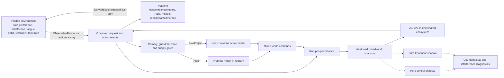
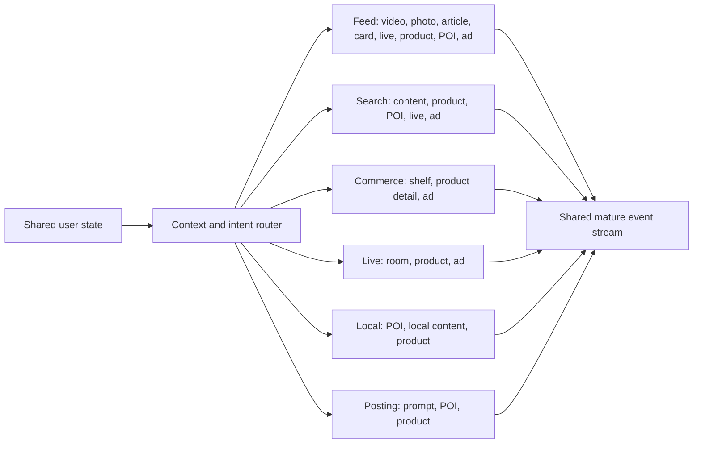
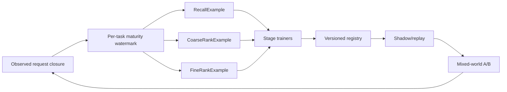

# Multi-surface recommendation digital twin / 多业务推荐数字孪生

> Historical v2 description. The implementation revealed additional causal,
> sample-semantic, score-composition, and A/B ordering failures. New work is
> governed by [Recommendation Digital Twin v4](digital-twin-v4-redesign.md).

## Decision / 决策

旧 Feed engine 分别执行 control 和 treatment 的完整轨迹，再比较两个
pre-period 是否相等。外部 Transformer 在 GPU 上产生微小数值差异后，离散行为会翻转，
所以这个结构不能继续作为 A/B authority。

The v2 replacement first separates the hidden app-user environment from the
platform. The platform may send only the rendered `ServedSlate`; the environment
may return only observable events. Retrieval, ranking, trace, and training
modules cannot import latent state. It then materializes the pre-treatment world once. Pure policy arms
deep-fork that snapshot only for shadow counterfactual evidence. Online A/B is
executed inside one mixed world; this mixed world is the only factual successor
and the only source of later training data. A failed treatment is not erased
from history, although it never becomes the active model.



## Shared world / 共享世界

| Actor or state | What is shared across surfaces | 中文说明 |
|---|---|---|
| Hidden user | True long/short preference, satisfaction, fatigue, habit, intent, signup schedule, retention | 用户真实状态只属于 environment，可注册、回访、流失和再获取，平台不可读取 |
| Observable user | Event-derived interest, intent estimates, counters, tenure, geography and request context | 平台只能使用曝光、播放、停留、互动、搜索、交易和投稿日志推断用户 |
| Hidden item | Semantic truth, true quality, true risk and price appeal | 决定真实用户响应，但不进入候选特征 |
| Observable supply | Encoder embedding, delayed quality/risk estimates, freshness, popularity, inventory and sponsorship | 视频、图文、卡、直播间、商品、POI、广告和投稿提示共享可观测 catalog |
| Exposure ledger | Up to 64 item, author, cluster, topic, kind, surface, and step records | 同请求 item 去重；跨请求 item 硬过滤；作者、主题和 cluster 时间衰减疲劳 |
| Behavior | Hidden five-expert nonlinear SCM with task masks and cascades | 只消费实际曝光 slate，不读取召回全集、模型分数或候选特征 |
| Ecosystem | Creator motivation/retention, publishing, inventory, freshness and popularity feedback | 消费反馈会反作用于供给，而不是固定 corpus 上重复采样 |
| Experiment | Mixed-world UID A/B, orthogonal parameter layers, region-time switchback, CUPED, and last-accepted model | A/B 改变未来样本；只有通过门禁的模型成为下一轮 active model |

The transition owner is also separated. `environment/response.py` updates only
hidden preference, satisfaction, fatigue, intent, habit, and session exit.
`platform/updates.py` consumes `ObservableResponse` and updates only online
interest estimates, counters, intent estimates, activity estimates, and
request history. Neither platform updater function accepts a latent argument.

## Surface contracts / 场景契约



Every request retains recalled candidates, route provenance, recall, coarse and
fine scores, eligibility, exposed slate, selected item, point-in-time history,
exploration/position propensity, labels, masks, model version, and experiment
cell. This request-level closure distinguishes retrieval miss, coarse
attrition, fine-ranking error, mixing suppression, and behavior change.

每个 surface 有自己的有效任务空间。Feed 产生 play、3s、long-view、互动和负反馈；
Search 产生 click、detail 和 order；Commerce/Live/Local 形成 click 到 payment 的级联；
Posting 形成 click 到 create 再到 publish 的级联。未定义任务写 `label_mask=0`，不能当负样本。

## Samples and continuous learning / 样本与持续学习



`RecallExample` contains query, behavior-qualified positive, actual candidate
negatives, route, sampling probability, and behavior strength.
`CoarseRankExample` contains the actual recall set, eligibility, served coarse
score, fine teacher score, exposure status, and request-level relevance.
`FineRankExample` contains exposed candidates, 54 observable features,
position and exploration propensity, 17 labels, and per-task maturity masks.
Undefined or immature labels remain masked; they are never manufactured as
negatives.

The executable dense-feature ladder now includes LR, Wide & Deep, DCNv2, and
MMoE through adapters around the repository's existing reusable PyTorch
blocks. It optimizes clipped-IPS pointwise BCE plus request-aware
pairwise and listwise losses. Only heads with enough mature positives and
negatives receive serving value weights. Checkpoint reload must reproduce the
same scores before a model can enter shadow.

Training uses a deterministic request reservoir over the event-time window.
Its second-stage inclusion probability is multiplied into the existing request
sampling probability before clipped IPS. This reduced the 100k-user/four-model
screen from a 15.24GB OOM to a successful 10.64GB peak-RSS run without reducing
the simulated users, catalog, candidates, or online trace generation.

Offline reports use whole-step chronological splits and report AUC, PR-AUC,
log loss, ECE, NDCG, and user GAUC with eligible-group coverage. These are
diagnostics only. The candidate still must pass mixed-world A/B guardrails.

DeepFM is intentionally not attached to the 54 dense-feature tensor and called
complete. Its useful contract requires versioned sparse FIDs, bucket sizes,
user/item/category/route IDs, and the same IDs at serving time. DIN,
Transformer, and PLE likewise require the point-in-time sequence contract.
Those are the next sample-contract migration, not aliases for another dense
MLP.

## Continuous Launch Reviews / 连续上线演进

The default executable campaign contains eight adjacent experiments: two each
for retrieval, coarse ranking, fine ranking, and mixing. A proposal is a field
mutation over the current accepted policy, never an arbitrary full replacement.
Pass promotes both policy and evolved world state; hold/reject advances the
control world only.

```text
current mixed world + active model
→ controlled exploration logging
→ label maturity and point-in-time Joiner
→ chronological GPU training
→ candidate registry and shadow replay
→ one pre-period snapshot
→ mixed-world A/B plus disposable pure-arm diagnostics
→ promote/hold/reject model
→ mixed world and observed samples continue
```

A separate held-out gate trains one artifact in a source environment, hashes
the checkpoint, and replays that exact artifact without fitting or calibration
in multiple unseen `environment_seed` worlds. Any reject rejects the aggregate;
any hold prevents promotion.

The first screen report uses artifact fingerprint
`667556cc8a3eb12eda689bb74dfa70746bc76629f4e765b8901fdc4a3b136e04`.
Its whole-step holdout reports long-view AUC 0.620 and click AUC 0.721. The
unchanged artifact produces positive LT intervals in two unseen environments,
but both decisions are `hold` because negative-feedback upper bounds exceed
0.002. This is the intended distinction between learning signal and launch
authority.

This is the distinction between a model leaderboard and a simulated algorithm
team. A leaderboard compares frozen artifacts. The campaign reproduces repeated
launches, failures, control inheritance, behavior drift, supply feedback, and
cross-surface externalities.

## Performance ownership / 性能边界

The fixed GPU profile separates a 250,000-user persistent state shard from a
50,000-request candidate compute microbatch. This preserves the one-million-user
world while bounding the much wider 96-candidate by 54-feature tensors. Exposure
ledger integers and trace tensors use range-safe compact dtypes. Pure shadow
worlds are released immediately after metrics are extracted. Independent arms
run serially because concurrent GPU arms reduce throughput and complicate
deterministic evidence.

The historical RTX 4090 report executes one complete logging, training, shadow, A/B,
and promotion iteration at one million users and two million items. It takes
279.5 seconds and reports 8.90GB peak CUDA allocation. That report predates the
hidden/platform isolation and therefore proves throughput, tensor capacity,
checkpointing, and end-to-end loop execution only. Its LR uplift is rejected as
model-quality or launch evidence. The v2 acceptance run must use multiple
`environment_seed` values and keep the platform seed, features, candidate
budgets, and launch protocol fixed.

## Research basis / 研究依据

- [RecSim NG](https://google-research.github.io/recsim_ng/) motivates composable
  multi-agent entities, probabilistic behavior, and accelerator execution.
- [KuaiSim](https://arxiv.org/abs/2309.12645) separates request-level,
  whole-session, and cross-session/retention evaluation with multi-behavior
  feedback.
- [RecoGym](https://arxiv.org/abs/1808.00720) couples organic browsing and
  advertising rather than evaluating ads in an isolated population.
- [Virtual-Taobao](https://ojs.aaai.org/index.php/AAAI/article/view/4419)
  supports learned behavior environments and explicitly warns against policies
  exploiting simulator imperfections.
- [RecSim ecosystem modeling](https://research.google/blog/flexible-scalable-differentiable-simulation-of-recommender-systems-with-recsim-ng/)
  motivates users, providers, advertisers, and recommender policies as one
  interacting system.

The project adopts these boundaries without adding a second TensorFlow runtime.
The existing PyTorch models, KuaiRand adapters, request-candidate datasets, and
GPU tensor components remain reusable evidence and model assets.

## Migration and deletion boundary / 迁移与删除边界

The v2 package has passed CPU A/A, request
closure, chunk-invariance, mixed-world sample feedback, orthogonal assignment,
checkpoint replay, platform/latent import isolation, and latent-intervention
invariance. The full RTX 4090 learning iteration is still v1 historical evidence;
v2 has not yet passed the multi-environment GPU launch gate. The old dual-world
`feed_loop/serving/launch.py` remains only until the new kernel passes CPU A/A,
GPU repeated-seed determinism, disk-backed streaming event retention, multi-run
campaign, and external-data calibration gates. After those remaining reports
are frozen, the old serving CLI and its duplicate pre-period comparison are
removed from executable entry points; historical JSON reports remain immutable
evidence.
