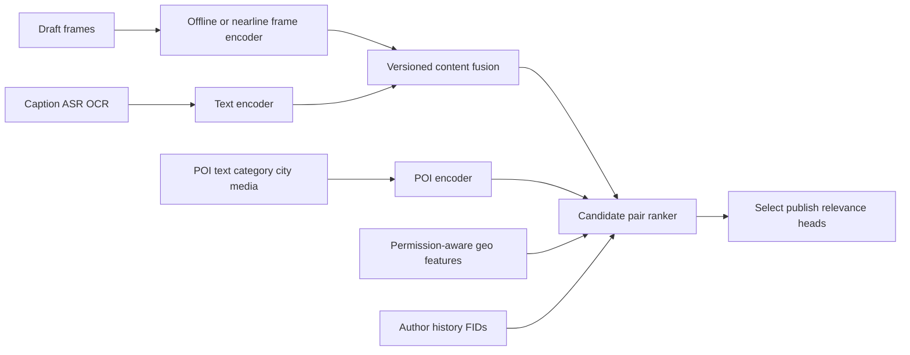

# POI posting recommendation: runnable reconstruction

This module is a public, local reconstruction of a realistic POI posting recommendation problem. It is not ByteDance source code, an internal architecture disclosure, or evidence that every component was deployed in the author's employment. Its purpose is to make an interview answer executable and falsifiable.

## Current authority versus historical demo

The original `fid_lab.poi_posting.demo` remains a small model-API teaching
example. It is not the Launch Review authority because its candidate generator
forces the latent target into every slate and its trained model does not feed
the supply switchback.

The current simulated authority is Supply V4 in `fid_lab.poi_posting.world`. It
generates a closed request-level candidate dataset over repeated creator panels
with a hidden neural teacher, trains actual Linear, Wide & Deep, and MMoE
artifacts, replays the serialized models, and evaluates candidate, fine-rank,
and end-to-end effects with creator-cluster inference across three seeds. See
the [Supply V4 Launch Review](../launch-reviews/2026-08-24-poi-posting-neural-v4.md).

```bash
python3 -m fid_lab.poi_posting.world.cli \
  --requests 400000 --creators 50000 --epochs 3 --device cuda:0 \
  --world-version creator-neural-supply-v4 --catalog-seed 20260824 \
  --seeds 20260824 20260825 20260826 \
  --artifact-dir artifacts/models/poi-posting-v4 \
  --output reports/launches/2026-08-24-poi-posting-neural-v4-400k.json
```

## What is actually modeled

The online decision is a ranking over POIs already retrieved for one posting draft. The model predicts three different facts:

1. `select`: the exposed POI will be selected by the author;
2. `publish`: the author will complete publication after selecting it;
3. `relevance`: the draft and POI describe the same place or a defensibly equivalent place.

`select` and `publish` come from impression and action events. `relevance` represents a separately governed gold-label process. This prevents a popular but unrelated POI from becoming a quality positive merely because an author selected it.

## Offline and online boundary



The demo starts from frame-level and text-level feature vectors because downloading and running a large proprietary video foundation model is not the ranking problem being tested. A separate materializer performs frame attention and text/video projection, records the encoder version and content hash, and writes a normalized content vector. The online ranker consumes that vector together with POI encoding, sparse-ID embeddings, MMoE routing, and multi-task objectives. In production, raw frame vectors would be produced asynchronously by a versioned encoder such as a CLIP-like image-text model or a video encoder; they are not computed inside the latency-sensitive ranking request.

The local representation dimension is 32 because the synthetic catalog is small. It is not a claimed production dimension. A production choice must sweep dimensions such as 64, 128, and 256 against retrieval Recall@K, hard-slice recall, index bytes, build time, and p99 serving latency. The smallest dimension on the quality-latency Pareto frontier wins.

## Features versus labels

Features known before ranking include author, POI, city, category and permission FIDs; permission-aware distance; POI popularity; author-category affinity; a materialized content vector; and POI semantic vectors. The upstream media pipeline owns frame attention and content-vector versioning; the online model owns POI adaptation and candidate ranking.

Labels are outcomes after exposure. The model does not call an unselected candidate a failed conditional publication. Instead, it learns selection on the full exposure space and learns the joint `selected and published` probability as the product of selection probability and conditional publication probability. The joint label is valid for every exposure and avoids training the sparse head only on a selected, biased subset.

## Negative sampling

Every candidate in the synthetic log was exposed. An unexposed catalog item is never converted into a behavioral negative.

- Positive: selected candidate; publication is a separate conditional label.
- Easy negative: an exposed candidate that was skipped and is clearly remote or semantically different.
- Hard negative: an exposed, skipped candidate that is in the observed city, shares a category, or is semantically close to the draft.

All positives and hard negatives are retained. Easy negatives are sampled, and retained examples receive inverse keep-rate weight. This reduces training cost without changing the easy-negative population prior. The hard negatives force the model to learn branch, semantic, and preference distinctions instead of winning through distance or popularity alone.

## Sparse funnel and multiple objectives

The reconstruction uses selection as the dense auxiliary task, the entire-space `selected and published` event as the sparse target, and independently supervised relevance as the quality task. Shared experts learn common structure while task-specific gates can avoid forcing identical representations on goals that disagree. Positive-class weighting handles the remaining imbalance; the task loss weights express training priority and are separate from serving-time business values.

At serving time the demo ranks by joint publication probability times relevance probability. A real system would calibrate every head on an unsampled holdout before combining them, then select business weights or constraints through powered online experiments. Training-loss coefficients must not be presented as business-value coefficients.

## Run and inspect

```bash
python3 -m fid_lab.poi_posting.demo
```

The report includes task AUC and average precision, label prevalence, hard-negative count, a geography-plus-popularity baseline, learned NDCG@3 and Recall@3, and frame-attention entropy. The dataset uses a time split so later posting sessions cannot leak into training.

## Interview answer

> I reconstructed the posting problem as an impression-level, multi-task ranking system. Draft frames and text are encoded asynchronously and fused into a content representation; POI semantics and sparse IDs form the candidate representation. The ranker predicts author selection, conditional publication, and independently labeled content-POI relevance. I train the sparse joint selection-and-publication event over the entire exposure space, retain all positives and confusing exposed negatives, and sample only easy negatives with correction weights. This addresses sparsity and selection bias without calling every non-action a failed conditional publication. The local model is executable, but it is a public reconstruction rather than a claim about an internal production architecture.

## Public design references

- [Deep Neural Networks for YouTube Recommendations](https://research.google/pubs/deep-neural-networks-for-youtube-recommendations/) motivates separate retrieval and ranking stages.
- [Mixed Negative Sampling for Two-Tower Networks](https://research.google/pubs/mixed-negative-sampling-for-learning-two-tower-neural-networks-in-recommendations/) explains why negative-source mixture and sampling bias matter.
- [MMoE](https://research.google/pubs/modeling-task-relationships-in-multi-task-learning-with-multi-gate-mixture-of-experts/) motivates task-specific gates over shared experts.
- [ESMM](https://arxiv.org/abs/1804.07931) addresses sequential labels, selection bias, and sparse post-action outcomes.
- [CLIP](https://arxiv.org/abs/2103.00020) provides the public contrastive image-text representation pattern.
- [Content-Aware POI Recommendation](https://ojs.aaai.org/index.php/AAAI/article/view/9462) supports combining geographic context with content and user-interest signals.
