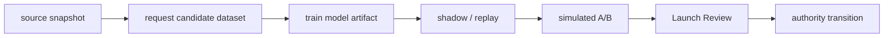

# Simulation Scale and Orchestration

## Decision

Do not add Dagster to the request-level simulation hot path. The hot path is a
stateful tensor program; adding an asset orchestrator inside it would add process
and serialization overhead without accelerating candidate generation, ranking,
behavior sampling, or state transition.

Dagster becomes useful only as an optional control plane when the repository has
scheduled, independently materialized assets that need retries and lineage:



Each box may later be a Dagster asset. The GPU kernel inside `REPLAY` and `AB`
remains ordinary PyTorch. Until scheduling, partial retries, or multi-machine
materialization becomes a measured operational problem, adding Dagster would be
an unused dependency and a second execution authority.

The current POI stage runner is therefore a declarative in-process DAG, not a
Dagster deployment. Its nodes are semantic policy worlds keyed by every policy
field except the display name. Twelve declared arms collapse to nine unique GPU
worlds per seed; adjacent Launch Reviews reuse the exact same materialization.
This removes duplicate simulation without changing random streams or stage
outputs. A future orchestrator may schedule these nodes, but it must consume
the same semantic key and report contract rather than introduce another graph.

The Feed-posting runner makes one additional dependency executable:

```text
candidate worlds per seed
  -> repeated-seed candidate decision
  -> accepted candidate exposure rematerialization
  -> ranker retraining on the new candidate distribution
  -> fixed-control fine-rank reviews
  -> end-to-end review and hash-bound authority
```

This ordering prevents a ranker trained on old Trending+I2I exposure from being
evaluated as though it were trained for a new Semantic candidate distribution.
The 150k × 3-seed run exposed exactly this failure. A future Dagster adapter may
map these phases to assets and seed/user partitions, but orchestration calls must
remain outside the GPU request loop.

## Runtime boundary

```text
tensor_runtime/contracts.py  immutable scale and signal contract
tensor_runtime/response.py   vectorized Feed and Local behavior sampling
tensor_runtime/state.py      user state initialization and transition
tensor_engine.py             candidate selection, batching, aggregation, report
```

Counter-based RNG is keyed by user, step, event stream, and seed. Therefore
changing `batch_users` does not change user outcomes, which permits deterministic
single-GPU partitioning and future multi-GPU data parallelism.

The 2026-08-24 RTX 4090 run processed 10 million users over 24 steps in 43.98
seconds at 5.01 million simulated requests per second. Peak allocated memory was
2.49 GiB, essentially the same as the one-million-user run because memory is
bounded by the 200k-user batch. This proves the current engine can run large
synthetic experiments on one GPU; it does not prove production serving QPS or
business lift.

After the candidate graph was expanded to preserve all 48 merged candidates
until coarse rank, the current eight-step Pareto benchmark reports 1.976M,
2.143M, and 2.116M requests/s for 200k, 400k, and 600k batches. Peak memory is
6.64GB, 13.25GB, and 19.85GB. The default remains 200k under the explicit 8GiB
per-world budget so multiple experiment worlds retain scheduling headroom. All
stage counts are identical and the maximum metric delta is below 2e-7.

## Next performance work

Performance changes are accepted only when stage counts are identical and
metric deltas remain within the existing batch-invariance tolerance.

1. Profile candidate graph, feature construction, ranking, response, and report
   aggregation separately with CUDA events.
2. Remove repeated per-step tensor allocation and cache static catalog views.
3. Benchmark `torch.compile` on the stable response and state kernels; keep eager
   mode if graph breaks or compilation amortization is negative.
4. Vectorize an orthogonal-experiment arm dimension after the current semantic
   world cache is profiled; do not run one Python process per A/B arm.
5. Scale beyond one GPU by disjoint user-id ranges and reduce sufficient
   statistics. Persist request-level rows only for a deterministic audit sample.
6. Use ClickHouse or Parquet for event/Joiner analysis. Rust or C++ is justified
   only for a measured non-tensor bottleneck, not as a rewrite target.
