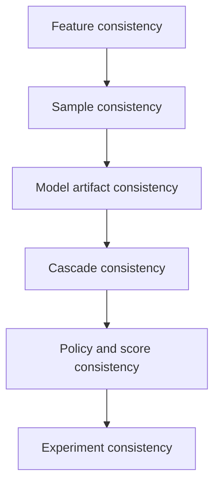

# 推荐系统演进综述 / Recommendation System Evolution Review

这份文档是系统演进的阅读入口。它回答系统如何工作、每次为什么迭代、算法到底
改变了什么，以及一项变更凭什么上线。详细公式、代码和单次实验仍由各自的责任域
维护，本文件只引用结果，不复制实现。

This is the reading authority for system evolution. It connects architecture,
model and strategy changes to their launch evidence without duplicating the
implementation owned by each subsystem.

## 1. 先消除两个歧义 / Remove two ambiguities first

`LR` 在本项目里有两个完全不同的意思：

| 缩写 | 中文 | English | 使用位置 |
|---|---|---|---|
| LR model | 逻辑回归模型 | Logistic Regression | 召回、粗排或精排的简单可解释基线 |
| LR process | 上线评审 | Launch Review | train → shadow/replay → A/B → gate → retrospective |

`LT` 只有一个含义：平台统一价值兑换容器（platform value-exchange
container）。它接收停留、活跃天数和已获认可的商业化价值。`long view` 是长播行为
标签，不能叫 LT。Local Value Tree 用于业务内部排序和归因，未获得平台汇率前不能
直接写入 LT。

`LT` means only the platform value-exchange container. Long view is a behavior
label. Local Value Tree is a business optimization and attribution tree, not an
LT input until an exchange rate is independently accepted.

## 2. 系统到底是什么 / What the system is

```mermaid
flowchart LR
    Request[Feed request / 请求] --> Assign[Orthogonal A/B parameters / 正交实验参数]
    Assign --> Recall[Multi-route recall / 多路召回]
    Recall --> Merge[RRF merge + dedupe / 合并去重]
    Merge --> Coarse[Coarse rank / 粗排]
    Coarse --> Fine[Fine rank / 精排]
    Fine --> VT[Value Tree + calibration / 价值树与校准]
    VT --> Mix[Multi-queue mixing / 多队列混排]
    Mix --> Policy[Rules: caps, diversity, COPP / 规则]
    Policy --> Exposure[Exposure / 曝光]
    Exposure --> Behavior[Play, stay, slide, interaction / 行为]
    Exposure --> Local[Anchor, detail, order, Pixel / 生活服务]
    Behavior --> Joiner[Point-in-time Joiner]
    Local --> Joiner
    Joiner --> Samples[Recall, coarse, fine samples / 三套样本]
    Samples --> Train[Offline + streaming train / 离线与流式训练]
    Train --> Shadow[Shadow + replay]
    Shadow --> AB[User A/B or switchback]
    AB --> Gate[Launch gate + review]
```



主 Feed 是最大、最完整的行为世界。Local Service 不是旁路 Demo，而是主 Feed
候选中的 POI 视频、anchor 和容器交易链路。Local 还拥有发布页 POI 推荐、详情页、
地图、YMAL、商品和评价等独立 surface；它们的 label 和模型可以不同，但最终进入主
Feed 的供给和分发变化必须回到平台 Feed 指标与 LT 容器验证。

The main Feed owns the richest behavior loop. Local Service is embedded through
POI videos, anchors and commerce funnels, while posting, detail, map, YMAL,
product and review surfaces retain separate contracts. Any supply or
distribution change must still clear platform Feed and LT gates.

## 3. 系统如何演进 / Evolution timeline

| 阶段 | 系统变化 | 算法增量 | 为什么进入下一阶段 | 当前证据 |
|---|---|---|---|---|
| E0 规则基线 | Popular、quality、geo、fresh | 人工权重与兜底 | 能运行但不个性化 | 保留作冷启动和故障降级 |
| E1 LR 基线 | 固定候选上的线性打分 | 可解释 affinity、quality、freshness | 需要验证非线性与交叉 | 当前精排 authority |
| E2 树与交叉 | XGBoost、W&D、DeepFM、DCNv2 | 非线性分裂、显式/自动交叉 | 离线增益未必改变候选选择 | 必须比较 oracle regret 和 A/B |
| E3 序列与多目标 | DIN、Transformer、MMoE、PLE | 候选相关兴趣、任务 Gate、负迁移控制 | 长短序列及支付等稀疏目标冲突 | 当前是候选，不能按复杂度上线 |
| E4 级联生产化 | 六路召回、RRF、粗排、精排、VT、混排 | 候选机会与排序能力分离 | 避免用更大 Top-K 伪造模型提升 | coarse pass-through 已独立验证 |
| E5 Local 业务化 | search、retarget、Local embedding correction | 识别 Local intent 与内容/POI 匹配 | Local tree 增长可能损伤 Feed | v4 保留长期 holdout，v5 拒绝 |
| E6 实时学习 | Joiner、PS、幂等更新、shadow replay | 分钟级新行为进入模型 | 小型 hashed linear model 表达不足 | 链路通过，serving candidate 拒绝 |
| E7 长期实验 | user A/B、switchback、reverse holdout | 区分短期响应和持续价值 | active-day 稀疏、归因弱 | 报告 effect、CI、MDE 和已知 DGP |
| E8 生成式路线 | Semantic ID、prefix-constrained decoder | 直接生成候选或 session | 需证明有效率、重复率和延迟 | 研究轨道，不替换传统级联 |

## 4. 策略、算法和模型分别做什么 / Strategy, algorithm and model

策略（strategy）决定候选机会和业务约束，例如开启哪条召回、Top-K 预算、Local
load、作者/类目打散、广告间隔、探索率和兜底。算法（algorithm）定义可学习问题，
包括正负样本、目标、loss、校准、蒸馏和多目标权衡。模型（model）只是实现该学习
问题的函数族。产品改变入口或 UI，策略改变可见机会，模型改变同一机会中的预测；
三者必须分别开 LR，不能把产品漏斗增长归因给模型。

Strategy controls opportunity and constraints; algorithms define labels,
sampling, objectives and estimation; models implement the scoring function.
Product, strategy and model launches are isolated so attribution remains valid.

召回长期保留多路：ANN、Graph、Geo、Fresh、Long-tail、Popular，以及 Local 的
post-search 和 retarget。各路独立限额，RRF 合并去重。粗排只看真实召回候选，目标
是保住精排高价值 Top-K，而不是单独追求 AUC。精排对曝光后的行为建模。Value Tree
组合 Feed、Local、Ads 和 Live 的业务目标；混排再执行 load、频控、打散和安全约束。

## 5. 特征如何演进 / Feature evolution

| 特征层 | 例子 | 时效 | 主要风险 |
|---|---|---|---|
| Stable identity | viewer、author、video、POI、city、category FID | 天级或更慢 | FID/hash 版本错配、碰撞 |
| Item/content | quality、freshness、video/POI embedding、ASR/OCR/text | 分钟到天 | 媒体向量缺失、encoder 版本漂移 |
| Context | hour、device、permission、distance、inventory | 请求时 | 权限缺失被误写成零距离 |
| Short counters | 3s play、slide、recent negative、recent anchor | 秒到分钟 | lag、重复事件、窗口边界 |
| Window counters | 1h/1d/7d category、POI、author statistics | 分钟 | offline/online window 不一致 |
| Sequence | recent item/topic/POI、search、retarget | 请求时 | padding、mask、事件顺序和未来泄漏 |
| Long sequence | multi-session behavior and return state | 小时到周 | 非平稳、截断和 serving cost |
| Cross features | user×category、city×POI、intent×quality | 依模型而定 | 手工交叉膨胀、训练/服务定义漂移 |

FID 只负责 `slot + signature` 的稳定编码，不负责发明特征语义。Feature manifest
必须同时冻结 slot registry、hash 版本、bucket 边界、窗口、sequence mask、媒体
encoder 和 point-in-time timestamp。公开的字节实践也把简单计数、窗口计数和序列
特征迁移到统一 Flink SQL/State 体系，并强调流批复用同一逻辑以支持历史回溯。

FID owns stable encoding, not feature meaning. One feature manifest freezes all
definitions used by training and serving.

## 6. 三套样本为什么必须分开 / Why samples are separate

```text
RecallExample    = query + positive item + 60/25/15 sampled negatives + q(sample)
CoarseExample    = actual recalled candidate + label + teacher score/rank + route
FineRankExample  = actual exposure + PIT features + sequence + labels + masks
```

- 召回负样本由 60% in-batch、25% 同城/同类/语义 hard negative、15% random
  组成，并保存采样概率做 `log q` 或 IPS 修正。
- 粗排负样本只能来自真实召回候选；teacher Top-K、粗精排冲突和所有正样本必须保留。
- 精排只把实际曝光作为普通正负样本。未曝光 item 不是“用户不喜欢”。
- 不同任务独立等待 label maturity。Pixel 不可观测、订单未成熟或迟到时使用
  `label_mask=0`，不能写成零。
- Joiner authority 是 `request_id + video_id + poi_id`，并负责幂等、闭包、事件时间、
  多触点归因和版本 manifest。

## 7. 模型结构与当前结论 / Model structures and current conclusion

| 模型 | 结构要点 | 适用位置 | 当前判断 |
|---|---|---|---|
| Logistic Regression | sparse/dense features 的线性 logit | baseline、粗排、精排 | 简单但当前 DGP 最稳 |
| XGBoost | histogram tree ensemble | 工程特征强、样本中等 | 离线可增益，仍需候选与 A/B |
| Wide & Deep | wide memorization + DNN generalization | 已知 cross + 泛化 | 当前精排 A/B 违反护栏 |
| DeepFM | first order + shared FM embeddings + DNN | 大量 sparse 二阶交叉 | 当前未胜过 LR |
| DCNv2 | bounded explicit cross network + deep tower | 粗排/精排可控交叉 | 粗排蒸馏候选，不预设胜出 |
| DIN/Transformer | candidate-conditioned attention / ordered sequence | 短序列与长期依赖 | 数据量和 latency 必须证明价值 |
| MMoE | shared experts + per-task softmax gates | 多目标共享 | 当前 quality 增长但 stay/Local 回退 |
| PLE | shared/task-specific experts, progressive extraction | 缓解支付等稀疏任务负迁移 | 候选路线 |
| Two-Tower | query tower 与 item tower，ANN serving | 大规模召回 | 正在修复无泄漏 benchmark 和真实 LR |
| Semantic-ID decoder | autoregressive code generation + prefix trie | 第七路生成式召回 | 研究路线 |

MMoE 的 gate 对每个任务输出一组 expert 权重；expert 是共享的非线性子网络。不同任务
看到同一输入但选择不同 expert 混合，因此能共享统计强度，又保留任务差异。它不能
自动解决样本稀疏、label 错误、候选缺失或梯度冲突，所以必须报告 gate entropy、
expert utilization 和任务切片。

## 8. 样本量和结果 / Scale and evidence

| Evidence | Scale | Result |
|---|---:|---|
| Fine-rank actual-model ladder | 45,794 exposures; 5,000 fresh A/B users | LR AUC 0.7175，advanced candidates 均因效果或护栏拒绝 |
| Coarse cascade | 1M users × 24 steps × 3 seeds; 100 candidates | weak baseline oracle pass-through 65.3% → 99.9%；成熟改动 Hold |
| Local intent scale | 10M users × 24 steps | v4 Local tree +3.33%，LT +0.0344% 不显著；需约 52.6M users |
| Local load expansion | 10M users × 24 steps | Local tree +11.42%，但 LT -0.0813%、stay -0.1402%；Reject |
| Local reverse holdout | 1M users × 48 steps × 3 seeds | LT +0.282%；active-day 观测显著但已知 DGP 约为零，继续 holdout |
| Supply switchback | city-period FE; 500 calibration seeds | 95.4% CI coverage；当前 seed estimator miss，Hold |
| Streaming PS correctness | 2,955 joined examples | exact replay pass；serving candidates 因 stay/负反馈拒绝 |

这些是合成 DGP 的工程证据，不是公司内部指标。大样本用于发现千分位变化，但样本再
大也不能修复错误 label、未来泄漏、错误候选集合或错误价值口径。

## 9. 一致性到底检查什么 / Consistency layers



1. Feature：同一 FID/hash、bucket、窗口、sequence mask、media embedding 和 PIT
   timestamp。
2. Sample：request/candidate/impression 闭包，label maturity、dedupe、Pixel
   attribution 和 sampling probability 一致。
3. Artifact：model、feature、vector index、Semantic ID codebook 和 corpus hash
   版本匹配。
4. Cascade：相同 recall budget、frozen corpus、coarse pass-through、fine Top-K
   preservation；不能用更大候选池制造提升。
5. Score：serialized reload、shadow prediction、calibration 和 Value Tree 输入逐项
   回放。
6. Experiment：稳定分桶、正交层参数 ownership、SRM、CUPED/cluster estimator、
   confidence interval、MDE 和 guardrail 顺序。

## 10. 一次真实上线如何验证 / One launch protocol

```text
proposal
→ immutable config and hypothesis
→ point-in-time training set
→ offline metrics and failure slices
→ frozen-candidate replay
→ serialized shadow parity
→ small user A/B or city-time switchback
→ primary + guardrail + LT decision
→ ramp / hold / reject
→ reverse holdout where long-term attribution is required
→ bilingual Launch Review and manifest hash
```

上线不以 AUC 为准。必须同时回答：候选是否变了、校准是否变了、核心 stay/quality
是否受损、Local tree 是否增长、LT 的哪一个可接受 component 变化、负反馈是否恶化、
实验是否有功效、真实 ITT 是否能被 estimator 回收。任何硬护栏回退都先于“LT
underpowered”判断。

Launch is not an AUC decision. Candidate opportunity, calibration, Feed
guardrails, Local value, LT components, negative feedback, power and estimator
calibration are reviewed together.

## 11. 当前没有完成什么 / Remaining gaps

- 训练后的 two-tower 已完成 frozen corpus、query-disjoint split 和 sampling
  correction；Recall@20 低于 graph，离线门禁已拒绝，因此没有进入 downstream A/B。
  下一步是修复训练目标或特征，而不是绕过门禁。
- 流式 PS 的语义链路正确，但训练 backend 仍是 CPU NumPy；需要 GPU-native
  microbatch、版本化 artifact 和同一 replay/A/B gate。
- Semantic-ID generation 已有约束解码，但尚未证明相对 two-tower 的有效增量。
- 合成 DGP 可以验证机制和 estimator，不能替代真实日志校准和线上随机实验。

因此，当前系统已能完整解释“为什么复杂模型不上线”和“Local 增长为什么不能直接
兑换 LT”，但还不能宣称召回与 GPU 流式训练演进已经闭环。

## 12. 证据入口 / Evidence index

- [LT 与 Local Service 边界](unified-lt-local-service.md)
- [模型演进和实际 leaderboard](model-evolution.md)
- [统一 Launch 协议](../operations/launch-protocol.md)
- [Launch Review 总表](../launch-reviews/2026-08-23-main-feed-suite/README.md)
- [粗排级联 LR](../launch-reviews/2026-08-23-main-feed-suite/l-coarse-001.md)
- [Local 规模 LR](../launch-reviews/2026-08-23-main-feed-suite/l-local-scale-003.md)
- [Reverse holdout LR](../launch-reviews/2026-08-23-main-feed-suite/l-local-reverse-004.md)
- [流式训练 LR](../launch-reviews/2026-08-23-main-feed-suite/l-online-001.md)

公开参考边界：ByteDance Monolith 证明 collisionless embedding、batch/real-time
training 和 serving 是公开系统能力；火山引擎公开实践说明实时计数、窗口和序列特征
由 Flink SQL/State 统一生产，并用流批同源逻辑保证历史回溯一致性；DataTester 案例
说明互动上升但 VV/留存下降时应拒绝上线。这些材料只支持工程原则，不被描述成内部
实现复刻。

- [ByteDance Monolith](https://github.com/bytedance/monolith)
- [抖音推荐实时特征系统演进](https://developer.volcengine.com/articles/7317094357104853001)
- [字节推荐系统流批一体实践](https://developer.volcengine.com/articles/7141207081436053517)
- [DataTester 产品优化与长期价值案例](https://developer.volcengine.com/articles/7340591826144854042)
