# Architecture Visual Atlas

These diagrams define system boundaries and acceptance ownership. They are not claims that the local simulator already provides distributed production scale.

## 1. System context

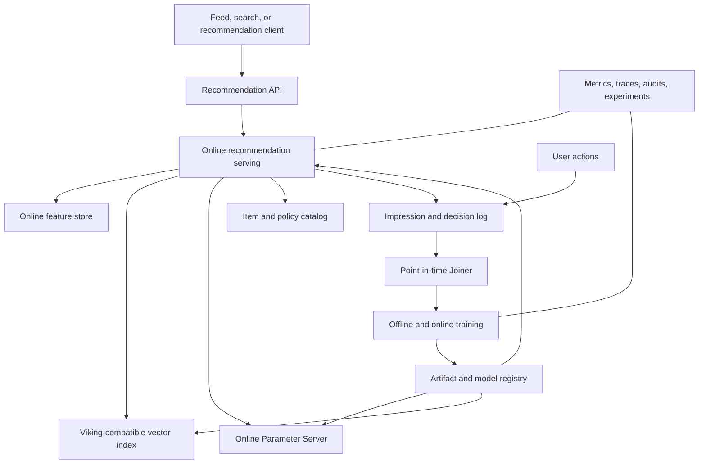

## 2. Online candidate funnel

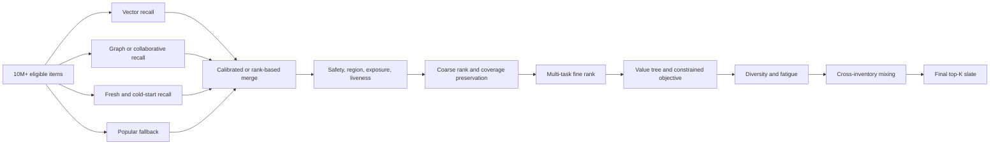

## 3. Event-time training lineage

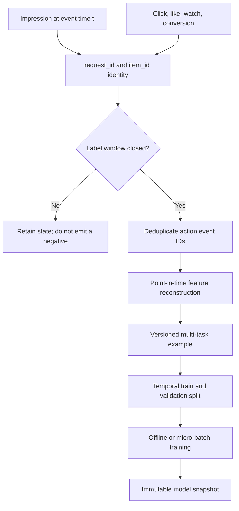

## 4. Offline-online consistency isolation

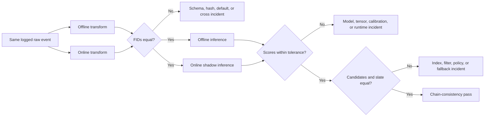

## 5. Multi-objective decision path

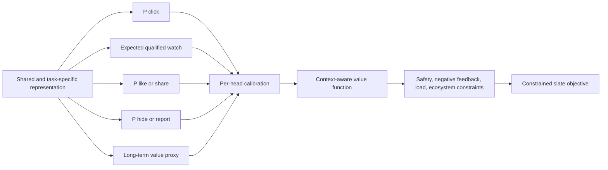

## 6. Generative recommendation boundary

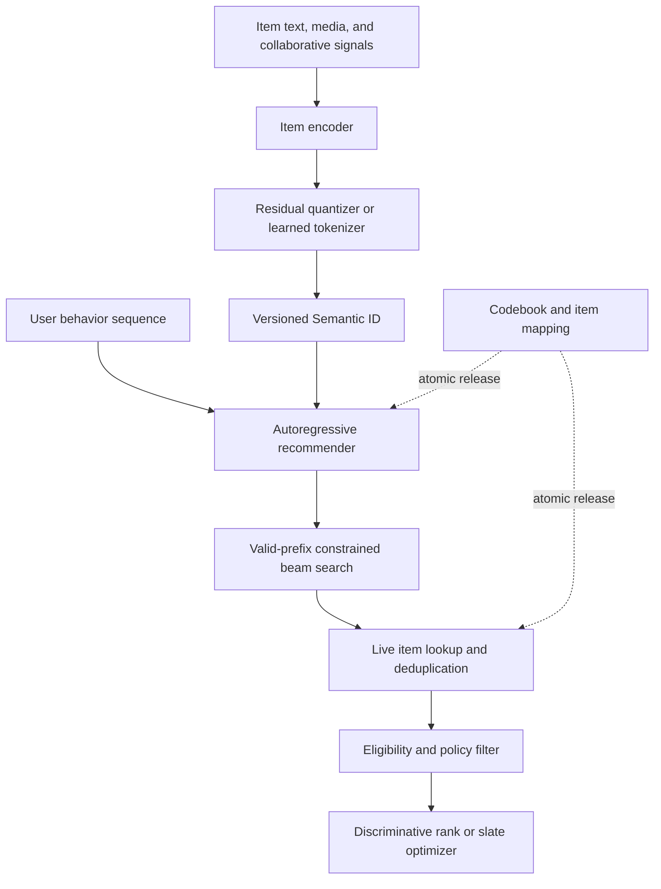

## 7. Outsourcing delivery gates

```mermaid
flowchart LR
    G0["G0: discovery and frozen requirements"] --> G1["G1: golden data and contracts"]
    G1 --> G2["G2: offline training and reproducibility"]
    G2 --> G3["G3: online shadow and replay parity"]
    G3 --> G4["G4: load, resilience, and security"]
    G4 --> G5["G5: controlled canary"]
    G5 --> G6["G6: handover and final acceptance"]
    G0 -. "owner approval" .-> G1
    G1 -. "independent evidence" .-> G2
    G2 -. "independent evidence" .-> G3
    G3 -. "independent evidence" .-> G4
    G4 -. "owner approval" .-> G5
    G5 -. "measured outcome" .-> G6
```

## 8. One launch protocol for every change

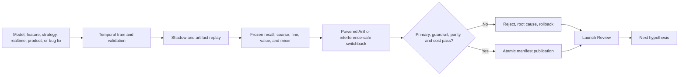

## 9. Shared Feed loop and business-specific labels

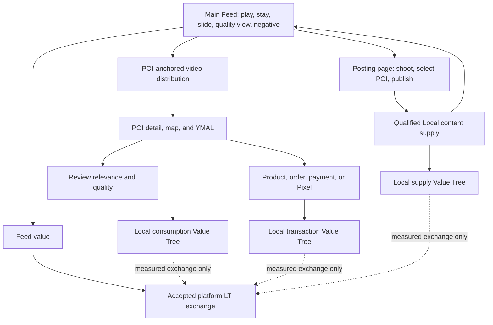

## 10. Joiner and score diagnosis

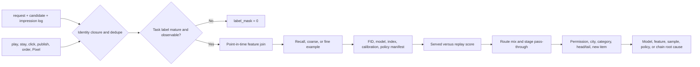

## 11. Semantic authority to tensor scale

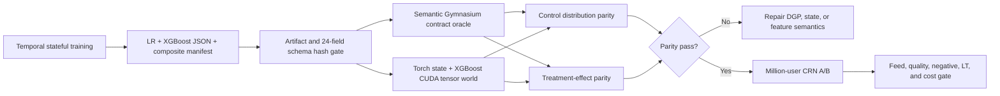

## 12. Composite V4 world authority

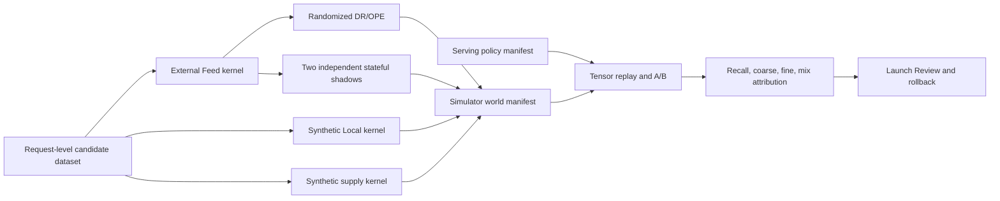

World-model authority and serving-policy authority are deliberately separate.
The external Feed kernel can validate Feed policy ordering without claiming POI,
supply, retention, commercialization, unified LT, or production deployment.
