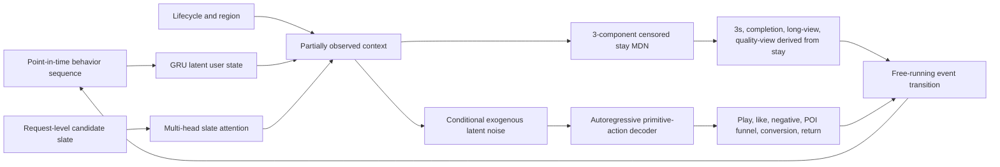

# L-SIMULATOR-005 — Learned neural-SCM Feed world model

Change type: major DGP architecture replacement candidate

Decision: accept the learned research lane; hold simulator-authority transition

Hardware: RTX 4090 24GB, CUDA 12.6

Evidence: `reports/world-model/2026-08-23-neural-scm-v4-4090*.json`

## Why V1–V3 were insufficient

V1–V3 are variants of one feature-derived formula world. V3 repaired random-stream
correlation and calibrated selected KuaiRand marginals, but label truth still came
from explicit affinity, quality, fatigue, duration, thresholds, hashes, and handcrafted
crosses that were also visible to evaluated rankers. This favored tabular trees and
did not validate joint actions, free-running sequences, interventions, or policy order.

V1–V3 本质上仍是同一个人工公式世界。V3 修复了随机数和边际校准，但 teacher 公式的
原料仍直接暴露给模型，无法证明复杂模型在真实行为世界中有效。

## Implemented architecture

The implementation is isolated under `fid_lab/feed_loop/world_model/`. It uses:

- request-level selected candidate, full slate, propensity, sequence, lifecycle,
  region, and mature primitive labels;
- a slate attention encoder and GRU user-state encoder;
- conditional stochastic latent noise unavailable to the serving policy;
- an autoregressive decoder for primitive actions;
- a three-component censored mixture-density survival model for stay;
- a point-in-time `session_exit` label with a maturity mask, with return sampled
  only after exit;
- deterministic derivation of 3-second, completion, long-view, and quality-view
  labels from sampled stay, eliminating contradictory independent heads;
- three bootstrap members, paired structural noise, free rollout, and uncertainty.

The first CVAE prototype was rejected during the run. Its label-conditioned posterior
reduced training loss while prior validation diverged, and a single LogNormal reduced
the observed stay P90 from 80.9 seconds to about 19.7 seconds. The accepted challenger
removes the future-label posterior and uses a three-component censored mixture.

## RTX 4090 training

The final run used all 709,644 training requests, three ensemble members, ten epochs,
batch size 8,192, and a frozen request-level candidate dataset. Training completed in
65.99 seconds. A validation-only log-stay median calibration learned a normalized
shift of 0.01216 and was stored inside the artifact; the test set remained held out.
The published external weight object is content-bound by SHA-256
`fb68810e8194b44f65e45e9ec3b2f35b60077b8f36f608015092c4bb4a1f0ed7`; weights are
not checked into the public Git repository.

| Gate | Result | Threshold | Status |
|---|---:|---:|---|
| Mean binary ECE | 0.00462 | ≤ 0.035 | Pass |
| Joint action correlation MAE | 0.0476 | ≤ 0.080 | Pass |
| Stay P50 relative error | 4.73% | ≤ 10% | Pass |
| Stay P90 relative error | 1.96% | ≤ 15% | Pass |
| Eight-step lag-1 MAE | 0.0101 | ≤ 0.120 | Pass |
| Ensemble probability std P99 | 0.0281 | ≤ 0.080 | Pass |

## Paired interventions and policy order

Three held-out synthetic interventions change affinity, quality, and fatigue. The
learned world model recovers all three effect signs with normalized effect MAE 0.326.
Across Popular, Quality, served rule, and world-model policies, it preserves five of
six pairwise orderings, giving Kendall tau exactly 2/3. Both synthetic gates pass.

These tests use the frozen V3 oracle and audit utility. They prove that the new lane
can learn and recover mechanisms inside a known world; they are not production causal
evidence. The exact `2/3` threshold is owned by the world-model contract rather than a
rounded duplicated `0.67` literal.

## Decision boundary

Distribution, free-running sequence, uncertainty, synthetic intervention recovery,
and synthetic policy-order gates pass. External intervention recovery and external
policy-order gates remain unavailable. Therefore:

- the neural SCM is accepted as the V4 research challenger;
- V3 remains the executable simulator authority;
- no production or real-user fidelity claim is allowed;
- authority promotion requires at least three artifact-bound randomized interventions
  and three frozen policies with measured outcomes, adequate support, effect-sign
  accuracy at least 0.80, normalized effect MAE at most 0.50, and policy Kendall tau
  at least 2/3.

这次升级已经摆脱“继续给公式加非线性”，但仍不冒充真实线上。内部随机流量与历史 A/B
尚未接入，所以新的 learned DGP 进入 research lane，不能替换最终实验 authority。
