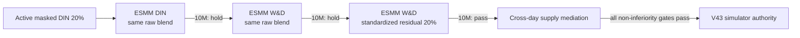

# L-FEED-POST-V43 — Entire-space funnel and calibrated serving

Decision: promote `Trending + I2I + 20% standardized-residual W&D` as the
simulator Feed Posting authority. It replaces the masked-conditional DIN 20%
release and preserves that exact release as the immediate rollback. This is
synthetic V4 evidence, not TikTok production lift.

中文口径：模拟器 Feed 投稿 authority 从条件概率 DIN20% 演进到
`entire-space ESMM-style W&D + request-standardized residual 20%`。上一版 DIN20%
被完整保留为一级回滚。本报告不代表真实生产收益。

## Why the old model stopped improving / 旧模型为何到顶

The label authority was already causally correct: click is observed on exposed
prompts, create is mature after click, publish after create, and quality/risk
after publish. The serving probability was not correct. It added
`P(create|click)` and `P(publish|create)` directly to `P(click)`, so the score
was not the probability that an impression produces a publish.

V43 keeps the conditional labels but trains an entire-space chain:

```text
pCreate = pClick * pCreateGivenClick
pPublish = pClick * pCreateGivenClick * pPublishGivenCreate
```

Create and publish joint losses are evaluated over valid impressions. Quality
and risk remain masked until publication; unavailable labels are never changed
to zero. The served score uses the joint probabilities, so
`pPublish <= pCreate <= pClick` is guaranteed by construction.

## Model ladder / 模型梯度

All models use the same 400k requests per seed, three seeds, 32 recalled
candidates, eight exposed prompts, 64-step Feed history, temporal split, and
creator-neural V4 world. Publish prevalence is about 0.28% in the impression
space, rather than the old 27% conditional-on-create prevalence.

| Model | Joint publish AUC | Publish LogLoss | Publish ECE20 | Quality AUC |
|---|---:|---:|---:|---:|
| Linear | 0.560–0.579 | 0.0268–0.0382 | 0.0119–0.0251 | 0.796–0.820 |
| W&D | 0.572–0.581 | 0.0191–0.0197 | 0.0009–0.0015 | 0.950–0.966 |
| DIN | 0.568–0.576 | 0.0189–0.0199 | 0.0006–0.0015 | 0.961–0.977 |
| Transformer+MMoE | 0.570–0.580 | 0.0190–0.0197 | 0.0007–0.0014 | 0.977–0.988 |

The deeper models learn post-publish quality, but that alone is not a launch
reason. W&D is selected on the Pareto frontier: comparable joint-publish
ranking, strong calibration, 56k parameters/artifact footprint, and lower
serving cost than DIN or Transformer+MMoE.

## Three adjacent Launch Reviews / 三次相邻迭代



Changing only the objective does not launch: ESMM DIN with the legacy raw
blend changes 1.76% of exposure membership; publish and LT confidence intervals
cross zero. Changing only the architecture also does not launch: ESMM W&D with
raw blend changes 2.47% of exposure membership and remains underpowered.

The actual serving bug is score-scale skew. A raw convex blend assumes Rule and
model scores share a meaningful scale. They do not. Request-standardizing both
scores before adding the learned residual makes the dose comparable across
models. W&D 20% then changes 6.28% of the exposed set and 9.78% of top-1 prompts.

## Powered creator A/B / 1,000 万请求作者实验

The final comparison uses 10m requests, 1.25m repeated creators, creator-stable
randomization, the same corpus and candidate budget, old DIN20% as control, and
the new W&D artifact as treatment.

| Metric | Relative effect | Absolute 95% interval |
|---|---:|---:|
| Publish rate | +1.20% | [0.000102, 0.000489] |
| Quality supply | +1.50% | [0.000090, 0.000299] |
| Feed stay | +1.66% | [0.000548, 0.001556] |
| Active-day contribution | +1.41% | [1.48e-7, 5.46e-7] |
| Platform LT | +1.64% | [9.88e-6, 2.86e-5] |
| Negative event | -0.56% | [-3.16e-5, 2.57e-5] |
| Selected content risk | +0.37% | [6.81e-5, 9.24e-5] |

All declared gates pass. Content risk rises significantly but its absolute
upper bound remains below the predeclared `0.0002` budget; it is a recorded
trade-off, not described as neutral. Throughput is about 223k requests/s with
4.91 GB peak GPU allocation in this simulator.

## Cross-day supply to Feed / 跨天供给消费传导

The accepted artifact is injected into a three-day world with 100k Feed users,
1.25m creators, and 1.5m items. Creator posts rise by `0.001063` per creator
with interval `[0.000815, 0.001311]`; creator quality also rises. Three-day
Feed stay and LT point estimates are positive but their intervals cross zero.
Creator active rate falls by `0.0000624`, still inside the predeclared
`-0.001` non-inferiority bound. All ecosystem gates pass, but this does not
claim proven long-term Feed growth.

## Evidence / 证据

- [Three-seed ladder](../../reports/launches/2026-08-24-feed-posting-v43-esmm-ladder-400k.json)
- [Objective-only hold](../../reports/launches/2026-08-24-feed-posting-v43-esmm-din-raw-ab-10m.json)
- [Raw W&D hold](../../reports/launches/2026-08-24-feed-posting-v43-esmm-wide-deep-raw-ab-10m.json)
- [Standardized W&D pass](../../reports/launches/2026-08-24-feed-posting-v43-esmm-wide-deep-standardized-ab-10m.json)
- [Cross-day mediation](../../reports/launches/2026-08-24-feed-posting-v43-cross-day-mediation.json)
- [Active authority](../../artifacts/releases/simulated-feed-posting-control.json)

The active authority is simulator-only and remains
`hold_external_creator_and_supply_validation`. Real creator experiments,
moderation outcomes, interference-aware supply tests, production P99, and
accepted external LT exchange evidence remain outside this repository.
