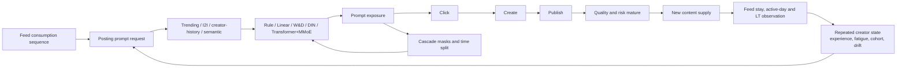

# L-FEED-POST-V4 — Creator-neural Feed Posting launch progression

Decision: promote `Trending + I2I + 20% DIN residual` as the simulator-only
Feed Posting authority. The 100% neural replacements are rejected. A 5% dose is
safe but underpowered. The 20% dose passes the powered creator-randomized A/B.
Nothing in this report is TikTok production evidence.

中文口径：模拟器内上线 `Trending + I2I + 20% DIN residual`。全量替换被风险门禁
拒绝，5% 剂量因随机实验功效不足而 hold，20% 剂量通过 1,000 万请求的作者随机
实验。本报告不代表真实线上收益。

## Supply and consumption boundary / 供给消费边界

The posting ranker is a separate authority from Feed consumption ranking. Its
request uses the creator's 64-step Feed sequence, but it owns different labels,
candidate routes, experiment unit, and rollback. The downstream Feed outcome is
measured as an experiment outcome; LT is not a training label.

Feed 投稿模型不会复用 Feed 消费模型权重。它读取同一条消费序列，但候选、标签、
实验单元和回滚 authority 独立。新供给的 Feed 价值只用于 A/B 度量，不作为训练标签。

## Root causes repaired / 修复的根因

The previous V4 attempt could not establish a valid model ladder for three
independent reasons:

1. `create` and `publish` were incorrectly trained in the full exposure space.
   V4 now defines click on exposed candidates, create only after click, publish
   only after create, and quality/risk only after publish. At 100k requests,
   publish prevalence changed from a misleading 0.18% of exposures to about 27%
   of mature create rows.
2. Materializing 400k × 64 × 32 sequences created a 6GB counter-random temporary
   and exceeded the 4090. Deterministic generation is now partitioned. Candidate
   IDs remain exact across partitions; floating features differ by at most
   `5.96e-8`.
3. The powered report originally gated on paired potential outcomes, which are
   unavailable in a real creator experiment. Launch authority now uses only the
   creator-cluster randomized estimator. Paired replay remains diagnostic.

These were sample-authority, runtime, and experimentation bugs. Changing model
depth or learning rate would not have fixed them.

## Offline ladder and full replacement / 离线与全量替换

All four models use the same 400k-request worlds, 64-step sequence, 32-dimensional
semantic vectors, time split, exposed candidates, and maturity masks across
three seeds.

| Model | Publish AUC | Quality AUC | Full-replacement result |
|---|---:|---:|---|
| Linear | 0.545–0.547 | 0.796–0.820 | Hold: selected risk +0.00126 |
| Wide & Deep | 0.549–0.558 | 0.953–0.967 | Hold: selected risk +0.00117 |
| DIN | 0.553–0.561 | 0.968–0.981 | Hold: selected risk +0.00139 |
| Transformer+MMoE | 0.556–0.563 | 0.977–0.990 | Hold: selected risk +0.00125 |

The complex models now clearly learn hidden nonlinear quality interactions.
They still do not earn a full replacement because the stable rule score owns a
strong saturation guardrail. The correct launch unit is a bounded residual,
not an unconstrained neural takeover.

复杂模型已经学到非线性交互，MMoE 的 quality AUC 接近 0.99。它们不能 100% 替换
规则的原因是内容风险，不是模型没有收敛。上线策略因此改为受约束 residual dose。

## Dose and powered A/B / 剂量与随机实验

A 200k-request screen compares four models at 2%, 5%, 10%, and 20% blends. The
5% DIN dose first advances because it is directionally positive and safely below
the risk budget. In the 10m-request, 1.25m-creator randomized test, its publish
and LT intervals cross zero, so it is held. Because safety still has substantial
margin, one predeclared escalation to 20% is run; no further dose search follows.

| DIN dose | Publish | Feed stay | Platform LT | Risk absolute | Decision |
|---|---:|---:|---:|---:|---|
| 5% | +0.60% | +0.73% | +0.72% | +0.000018 | Hold: primary CIs cross zero |
| 20% | +1.21% | +1.62% | +1.60% | +0.000088 | Pass |

At 20%, the randomized absolute 95% intervals are `[0.0000969, 0.0004776]`
for publish and `[0.00000891, 0.00002729]` for LT. The selected-risk upper bound
is `0.0000999`, below the declared `0.0002` budget; the negative-event interval
crosses zero. The report processes about 313k requests/s with 2.51GB peak GPU
allocation. This is simulator throughput, not an online P99 claim.

## Evidence / 证据

- [400k three-seed cascade ladder](../../reports/launches/2026-08-24-feed-posting-v4-cascade-400k.json)
- [200k dose screen](../../reports/launches/2026-08-24-feed-posting-v4-dose-screen-200k.json)
- [5% powered hold](../../reports/launches/2026-08-24-feed-posting-v4-din-005-ab-10m.json)
- [20% powered pass](../../reports/launches/2026-08-24-feed-posting-v4-din-020-ab-10m.json)
- [Cross-day supply mediation](../../reports/launches/2026-08-24-feed-posting-cross-day-mediation-v4.json)
- [Hash-bound simulator authority](../../artifacts/releases/simulated-feed-posting-control.json)

The user-response and provider-state abstraction follows
[RecSim NG](https://arxiv.org/abs/2103.08057), dynamic feedback-loop stress
testing follows [SARDINE](https://arxiv.org/abs/2311.16586), and the provider
utility boundary follows [Google's provider-aware simulation study](https://research.google/pubs/towards-content-provider-aware-recommendation-systems-a-simulation-study-on-interplays-among-user-and-provider-utilities/).

## Cross-day mediation and remaining boundary / 跨天传导与边界

The accepted posting artifact is also injected into the three-day ecosystem:
same-day Feed feedback updates creator motivation and fatigue; the posting
ranker changes prompt click/create/publish; up to 20k new items enter the next
catalog; later Feed requests consume that changed supply. The run covers 100k
users, 1.25m creators, and a 1.5m-item corpus.

Cumulative posts rise by `0.000370` per creator with 95% interval
`[0.000200, 0.000539]`; creator quality rises significantly. Feed stay rises by
`0.119` seconds per user with interval `[0.0119, 0.2258]`. Three-day LT changes
by `+0.00143`, but its interval crosses zero. The mediation gate therefore means
positive supply with consumer non-inferiority, not proven cross-day LT lift.

这个实验已经把投稿模型真正接入次日 Feed。作者发帖和供给质量显著增加，stay 有正向
证据，但三天 LT 仍不显著。因此不能把直接投稿 A/B 的 LT 增量偷换成跨天长期收益。

The mediation runner observes both potential worlds and is a simulator stress
test. Only the separate 1.25m-creator randomized report is launch authority.
External creator logs, real moderation outcomes, interference-aware supply
experiments, and production latency evidence remain mandatory.
