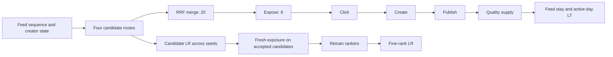

# L-FEED-POST-REQUEST-001 — Feed posting request and model ladder

Change type: Feed-to-creation candidate retrieval, multi-task rank, and supply value  
Scale: 150,000 requests × 3 seeds × two materialization phases  
Decision: promote calibrated Linear ranker; hold new candidate routes and deeper models  
Evidence: `reports/launches/2026-08-24-feed-posting-request-launch-review.json`

## Business boundary / 业务边界

Feed posting is not POI posting. The request begins after Feed consumption and
recommends a creation prompt, topic, sound, or template:

```text
Feed sequence + creator history + noisy profile
  -> Trending / I2I / Creator-history / Semantic candidates
  -> 20 merged prompts -> 6 exposed prompts
  -> prompt click -> create start -> publish -> quality supply
  -> downstream Feed stay, active-day LT component, and content risk
```

Feed 投稿不是“给草稿选 POI”。它根据消费序列和创作者状态推荐拍摄主题、声音或模板，
最终同时看点击、开拍、发布、供给质量及新供给进入 Feed 后的 LT 和生态风险。

The teacher sees latent creative intent and nonlinear interactions. Rankers see
only noisy observed state. The audit oracle is never injected into candidates,
and behavioral labels are written only on the six actually exposed prompts.



## Pipeline failures found / 本轮发现的链路问题

Three failures were fixed before accepting any model:

1. Trending retrieval returned `[1,K]` instead of `[request,K]`; scale execution
   crashed before candidate merge.
2. Candidate expansion was evaluated and then deeper rankers were trained on the
   old candidate distribution. One seed regressed every model. The runner now
   enforces `candidate LR -> global decision -> fresh exposure -> retrain -> fine LR`.
3. Sparse-task `pos_weight` logits were fused as probabilities. The score now
   subtracts the weight-induced logit offset before multi-objective fusion and
   applies the same observable quality/saturation guardrail to every learned model.

这三项分别对应候选维度错误、召回变更后的训练分布偏移、以及加权损失造成的概率尺度错误。
它们都属于底层模拟和上线协议问题，不能靠换模型或调学习率掩盖。

## Candidate reviews / 候选实验

| Proposal | Oracle recall | Publish/request | Platform LT/request | Selected risk | Decision |
|---|---:|---:|---:|---:|---|
| Trending+I2I → +Creator history | +0.00265 | +0.01994 | +0.000928 | +0.000046 | Hold; seed instability |
| Trending+I2I → Semantic full | +0.00212 | +0.01523 | +0.000702 | +0.000111 | Hold; seed instability |

Both routes improve mean supply and LT, but neither clears every seed's fixed-load
content-risk gate. The simulated authority therefore retains Trending+I2I.

## Fine-rank reviews / 精排模型实验

All models are trained on fresh exposure from the accepted candidate policy and
compared independently with the same Rule control.

| Treatment | Publish AUC range | Publish/request | Platform LT/request | Selected risk | Decision |
|---|---:|---:|---:|---:|---|
| Linear | 0.9052–0.9112 | +0.02507 | +0.001198 | -0.000784 | Pass all seeds |
| Wide & Deep | 0.9127–0.9239 | +0.01999 | +0.000954 | -0.000779 | Hold; seed instability |
| DIN | 0.9239–0.9287 | +0.01323 | +0.000637 | -0.000750 | Hold; seed instability |
| Transformer+MMoE | 0.9272–0.9291 | +0.01182 | +0.000572 | -0.000742 | Hold; seed instability |

This is the intended answer to “why can a higher-AUC model fail to launch?” The
deeper models rank logged exposed pairs better, but one independent world still
shows negative incremental publish/LT. Offline capacity is evidence, not launch
authority. Linear is the only treatment whose confidence gates pass in all seeds.

这不是“复杂模型没有训练好”的模糊结论。复杂模型的 AUC、PR-AUC 和 loss 都更好，
但跨 seed 的业务增量不稳定，因此只能 hold。当前可上线模拟 authority 是 Linear。

## Scale, artifacts, and DAG / 性能、产物与 DAG

Each final seed processes about 16.1k requests/s on the RTX 4090 and peaks at
2.30 GiB allocated GPU memory. All 12 model artifacts replay with zero score
delta after save/load. The accepted authority is
`artifacts/releases/simulated-feed-posting-control.json`; rollback is the
Trending+I2I Rule policy.

Dagster is not added to the tensor hot path. The repeated runner already enforces
the two materialization phases in process. Dagster becomes justified when these
assets require scheduled multi-machine execution, persistent partition retries,
or external data lineage. It must orchestrate the same report/artifact contracts;
it must not become a second simulation implementation.

## Evidence boundary / 证据边界

This is teacher-hidden synthetic evidence, not TikTok production evidence. The
structure follows the multi-agent latent-state direction in
[RecSim NG](https://arxiv.org/abs/2103.08057) and the multi-behavior/session
separation in [KuaiSim](https://arxiv.org/abs/2309.12645). Production promotion
still requires creator impression/action logs and randomized supply experiments.
