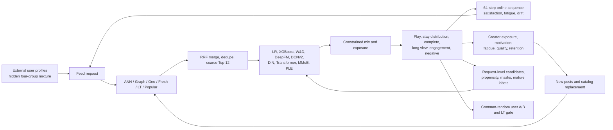

# L-FEED-V4-010 — External-mixture Feed loop and request-aware ranking

Decision: Feed behavior and consumer-to-creator ecosystem are accepted as the
active simulator components. The MMoE guarded 0.010 policy passes the powered
synthetic A/B and becomes the V4 simulator ranking control. Nothing in this
review is production-lift evidence.

中文口径：Feed 行为世界与消费到供给闭环已进入模拟器 authority；request-aware
模型仍须通过大规模合成 A/B。本报告不代表 TikTok 生产环境增量。

## Causal loop / 因果闭环

The response world is not a formula copied into serving features. A trained
external sequence adapter supplies seven action probabilities and expected
normalized stay. Hidden mixture residuals add population heterogeneity without
entering the ranker feature vector. A conditional residual bootstrap learned
from randomized holdout reconstructs the stay distribution, including its
completion mass, instead of treating a conditional mean as a deterministic
watch time.

行为世界不再把同一套人工公式同时暴露给模型。外部序列 adapter 产生七种行为概率和
期望 stay，隐藏 mixture 只属于 simulator。随机 holdout 学出的条件残差分布恢复短播、
长播和播完尾部，因此 `complete_play` 不再恒为零。

## Frozen request dataset / 冻结请求样本

The authority contains 279,903 train, 83,430 validation, and 63,135 test
requests. Every row retains 64 recalled candidates, the exact coarse mask,
served scores, one exposure, its propensity, a 64-by-8 point-in-time sequence,
21 labels and independent maturity masks. The same online sequence state now
feeds logging and serving; a deterministic rebuild proved tensor equality.

The temporal split intentionally exposes drift. Train/test play rates are
12.45% and 7.36%; mean stay falls from 6.49 to 3.82 seconds; completion falls
from 2.40% to 1.32%. Pure organic Feed has no observable accepted-ad outcome,
so that label is masked, not written as zero.

## Offline model diagnosis / 离线模型诊断

All models use the same time splits and candidate set. Snapshot models see only
the selected candidate. DIN and Transformer see the candidate slate and online
sequence. MMoE and PLE predict ten primitive tasks. LT is never a training
label. Exact exploration propensity reaches 1/60; stabilized IPS therefore
supports the full inverse weight instead of clipping it at 20.

The policy-aware 200k run reports long-view AUC 0.620 for logistic regression,
0.608 for XGBoost, 0.646 for DIN, 0.676 for Transformer, 0.668 for MMoE, and
0.667 for PLE. W&D, DeepFM, and DCNv2 remain below 0.51 under the current sparse
contract. This proves sequence capacity, but it does not prove candidate or
business value. GAUC coverage is reported because most short user trajectories
contain only one label class.

## Simulator Launch Review / 模拟上线复盘

The first 50k-user dose screen compares MMoE guarded blends with the last
accepted personalized policy. A 0.005 blend estimates LT +0.64% and stay +3.36%;
a 0.010 blend estimates LT +1.44% and stay +5.02%. Both LT confidence intervals
cross zero at 50k users. Only the predeclared 0.010 candidate proceeds to the
one-million-user powered review; no additional parameter search is allowed
after observing these outcomes.

The one-million-user review passes every declared gate. LT per user improves
1.62%, with an absolute 95% confidence interval of [0.0217, 0.0421]. Stay per
exposure improves 2.94%, quality-long-view improves 2.85%, and long-view is
neutral. Negative feedback changes by -0.72% with an interval crossing zero.
Selected duration rises 3.76%, below the 5% reward-hacking guard. Fine audit
regret falls 4.40%.

The cost is explicit. Treatment simulation throughput is about 97k requests/s
versus 198k for control. The synthetic launch accepts that cost for research
simulation; it does not prove a production P99 latency or capacity budget.

The hash-bound evidence is
[`2026-08-24-feed-v4-mmoe-guarded-010-1m.json`](../../reports/launches/2026-08-24-feed-v4-mmoe-guarded-010-1m.json).

## What still fails / 仍未解决

- The world is calibrated by public randomized Feed evidence, not proprietary
  TikTok traffic. It is a reproducible falsification environment, not a digital
  replica claim.
- W&D/DeepFM/DCNv2 need a separate sparse/FID and class-imbalance review. Their
  current failure cannot be blamed on insufficient neural capacity alone.
- Candidate audit utility is simulator-only evaluation truth. It never enters
  training or serving.
- Feed Posting prompt ranking is still a separate surface. Creator supply
  response is closed, but the posting-page model is not silently treated as the
  same model as Feed consumption ranking.
- Local, ads/live, and commercialization keep separate response authorities and
  experiment units. They do not borrow missing Feed labels.

The design follows the multi-agent latent-state abstraction in
[RecSim NG](https://arxiv.org/abs/2103.08057), request/session/cross-session
evaluation in [KuaiSim](https://arxiv.org/abs/2309.12645), dynamic feedback-loop
stress tests in [SARDINE](https://arxiv.org/abs/2311.16586), and provider-state
modeling in [Google's provider-aware simulation study](https://research.google/pubs/towards-content-provider-aware-recommendation-systems-a-simulation-study-on-interplays-among-user-and-provider-utilities/).
