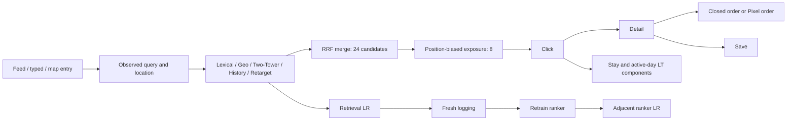

# L-LOCAL-SEARCH-REQUEST-001 — Local Search retrieval and rank ladder

Change type: query retrieval, request-aware ranking, transaction funnel, and LT

Scale: 120,000 search requests × 3 seeds × two materialization phases

Decision: retain Lexical+Geo retrieval; promote calibrated Linear ranker
Evidence: `reports/launches/2026-08-24-local-search-request-launch-review.json`

## Search journey / 搜索业务链路

This is a joint Search/Recommendation journey, not an independent Gaussian
surface demo. Entry source, query intent, POI corpus, geographic context, recent
behavior, candidate route, position propensity, action funnel, and Local outcome
remain in one request identity.

这条链路不是独立生成“搜索特征和标签”。用户可以从 Feed、主动输入或地图进入搜索；
每个请求保留完整候选、实际曝光、位置 propensity、点击到订单级联，以及闭环和开环
Pixel 的可观测性。

## Request-level sample / 请求级样本

Each seed contains:

- 120,000 requests;
- 2,880,000 candidate rows and 960,000 actually exposed rows;
- click positive rate about 8.63%, detail 6.42%, save 2.05%, order 1.69%;
- about 19–20% of orders on the open-loop path;
- position propensities from 1.00 at rank 1 to 0.375 at rank 8;
- a hash-bound 2,048-request audit trace.

Labels are written only for exposed results. A clicked open-loop result whose
Pixel conversion is not observable receives `order_mask=0`; it is not converted
to a negative. Torch rankers use inverse-propensity-weighted pointwise plus
request-listwise losses. Two-Tower negatives are exposed-but-not-selected POIs.

## Retrieval evolution / 召回演进

| Proposal | Oracle Recall | Query success | Order | Platform LT | Decision |
|---|---:|---:|---:|---:|---|
| Lexical+Geo → +Two-Tower | +0.04809 | -0.06654 | -0.04169 | -0.01077 | Reject |
| Lexical+Geo → +History | +0.04498 | -0.06378 | -0.03930 | -0.01044 | Reject |
| Lexical+Geo → +Retarget | +0.04530 | -0.06387 | -0.03952 | -0.01047 | Reject |

The learned retriever is real: pair accuracy is 0.580–0.593 after training from
actual search exposure. It also adds roughly 4.5–4.8pp audit-oracle recall. But
RRF replacement removes strong Lexical/Geo candidates and every business metric
regresses. Recall@K therefore cannot authorize launch.

Two-Tower 确实学到了 pairwise 偏好，也提高了 Recall，但新增候选挤掉了搜索强意图候选。
这是“召回指标上涨、线上失败”的完整实例，所以保留 Lexical+Geo。

## Adjacent ranker evolution / 相邻精排实验

| Control → treatment | Query success | Order | Platform LT | Selected risk | Decision |
|---|---:|---:|---:|---:|---|
| Rule → Linear | +0.02533 | +0.02207 | +0.005441 | -0.001900 | Pass all seeds |
| Rule → XGBoost pairwise | +0.02535 | +0.00839 | +0.004705 | -0.000008 | Hold; 2/3 seeds |
| Linear → Wide & Deep | +0.00880 | +0.00057 | +0.001877 | +0.000477 | Hold risk guardrail |
| Wide & Deep → DIN | -0.00002 | +0.00017 | +0.000049 | -0.000035 | Reject mean regression |
| DIN → Transformer+MMoE | +0.00002 | -0.00076 | -0.000044 | +0.000060 | Reject mean regression |

The deeper models have better offline AUC. For example, order AUC moves from
roughly 0.823–0.833 for Linear to 0.854–0.862 for W&D/DIN. Yet W&D breaches the
fixed-load risk guardrail, and later sequence models do not add stable value.
The accepted simulated authority therefore stops at Linear.

复杂模型不是“上不了线”，而是必须证明相对上一代的增量。W&D 的离线 AUC 和 LT 都更高，
但风险门禁失败；DIN 和 Transformer 相对上一代没有稳定增量，因此不能越级发布。

## Engineering and evidence boundary / 工程与证据边界

The final seed runs at 12.2k–12.6k requests/s on the RTX 4090 with 4.35 GiB peak
allocated memory. Eighteen retrieval/ranker artifacts are hash-bound; save/load
replay delta is zero, including the CuPy DLPack XGBoost CUDA path.

The world structure is informed by [KuaiSAR's integrated Search and Recommendation
behaviors](https://arxiv.org/abs/2306.07705), [Airbnb's trip-level Two-Tower and
hard-negative construction](https://airbnb.tech/ai-ml/embedding-based-retrieval-for-airbnb-search/),
and [Google's position-bias work in sparse personal search](https://research.google/pubs/position-bias-estimation-for-unbiased-learning-to-rank-in-personal-search/).
It remains synthetic evidence. Production promotion requires external query/POI
logs, real Pixel coverage, and randomized search experiments.
