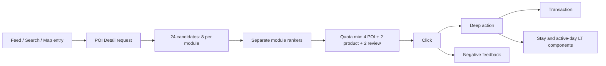

# L-POI-DETAIL-REQUEST-001 — POI Detail module ranking

Change type: related POI, product, and review module ranking

Scale: 500,000 page requests × 3 seeds, trained and replayed on one RTX 4090

Decision: retain the fixed 4/2/2 quota mix and rule ranker

Evidence: `reports/launches/2026-08-24-poi-detail-request-launch-review.json`

## Page journey / 页面链路

One request preserves the upstream entry source, current POI, user intent,
history sequence, all 24 candidates, eight exposures, mature labels, module
identity, and the final selected entity. Product and POI candidates may receive
a transaction label; review candidates use `transaction_mask=0` rather than a
fabricated negative.

一个请求同时保留入口、当前 POI、行为序列、完整候选、曝光和成熟标签。三个模块模型
不共享参数，评价模块不可观测的交易标签会被 mask，不会被错误写成负样本。

## Model ladder / 模型迭代

| Control → treatment | Deep action | Transaction | Platform LT | Selected risk | Decision |
|---|---:|---:|---:|---:|---|
| Rule → separate Linear | +0.009787 | +0.002618 | +0.001987 | -0.002693 | Hold safety uncertainty |
| Linear → separate W&D | +0.010213 | +0.001667 | +0.000975 | +0.000923 | Hold risk regression |
| W&D → specialized DIN/MMoE/Deep | +0.000044 | -0.000058 | +0.0000004 | +0.000020 | Hold no incremental value |

Offline capacity behaves as expected. Linear transaction AUC is 0.908–0.917;
W&D reaches 0.927–0.928; the specialized family is 0.927–0.928. Higher AUC is
therefore real, but it is not sufficient for promotion. Linear increases raw
negative feedback per request by 0.000222, while W&D increases selected risk.
The control remains the only accepted simulated authority.

离线结果证明复杂模型学到了更多信号，但 A/B 门禁找到了两类线上问题。Linear 的负反馈
不确定性没有关闭，W&D 的风险切片明确变差，specialized 相对 W&D 又没有稳定增量。
这正是“模型 AUC 上涨但不能上线”的完整 Launch Review，而不是强行让复杂模型获胜。

## Scale and evidence boundary / 规模与证据边界

The 500k run uses 4.17 GB peak allocated GPU memory and sustains roughly
52k–61k requests/s per seed. Nine model artifacts replay exactly after
serialization. This is teacher-hidden synthetic evidence; real POI Detail,
transaction, and review logs remain required before production use.
