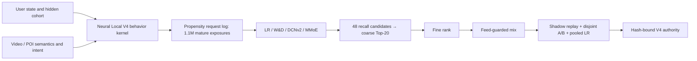

# POI distribution neural V4 Launch Review

Decision: promote Linear coarse + Linear fine inside the simulator; retain the
Feed-guarded mixer. Production Local validation remains required.

## What changed / 本轮改造

V3 generated Local actions from visible linear sigmoid formulas. V4 keeps the
externally calibrated Feed kernel but generates anchor, detail, favorite, and
conversion through a hidden neural teacher. The teacher combines user cohort,
content affinity, POI quality, inventory, geography, search, retargeting, and
fulfilment interactions. Serving models receive only the canonical 28 noisy,
point-in-time features.

V3 的 Local label 基本可以被规则直接复现。V4 把用户异质性、多维语义、搜索与重定向
意图以及非线性交互放进隐藏 teacher，模型只能通过曝光日志学习，不能读取 latent。

## Sample and training / 样本与训练

- 50,000 users × 24 requests generated 1,099,300 mature request examples.
- Every request retains 48 recall candidates, route bits, coarse/fine scores,
  one exposed candidate, propensity, 24-step behavior sequence, and cascade labels.
- Train/validation/test are time-ordered request windows.
- Pointwise entire-space cascade loss is IPS corrected.
- Anchor-positive requests add a request-level listwise loss against all 48
  candidates; no hidden teacher utility is used as a label.
- Calibration preserves `detail <= anchor` and `conversion <= detail`.

## Offline capacity / 离线能力

| Model | Parameters | Anchor AUC | Detail AUC | Conversion AUC |
|---|---:|---:|---:|---:|
| Linear | 174 | 0.814 | 0.851 | 0.852 |
| Wide & Deep | 7,908 | 0.866 | 0.864 | 0.877 |
| DCNv2 | 10,338 | 0.864 | 0.863 | 0.877 |
| MMoE | 31,194 | 0.866 | 0.864 | 0.880 |

The complex models clearly beat Linear offline. That result does not authorize
launch: candidate-distribution shift, calibration, Feed stay, and LT are checked
in the online simulator.

## Stage Launch Reviews / 分阶段实验

| Stage | Control → treatment | Primary effect | Platform LT/user | Decision |
|---|---|---:|---:|---|
| Coarse, 1M users/seed | Quality → Linear | oracle recall +0.1360 | +0.01367 | Pass pooled 3 seeds |
| Coarse | Linear → DCNv2 | oracle recall -0.000002 | 0 | Reject |
| Fine, 200k users/seed | Rule → Linear | anchor +0.00938 | +0.07133 | Pass pooled 3 seeds |
| Fine | Linear → W&D | anchor +0.00060 | -0.02729 | Reject LT |
| Fine | W&D → DCNv2 | anchor -0.00420 | -0.01693 | Reject |
| Fine | W&D → MMoE | anchor -0.00070 | -0.01801 | Reject |
| Mix | W&D → +0.003 Local weight | Local value +0.00169 | -0.00912 | Reject LT |

The coarse effect needed 1M users per seed before its LT confidence interval
closed above zero. This reproduces the real large-traffic pattern where a
material pass-through gain produces only a small business effect. W&D is the
important failure case: AUC rises sharply, but the selected slate loses stay
and LT, so it cannot replace Linear.

## Combined launch / 联合上线

The final 500k-users-per-seed experiment combines the independently accepted
coarse and fine changes:

| Metric | Pooled effect | 95% confidence interval |
|---|---:|---:|
| Coarse oracle recall | +0.14159 | [0.14119, 0.14200] |
| Anchor click rate | +0.00947 | [0.00935, 0.00959] |
| Conversion rate | +0.000420 | [0.000399, 0.000442] |
| Local Value Tree/exposure | +0.01491 | [0.01463, 0.01518] |
| Stay/exposure | +0.21983 seconds | [0.18572, 0.25395] |
| Platform LT/user | +0.08617 | [0.06775, 0.10459] |

The authority is simulator-only. These numbers are synthetic effect-recovery
evidence, not company metrics or a production lift claim.
