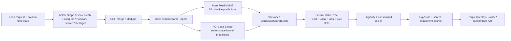

# L-SERVING-UNIFIED-001 — Main Feed and Local score composition

Decision: `continue_powered_online_experiment`. The architecture and paired
shadow gates pass. The disjoint randomized A/B proves Local anchor growth, but
does not yet prove nonnegative platform LT, stay, or negative feedback. The
candidate is not the active release.

中文口径：统一调用链已通过架构验证与同用户反事实回放；独立用户分桶只证明了
POI anchor click 增长，尚未证明平台 LT、stay 与负反馈门禁。因此该版本只进入继续扩量
实验，不能写成“上线”。

## Serving graph / 在线调用图

The old serving adapter exposed only one anonymous Feed scalar. The new
contract retains base score, calibrated primitive task probabilities, Local
funnel probabilities, queue values, and model versions at request-candidate
shape. Shape drift, missing primitive heads, Feed release-weight drift, and
invalid Value Tree configuration fail closed.

## Dose screen / 剂量筛选

Four predeclared 100k-user candidates used the same behavior artifact, item
corpus, candidate budget, main Feed model, Local model, seed, and eight-step
request horizon. Only Local coarse/fine weights changed.

| Coarse / fine | Anchor lift | LT lift | Stay lift | Result |
|---|---:|---:|---:|---|
| 0.025 / 0.050 | +0.82% | +0.005% | +0.029% | LT underpowered |
| 0.050 / 0.050 | +0.82% | +0.005% | +0.029% | no extra fine effect |
| 0.050 / 0.100 | +2.48% | +0.007% | +0.056% | LT underpowered |
| 0.100 / 0.200 | +5.69% | +0.021% | +0.091% | advance one candidate |

The screen shows that the Local model changes both coarse ordering and final
exposure. It also shows why model AUC or Local click alone is insufficient:
the platform effect is roughly two orders of magnitude smaller than the Local
primary effect.

## One-million-user review / 百万用户复盘

Paired common-random replay estimates anchor click +5.14%, platform LT per user
+0.027%, stay per exposure +0.063%, and coarse oracle recall +0.018%. Their
absolute 95% confidence intervals are respectively `[0.000241, 0.000274]`,
`[0.000203, 0.000895]`, `[0.00225, 0.00770]`, and
`[0.000127, 0.000170]`. The negative-rate increase is small and remains inside
the predeclared shadow guardrail, but it is reported rather than hidden.

The disjoint randomized A/B estimates anchor click +4.42% with a positive 95%
interval. Platform LT is +0.023% but its interval crosses zero; stay is -0.212%
and negative feedback -0.59%, with both intervals crossing zero. This is a
power limitation, not evidence that those guardrails passed. The previous
single `decision=pass` implementation incorrectly treated paired replay as the
randomized launch authority; the launch state machine now reports shadow and
online gates separately.

The treatment processed about 98k requests/s on the RTX 4090 and used 1.60 GB
peak GPU memory. This is simulator throughput, not production latency.

Hash-bound evidence:
[`2026-08-24-unified-feed-local-serving-v1-1m.json`](../../reports/launches/2026-08-24-unified-feed-local-serving-v1-1m.json).

## Remaining boundary / 剩余边界

- The active Feed MMoE and active POI Linear artifacts remain independent
  authorities. The composite candidate does not replace either release.
- The composite tree zeros the legacy business weights in the main Feed value
  calculation. Local value enters once, through the specialized Local model;
  the accepted Feed control remains the rollback authority.
- Ads and Live slots are typed but have zero weight until their own response
  models and accepted LT exchange evidence exist.
- This report is synthetic simulator evidence. It does not claim TikTok
  production lift.
