# Recommendation production failure runbook

The Windows RTX 4090 worker has a separate
[bounded WSL runtime contract](windows-gpu-runtime.md). GPU jobs must run through
its systemd cgroup rather than an unbounded `nohup` process.

Each row starts with the user-visible symptom, identifies the owning boundary,
and names evidence that can falsify the hypothesis. A higher offline AUC is not
root-cause evidence.

| Failure | First evidence | Immediate containment | Durable correction |
|---|---|---|---|
| Index/model version mismatch | Manifest mismatch and route Recall@K drop | Disable mismatched ANN route | Atomic model-index publication and replay gate |
| Hard-negative drift | Source mix or sampling-probability change | Restore accepted sampler manifest | One mixture authority and per-source metrics |
| Coarse loses fine winners | Teacher Top-K preservation drops | Increase budget or restore prior model | Distillation and slice-level pass-through gate |
| Recall and coarse ownership overlap | Logged coarse score differs from the score that selected survivors | Reject the report and freeze rollout | Recall emits only the merged pool; coarse alone emits score, mask, and budget |
| Late commerce becomes negative | Label changes with watermark | Mask immature tasks and rebuild partition | Task event-time windows and lateness accounting |
| Pixel duplication or loss | Duplicate, orphan, identity-missing rates | Deduplicate and mask unobservable outcomes | Idempotent ingestion and observability contract |
| Join explosion | More than one example per decision | Quarantine the partition | Unique decision key and pre-join deduplication |
| Future feature leakage | Feature timestamp exceeds impression | Reject the snapshot | Point-in-time query and replay oracle |
| MMoE gate collapse | One expert dominates | Restore simpler baseline | Expert utilization monitoring and PLE comparison |
| AUC rises, online does not | Replay stable but slate unchanged | Stop extension and localize causal stage | Match metric to opportunity, value, or guardrail |
| GAUC looks healthy on little data | Eligible group/record coverage collapses | Stop model comparison | Report GAUC value and both coverage rates together |
| Simulator predicts impossible lift | Funnel rates or state transitions miss logged slices | Do not use the forecast | Calibrate dynamics on held-out logs and retain sensitivity ranges |
| Offline and served XGBoost devices differ | Device-fallback warning and latency jump | Serve the accepted CPU path | Use a device-matched input/runtime and gate P99 plus score replay |
| PS shard unavailable | Missing shard and lookup errors | Use compatible cached snapshot | Replication, checkpoint and staleness policy |

```mermaid
flowchart LR
    SRM[Assignment and SRM] --> Trigger[Eligibility and trigger]
    Trigger --> Sample[Label maturity and sampling]
    Sample --> Replay[Feature and score replay]
    Replay --> Recall[Recall opportunity]
    Recall --> Cascade[Coarse and fine pass-through]
    Cascade --> Value[Calibration and value tree]
    Value --> Slate[Mixing and guardrails]
    Slate --> Power[Power and long-term effects]
```

| Remote GPU job survives its SSH session | Duplicate PIDs and abnormal QPS/memory contention | Kill the stale owned PID and invalidate timing evidence | Job manifest records PID, source hash, output path, and terminal state |
| WSL root becomes read-only | Write probe fails and `hv_storvsc` / aborted ext4 journal appears in kernel log | Stop the owned job and terminate the distro | Windows keepalive performs a bounded write-probe recovery; resume only content-verified partitions |

For any incident, answer in five sentences: what users saw; which invariant
failed; the metric or SQL that proved it; how exposure was contained; and which
single owner prevents recurrence. Corresponding ClickHouse queries are under
`sql/clickhouse`.
