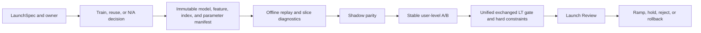

# Unified Recommendation Launch Protocol

Every main-Feed change uses one protocol. A category may declare training not
applicable, but it may not skip the applicability decision, frozen artifact,
shadow/replay, randomized evidence, guardrails, or review.

## LaunchSpec

The required fields are launch id, category, hypothesis, single isolated change,
owner, control and treatment artifact ids, primary metric, guardrails, product
dependency, short-term value, long-term value, trigger population, experiment
layer, and rollback authority.

Supported categories are model, feature, strategy, architecture, realtime,
Bug fix, chain diagnosis, product cooperation, business Value Tree, and
long-term value. Mutually dependent parameters share one experiment layer;
different layers are orthogonal. Two layers may not own the same parameter.

## Training gate

- Model changes retrain on point-in-time joined examples and report temporal or
  user-disjoint splits, sampling correction, task prevalence, calibration, and
  candidate-level metrics.
- Feature and realtime changes either retrain or explicitly reuse the frozen
  control model to isolate data freshness/quality. The choice is part of the
  review, not an informal exception.
- Strategy, product, Value Tree, architecture, and metric-only fixes may declare
  no weight update. They still freeze model and parameter versions.

## Shadow and replay

Every request carries resolved experiment cells plus the full-chain parameter
snapshot. Replay verifies feature values, route membership, candidate budgets,
model/index/task order, calibrated scores, and final slate. Architecture and Bug
fixes must demonstrate business-output neutrality unless impact is intentional.

## A/B and decisions

Assignment is stable by user. Same-layer experiments are mutually exclusive;
cross-layer assignment is orthogonal. Reports include effect size, confidence
interval, p-value, CUPED/MDE where applicable, trigger and exposure rates, SRM,
known DGP truth only in simulation, and interaction slices for overlapping tests.

Stay, long-view, quality-long-view, negative feedback, return, calibration,
candidate coverage, latency, and memory remain mandatory diagnostics. The
growth decision uses one authority: unified exchanged LT. An unexchanged proxy
cannot override LT or create a second objective. Safety, legal, privacy,
integrity, serving correctness, and resource limits remain independent hard
constraints because they are feasibility boundaries, not growth value.

Business Value Trees are never additive LT terms. A Local, Ads, Live, or
E-commerce outcome can enter LT only after the central platform accepts a
versioned experiment-derived exchange rate. A synthetic or business-proposed
rate may pass the simulator's mechanical gate, but production readiness remains
`hold` until the organization accepts the causal exchange manifest.

Valid decisions are pass, staged ramp, hold, reject, and rollback. An offline
AUC improvement, lower training loss, or significant p-value alone is never a
pass condition.

The control is always the last accepted release artifact. A pass atomically
updates the active artifact and records the former active artifact as rollback.
Hold and reject are no-ops. Therefore a held candidate can never become the
control of the next Launch Review. The simulator enforces the same state
transition in `artifacts/releases/simulated-feed-control.json`.

## Evidence authority

- Immutable JSON under `reports/launches/` is the numeric authority.
- One Markdown record per launch under `docs/launch-reviews/` explains the
  decision and failure mode.
- Generated reports may not overwrite known DGP truth, hide held launches, or
  label synthetic results as company metrics.
