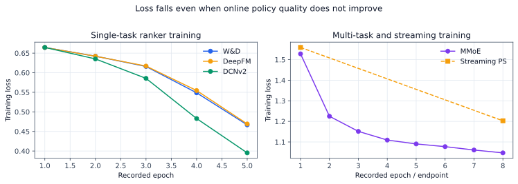

# Why LR still serves: simulator and launch diagnosis

This is a bilingual diagnosis of the checked synthetic system. `LR` has two
meanings in recommendation engineering, so this document always writes either
**logistic regression** or **Launch Review** in full.

本文是对当前可复现合成系统的中英文根因分析。推荐工程里的 `LR` 同时可能表示
逻辑回归和上线复盘，本文一律写成 **logistic regression** 或 **Launch Review**，
避免口径混乱。

## Conclusion / 结论

Logistic regression remains the stateful Feed authority for four evidenced
reasons: the original data-generating process is almost linear after known
crosses are exposed; the actual policy model receives only 24 dense features;
about 20,000 training rows are insufficient for 29,000-87,000-parameter neural
rankers; and offline loss/AUC does not optimize the candidate slate or the
Feed guardrails used by the A/B gate.

逻辑回归仍是有状态 Feed 的线上权威，不是因为系统禁止复杂模型，而是四个已验证的
原因叠加：旧 DGP 在显式交叉后几乎线性；实际策略模型只有 24 个 dense 特征；约
2 万训练样本支撑不了 2.9 万至 8.7 万参数的神经排序器；训练 loss 和离线 AUC
也没有直接优化候选选择与 Feed A/B 护栏。

The simulator has now gained a versioned nonlinear DGP. On the RTX 4090, one
million main impressions still produce only about 20,000 anchor examples and
almost no useful neural headroom. At ten million impressions and about 200,000
examples, XGBoost reaches AUC 0.6161, PLE 0.6120, MMoE 0.6115, and DCNv2 0.6111,
versus logistic regression at 0.6048. This falsifies the claim that complex
models cannot win. It does **not** authorize launch: those models have not yet
been coupled to the stateful downstream A/B environment.

模拟器现已加入版本化非线性 DGP。RTX 4090 上，100 万主曝光仍只有约 2 万 anchor
样本，神经模型几乎没有有效优势；扩大到 1,000 万主曝光、约 20 万样本后，XGBoost、
XGBoost、PLE、MMoE、DCNv2 的 AUC 分别达到 0.6161、0.6120、0.6115、0.6111，高于逻辑回归
的 0.6048。这证明复杂模型可以赢，但还不能批准上线，因为它们尚未接入有状态下游
A/B 环境。

## Evidence by failure layer / 分层证据

| Layer / 层 | Current evidence / 当前证据 | Consequence / 后果 | Required repair / 修复 |
|---|---|---|---|
| Simulator/DGP | V1 oracle AUC is about 0.672; logistic regression with the known cross and sequence features reaches about 0.672 | The label generator gives larger models almost nothing extra to discover | Keep V1 as a linear control; use versioned nonlinear V2 for capacity experiments |
| Sample/label | Stateful fine rank has 20,122 train rows; the 1M POI sample has only 21 orders | Rare tasks are underpowered and multi-task gradients are unstable | Scale exposure first; preserve task maturity masks; report positive counts and standard errors |
| Feature system | Stateful policy uses 24 dense features | Sparse identity, crosses, counters, and sequences demonstrated elsewhere do not affect the actual policy | Connect the shared FID manifest and sequence tensors to the same inference path |
| Model/training | Neural loss falls while test AUC, calibration, or oracle regret worsens | Loss convergence is only optimizer health, not launch evidence | Select with temporal validation, ECE, oracle regret, slices, latency, and A/B |
| Cascade | Quality-only coarse rank preserved only 65.3% of oracle Top-K; LR repair reaches 99.9% | Fine-rank improvements can be destroyed before fine rank sees the item | Freeze candidate sets and report stage pass-through for every launch |
| Experiment | Advanced stateful rankers violate stay, quality-long-view, or Local guardrails | Positive aggregate value cannot override a hard regression | Use fresh-user ITT, CUPED where valid, confidence intervals, guardrails, and rollback |
| Serving consistency | Tensor-scale simulator is not yet the same code path as actual model inference and Joiner replay | A fast GPU run cannot prove offline-online parity | Execute the published artifact inside replay and the stateful A/B loop |

The checked feature scale must be described honestly. The stateful Feed ranker
has 24 dense inputs. The throughput fixture has six sparse IDs, ten dense
features, a 24-by-8 sequence tensor, and two diagnostics. The repository
demonstrates FID hashing and sparse publication, but it does not simulate a
production system with hundreds of fields or billions of ID values.

当前特征规模必须如实表述：有状态 Feed 排序器使用 24 个 dense 输入；吞吐 fixture
包含 6 个 sparse ID、10 个 dense 特征、24×8 序列张量和 2 个诊断特征。仓库验证了
FID 哈希与稀疏发布，但没有冒充已经模拟了数百字段或数十亿 ID 的生产规模。

## Why lower loss did not launch / 为什么 loss 降了仍不能上线

Training loss answers whether the optimizer fits its sampled objective. A
launch needs four additional links: the probability must be calibrated; the
score must choose better candidates from the served set; the resulting slate
must improve user behavior; and the effect must pass the experiment guardrails.
The checked model ladder breaks between the first and second links: W&D,
DeepFM, and DCNv2 have candidate oracle regret around 0.140-0.150 versus 0.062
for logistic regression. MMoE improves to 0.093 but still regresses the A/B
primary metric.

训练 loss 只说明优化器拟合了采样目标。上线还需要四个连接：概率校准正确；分数能在
真实候选中选得更好；最终 slate 改变用户行为；实验通过核心指标与护栏。当前模型阶梯
在前两步之间就断了：W&D、DeepFM、DCNv2 的 oracle regret 约为 0.140 至 0.150，
逻辑回归只有 0.062；MMoE 降到 0.093，仍使 A/B 核心指标回退。

## Joiner and ClickHouse diagnosis / Joiner 与 ClickHouse 排查

The Joiner identity is `request_id + video_id + poi_id`. It deduplicates events,
waits for each task's maturity window, reconstructs point-in-time features, and
retains recall, coarse, fine, calibration, and Value Tree served scores. An
unmatured or unobservable task has `label_mask=0`; it is never silently written
as a negative. Closed-loop orders use deterministic IDs. Open-loop Pixel events
use observable click identity or normalized fractional multi-touch attribution.

Joiner 主键是 `request_id + video_id + poi_id`。它先幂等去重，再等待各任务成熟窗口，
重建当时可见的特征，并保留召回、粗排、精排、校准和 Value Tree 的线上分数。未成熟或
不可观测任务写 `label_mask=0`，不能偷写成负样本；闭环订单按确定性 ID 回填，开环
Pixel 按可观测 click identity 或归一化多触点归因回填。

The ClickHouse investigation order is causal, not cosmetic:

1. Verify the request-candidate-impression closure and duplicate/orphan rates.
2. Compare route mix and coarse/fine pass-through before comparing model AUC.
3. Slice feature/FID, model, index, calibration, and policy versions.
4. Compare served versus replay scores at p50, p99, and maximum error.
5. Inspect label maturity, Pixel coverage, sampling probability, and propensity.
6. Check calibration and candidate oracle regret by permission, city, category,
   head/tail author, new item, and transaction type.
7. Only then attribute the A/B change to model, feature, strategy, or chain bug.

ClickHouse 排查必须先查闭包、重复与孤儿事件，再看 route mix 和各级通过率；之后按
FID、模型、索引、校准、策略版本切片，对比 served/replay 分数误差；再检查 label
maturity、Pixel coverage、采样概率和 propensity；最后才看校准、oracle regret 与
各业务切片。否则把链路偏差解释成模型提升或回退，因果归因一定会错。

Executable SQL lives in
[`sql/clickhouse/funnel_and_parity_diagnostics.sql`](../../sql/clickhouse/funnel_and_parity_diagnostics.sql)
and
[`sql/clickhouse/poi_feed_training_examples.sql`](../../sql/clickhouse/poi_feed_training_examples.sql).

## Business evolution / 业务演进

| Phase / 阶段 | Candidate and label / 候选与标签 | Model and experiment / 模型与实验 | Launch value / 上线价值 |
|---|---|---|---|
| Main Feed content | Video candidate; play, 3s, stay, slide, quality-long-view, like, favorite, negative | LR baseline, then sequence/multi-task ranker; user ITT | Feed stay and active-day effects; platform LT gate |
| POI video distribution | POI-anchored video; anchor click, detail, favorite | POI-aware retrieval/coarse/fine; user A/B inside Feed | POI video VV and container entry without Feed regression |
| Posting supply | POI suggestion; click shoot, select POI, publish, qualified post | Draft/context ranker; entrant UID A/B before supply interference | Posting penetration and qualified supply |
| Supply feedback | Published content enters distribution | Author/city-time switchback when catalog interference exists | Incremental qualified supply plus downstream consumption |
| Map/detail/YMAL | POI candidate; detail, save, route, call | Separate surface rankers and request-level A/B | Container depth and intent fulfillment |
| Product/transaction | SKU/merchant; submit, order, payment or Pixel conversion | Multi-task transaction ranker with delayed masks | Closed/open-loop conversion; accepted LT exchange only |
| Review | Review/comment; helpful, dwell, report | NLP quality/relevance ranker | Decision quality and negative-feedback guardrail |

Posting and distribution experiments are not the same. If treatment only
reranks POIs after a user enters the posting page, entrant-level UID assignment
estimates the posting-page effect. Once treatment changes the amount or type of
published supply available to other viewers, SUTVA is violated; use an author
cluster or city-time switchback and measure both qualified supply and downstream
Feed/Local outcomes. Calling both tests “author experiments” hides the actual
unit and interference mechanism.

投稿页实验和分发实验不是一个实验。若 treatment 只在用户进入投稿页后重排 POI，按
进入用户 UID 分桶即可估计投稿页效果；当 treatment 改变了其他观众可见的内容供给，
用户之间产生干扰，就要用作者 cluster 或 city-time switchback，同时观察合格供给和
下游 Feed/Local 指标。笼统叫“作者实验”不能说明实验单位与干扰机制。

Search has its own query, retrieval, ranking, zero-result, reformulation, and
downstream session metrics. Post-search recommendation and retarget recall can
consume search intent, but their effect must be isolated from the search ranker
and Feed policy through orthogonal parameters or layered experiments.

搜索有独立的 query、召回、排序、零结果、改写和下游 session 指标。搜后推与重定向
召回可以消费搜索意图，但必须通过正交参数或分层实验，把其增量与搜索排序、Feed 策略
分开归因。

## Next acceptance boundary / 下一步验收边界

The next simulator version is accepted only when one published model artifact
runs through training, shadow replay, the actual candidate cascade, stateful
A/B, Joiner reconstruction, and Launch Review without replacing any stage with
an oracle score. The minimum bars are:

- V2 model-to-policy coupling with identical feature manifest and artifact ID.
- Replay score tolerance plus route and stage pass-through parity.
- At least three seeds and explicit power for sparse business metrics.
- A model win on candidate regret, calibration, Feed primary, and Local
  guardrails—not AUC alone.
- A declared cost report for GPU training and CPU/GPU serving latency.
- Separate launch records for model, feature, realtime, strategy, product, and
  bug-fix changes under the same protocol.

下一版只有在同一个已发布模型 artifact 贯穿训练、shadow/replay、真实候选级联、有状态
A/B、Joiner 重建和 Launch Review，并且没有任何阶段偷换成 oracle score 时才算完成。
门槛包括 feature manifest 与 artifact ID 一致、分数与候选通过率回放一致、至少三个
seed 与稀疏指标功效、同时改善 regret/校准/Feed 核心/Local 护栏，以及训练和服务成本。

That boundary now passes for the guarded LR plus expected-stay XGBoost artifact.
The semantic and million-user tensor engines agree on control distributions and
treatment-effect direction within declared tolerances. The measured algorithmic
impact is real inside the synthetic world: stay improves, but quality-long-view
regresses enough to reject launch. The remaining problem is a multi-objective
quality constraint, not simulator throughput or artifact consistency.

这条边界现已由 guarded LR + expected-stay XGBoost artifact 通过。semantic 与百万
用户 tensor engine 的 control 分布和 treatment effect 在声明门槛内一致。算法在
合成世界中确实提升 stay，但 quality-long-view 回退导致拒绝上线；剩余问题已经从
模拟性能和 artifact 一致性，收敛为真实的多目标质量约束问题。
